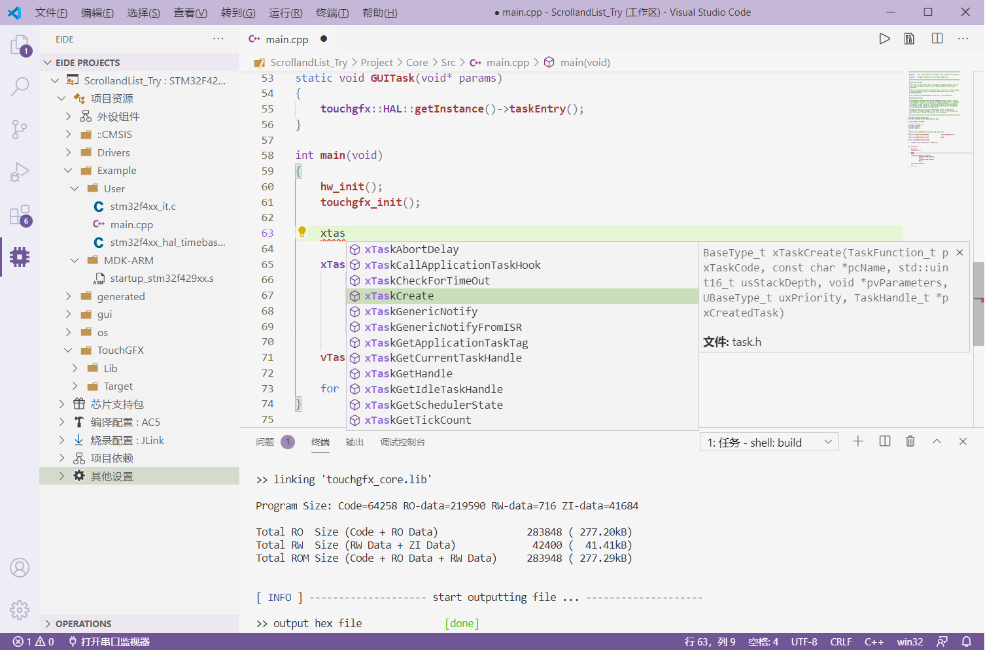

文档更新时间🕔：{docsify-updated}

***

[Embedded IDE](https://marketplace.visualstudio.com/items?itemName=CL.eide) 是 vscode 上的一个用于开发 8051/STM8/Cortex-M 的开发工具。用于在 vscode 上实现单片机的开发，编译，烧录功能

> Embedded IDE 论坛地址: https://discuss.em-ide.com

> 博客地址：https://blog.em-ide.com

> QQ 交流群：860375447

> **文档内资源下载地址：https://cloud.em-ide.com/s/R4SY**

