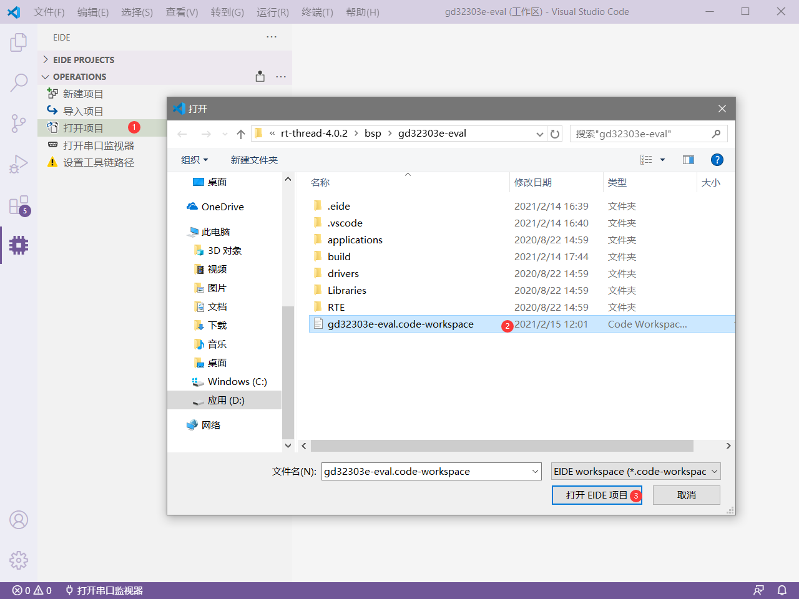
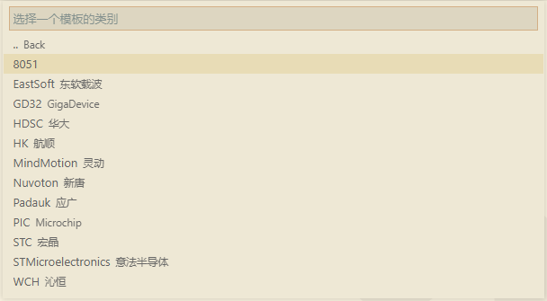

## 介绍

> 关于 Embedded IDE 的论坛已上线, 有什么问题可以直接在上面交流，[地址](https://discuss.em-ide.com)

[Embedded IDE](https://marketplace.visualstudio.com/items?itemName=CL.eide) 是 vscode 上的一个用于开发 8051/STM8/Cortex-M 的开发工具。用于在 vscode 上实现单片机的开发，编译，烧录功能


***

## 更新时间 🕔 2020/1/7 16:00
🔔 每次更新后注意查看插件的 [CHANGE.LOG](https://marketplace.visualstudio.com/items/CL.eide/changelog) 以得知版本变化
***

## 准备工作 🏃‍♀️

### 运行环境

`系统要求`：Windows 7 及以上

`.NET环境`：.NET FrameWork 3.5

> 提示：.NET FrameWork 4 及以上可能不兼容 .NET FrameWork 3 的程序。 如果构建工具无法启动，可能需要单独安装一下 .NET FrameWork 3.5

### 设置工具链的路径

由于各种编译器的体积过大，不适合与扩展打包到一起，因此你必须手动安装你要使用的编译器工具，然后在 `设置工具链路径` 选项中设置其安装路径

> 注：只需设置你要使用的编译工具的安装路径，不使用的可以不设置；如果你打算使用某种工具链来编译你的项目，但没有为其设置安装路径，插件会给出提示

**"设置工具链路径"** 选项的图标表明了路径设置的状态
 - `绿色`✔：所有的工具链已完全设置完毕
 - `橙色感叹号`⚠：某一个工具链路径是无效的
 - `红色叉`❌：还没有设置任何工具链路径


### 了解项目目录结构 📚

基本结构如下：


- `.eide` eide 项目文件, 项目依赖 和 日志存放的位置
- `.vscode` vscode 配置文件目录
- `out` EIDE 的编译输出目录, 编译产生的文件存放在此处
- `pack`  CMSIS 包的安装位置, 用户无需更改此文件夹下的内容
- `src` 默认的源文件的目录, 也可以通过 [添加源文件目录](#添加源文件目录) 来添加其他的目录
- `*.code-workspace` 工作区文件，每个 eide 项目必须存在

***

## 打开项目

> 提供两种打开项目的方式，分别为 `双击工作区文件` 和 `点击操作栏按钮`

### 双击 VsCode 工作区文件 打开

> 双击 .code-workspace 文件，vscode 会打开该工作区，eide 就能加载工作区内的项目

!> 注意：直接用 VsCode 打开项目根目录是无法打开项目的，因为 eide 只会在工作区内搜索和加载项目

### 在操作栏点击 “打开项目”



***

## 创建项目 📂

在 Operation 栏点击 `新建项目`, 会出现一个列表，可以选择 3 种创建项目的方式


### 1. 从 Github 仓库拉取模板并创建工程 （建议使用此方式）

作者正在向[模板仓库](https://github.com/github0null/eide-doc)不断增加新的模板工程，这将会使创建项目更加快捷方便

没有找到你想要的模板？ 这里有一个[模板心愿单](https://discuss.em-ide.com/d/14)，在下方评论，描述你想要的模板，作者会尽可能实现的

!> 注意：如果选择 **从 github 获取模板**，请确保网络良好，否则可能会发生连接失败


1. 打开 Operation 栏，点击 `新建项目`, 选择 `Get Template From Disk or Github ...` 项

 

 然后选择从 `磁盘` 或者 [Github 模板仓库](https://github.com/github0null/eide-doc) 创建获取模板.

 

 如果选择从 Github 获取模板，eide 会从默认仓库拉取模板信息，然后弹出对话框让你选择模板，然后完成创建

 > 提示：你可以在插件设置中配置自己的模板仓库位置，默认使用作者提供的仓库，也欢迎大家将自己的模板通过 PR 分享到默认仓库

 

2. 打开创建好的项目，开始进行一些项目的配置

3. 如果模板使用了 CMSIS 包（如果没有，可跳过此步骤），你需要先修改你**要使用的芯片型号**

 

 通过 CMSIS 包里的 **安装/删除 外设组件功能** 来 **启用/禁用 你要使用的标准外设**

 

4. 开始编写程序。

### 2. 从 EIDE 内置的项目模板创建

如果没有网络，导致无法从 Github 模板创建，eide 也提供了一些内置的模板，但十分有限

打开 Operation 栏，点击 `新建项目`, 选择 `Create Project By Internal Template` 项


eide 会弹出对话框让你选择 `项目模板`，然后根据你选择的模板创建一个示例项目


### 3. 从空项目开始（以 stm32f1 为例） 

> 注：你需要手动复制文件，组织你的代码和文件夹结构

在开始之前需要下载并解压相应芯片的外设库，此处为 [STM32F1 标准外设驱动](https://www.st.com/content/st_com/zh/products/embedded-software/mcu-mpu-embedded-software/stm32-embedded-software/stm32-standard-peripheral-libraries/stsw-stm32054.html#get-software)

#### 1. 创建一个空的项目

 打开 Operation 栏，点击 `新建项目`, 选择 `Create Empty Project` 项

 

 eide 会弹出对话框让你选择 `项目类型`，此处要创建 stm32 项目，应该选择 `Empty Cortex-M Project`

 

 创建完成的项目根目录如下

 

#### 2. 创建完成之后打开项目，开始复制文件

 在项目目录下新建一个 `hal` 文件夹用于存放库，将解压好的外设库目录里的 Libraries/STM32F10x_StdPeriph_Driver 文件夹复制到 hal 文件夹内；

 
 
 然后将 Libraries/CMSIS/CM3/DeviceSupport/ST/STM32F10x/startup/arm 目录里的启动文件 startup_stm32f10x_x.s 复制到项目的 src 目录下

 

 将 Libraries/CMSIS/CM3/DeviceSupport/ST/STM32F10x 目录里的源文件复制到项目的 hal 目录下

 

 将 Project/STM32F10x_StdPeriph_Examples/USART/Printf 目录（可以是其他的示例程序目录）里的 示例程序 复制到 src 文件夹

 > system_stm32f10x.c 已在上一步中复制过了，这里不用复制，因为重复的源文件在链接时会导致 `重复的定义` 这类错误

 

#### 3. 将 hal 文件夹添加到项目结构中

 

 点击 `install CMSIS Header` 将 CMSIS 的头文件添加到项目中

 

#### 4. 使用 **排除功能** 排除不使用的外设源文件

 

#### 5. 根据你要使用的芯片，添加一些必要的 **宏** 到项目

 

#### 6. 设置要使用的工具链，本例选择 AC5 (ARMCC 5),  选择好 CPU 类型为 Cortex-M3, 然后将 `使用自定义的脚本/UseCustomScatterFile` 选项设置为 false, 然后点击 `RAM/FLASH layout 选项` 开始设置芯片的 RAM/ROM 地址信息

 

 设置芯片的地址信息，然后保存

 

#### 7. 打开 main.c 开始编写示例代码，保存然后编译

 本处的示例代码：

 ```c++
  /*
  * ************************************************
  * 
  * STM32 blink demo
  * 
  * CPU:     STM32F103C8
  * PIN:     PA0
  * 
  * ************************************************
  */

  #include "stm32f10x.h"

  void delay(int x)
  {
      for (int i = 0; i < x; i++)
      {
          // nop ;
      }
  }

  int main()
  {
      GPIO_InitTypeDef gpioDef;
      RCC_APB2PeriphClockCmd(RCC_APB2Periph_GPIOA, ENABLE);
      gpioDef.GPIO_Mode = GPIO_Mode_Out_PP;
      gpioDef.GPIO_Pin = GPIO_Pin_0;
      gpioDef.GPIO_Speed = GPIO_Speed_10MHz;
      GPIO_Init(GPIOA, &gpioDef);

      while (1)
      {
          GPIO_WriteBit(GPIOA, GPIO_Pin_0, !GPIO_ReadInputDataBit(GPIOA, GPIO_Pin_0));
          delay(500000);
      }
  }
 ```

 编译项目：

 

***

## 编译项目 🔨

### 支持的工具链

- #### Keil_C51 工具链

  介绍：使用 Keil C51 自带的编译工具进行编译

  > 适用项目: 8051 项目

  > 提示：插件使用的 Keil_C51 工具链的 链接器 和 汇编器 为 LX51 和 A51

  !> **注意**：使用前必须完全破解 Keil C51，否则可能会链接失败

- #### SDCC (Small Device C Compiler) 工具链

  介绍：使用免费的编译工具 [Small Device C Compiler](http://sdcc.sourceforge.net/) 进行编译

  > 适用项目: 8051, STM8, Z80 ... 项目
  
  !> **注意**：强烈建议使用最新版本的 SDCC, 目前是 4.0, 因为过旧的版本可能不支持多文件编译，以及某些重要的编译参数, 这可能会引发一系列的编译错误

- #### IAR-STM8 工具链

  介绍：使用 IAR-STM8 自带的编译工具 iccstm8 进行编译

  > 适用项目: STM8 项目

  !> **注意**：使用前必须完全破解 IAR-STM8

- #### AC5/AC6 (ARMCC) 工具链

  介绍：使用 Keil-MDK 自带的编译工具 ARMCC 进行编译

  > 适用项目: Cortex-M 项目

  > 提示：AC5 是指 ARMCC 版本 5 的编译工具;  AC6 是指 ARMClang 编译工具

  !> **注意**：使用前必须完全破解 Keil-MDK

- #### ARM-GCC (GNU Arm Embedded Toolchain) 工具链

  介绍：使用免费的编译工具 [GNU Arm Embedded Toolchain](https://developer.arm.com/tools-and-software/open-source-software/developer-tools/gnu-toolchain/gnu-rm/downloads) 进行编译

  > 适用项目: Cortex-M 项目

***

### 编译配置

#### 编译选项

> 注：编译选项带有悬停提示和补全，注意阅读其含义，或者也可以通过字段名称来理解其含义
>
> 注：要添加自定义的编译参数，请在 misc-controls 选项中添加

#### KEIL_C51 工具链
?>略

#### SDCC 工具链

对于 **SDCC** 的配置，见下图：

1. 其中带有 **<>** 的选项，被 **<>** 包含的内容应该 **被替换为某个确定的值** ，见下图，如何取值见 **SDCC** 的手册
2. 当你成功替换了 **<>** 中的值，json验证器会产生警告，不用理会它，如下图
3. 悬停提示带有 **[]** 的选项，被 **[]** 包含的内容代表着此选项适用的 **设备** ，如下图


***

#### IAR_STM8 工具链

?>略

#### AC5/AC6 (ARMCC) 工具链

打开**编译配置**：点击下图按钮打开对应的配置


**编译配置** 带有 **悬停提示** 和 **自动补全**


**切换工具链**


***

#### ARM-GCC 工具链

?>略

***

### 附加自定义命令到构建流程中 💡

**编译配置**->**afterBuildTasks、beforeBuildTasks**  使用 CMD 执行，可用于扩展编译流程

命令中可用的 **路径变量**, 变量名不区分大小写：

>变量名：\${targetName}，含义：项目名称；
>
>变量名：\${exeDir}，含义：eide 内置构建工具所在目录；
>
>变量名：\${ToolDir}，含义： 编译工具链根目录；
>
>变量名：\${OutDir}，含义：项目输出目录；
>
>变量名：\${CompileToolDir}，含义：编译工具所在目录；
>
>变量名：\${toolPrefix}, 含义：GCC 工具链前缀，如: arm-none-eabi-
>
>示例，加入以下命令到 afterBuildTasks：del "${OutDir}\\*.o"，含义：在编译结束后删除输出目录下所有的 .o 文件
>
>

#### 通过 HEX 生成 Bin 文件

在编译选项 ->**afterBuildTasks** 中添加下图所示命令
```json
{
	"name": "output bin file",
    "command": "\"${exeDir}\\hex2bin.exe\" -b -c \"${outDir}\\${targetName}.hex\""
}
```

#### ARMCC 生成 S19 格式的烧录文件

在编译选项 ->**afterBuildTasks** 中添加下图所示命令

```json
{
	"name": "output s19",
    "command": "\"${CompileToolDir}\\fromelf\" --m32combined -o \"${OutDir}\\${targetName}.s19\" \"${OutDir}\\${targetName}.axf\""
}
```
***

#### 查看 GCC 生成的程序大小信息

在编译选项 ->**afterBuildTasks** 中添加下图所示命令

```json
{
	"name": "show total size",
	"command": "\"${CompileToolDir}\\${toolPrefix}size\" \"${OutDir}\\${targetName}.elf\""
}
```

***

### 开始编译

> 点击  按钮开始编译

#### 操作展示

##### C51 项目

> 使用 SDCC 工具链编译


##### STM8 项目

> 使用 SDCC 工具链编译


##### Cortex-M 项目

> 使用 ARMCC 工具链编译


***

## 烧录程序到目标芯片 💾

### C51 工程

> 需要 **Python3** 支持
>
> 在**开始**之前，需要安装 [stcgal 工具](https://github.com/grigorig/stcgal)
>
> 使用命令：**pip3 install stcgal --user** 完成安装

STC 的下载配置较多，将在配置文件里进行，可以点击下图按钮打开配置

**如果忽略此步骤，将使用默认配置**，默认配置见 [stcgal usage](https://github.com/grigorig/stcgal/blob/master/doc/USAGE.md)


配置文件的配置描述翻译自 [stcgal usage](https://github.com/grigorig/stcgal/blob/master/doc/USAGE.md)，带有悬停提示和自动补全

**"[]" 号**里描述了适用于此配置的芯片型号，例如：**\[ALL\]** 表示适用于所有型号


!> 注意：[stcgal 工具](https://github.com/grigorig/stcgal) 用法与 STC 官方的烧录工具一样，**在面板输出 Cycling power done 之后**，需要**复位 stc 芯片 或者 关闭然后打开芯片电源**，这样才能检测到 ISP 命令，进入到下载流程；如果配置没有问题，下载完成之后将会退出连接，配置有错误会失败并提示，请注意阅读失败后的**提示信息**；
	
### STM8 工程

> STM8 工程需要使用 [STVP 下载器](https://www.st.com/zh/development-tools/stvp-stm8.html)完成下载，因此需要安装 STVP
>
> 安装完成之后在 eide 插件设置中设置 **STVP_CmdLine.exe** 的绝对路径

STVP 工具配置界面如图


!> **注意：** 如果需要设置选项字节以开启相关外设，请打开 STVP 完成选项字节的配置，然后生成为 hex 或 bin 文件，将此文件路径添加到项目的 STVP 烧录设置: `选项字节文件路径` 中

在修改好配置之后，连接好 STLink，点击下载按钮开始下载


### ARM 工程

> 提示: 对于 arm 工程，eide 支持 4 种常用的烧录方式，由于 **JLink** 和 **STLink** 配置较为简单，因此此处只介绍 **pyOCD** 和 **OpenOCD** 的烧录配置


#### 使用 pyocd 烧录程序到芯片

> 注意：pyocd 需要 python3 支持，必须先安装 python3
>
> pyocd 主要被用来支持 DAPLink 和 STLink

1. 命令行输入 `pip3 install pyocd` 安装 pyocd

2. 从 github 下载 [usblib](https://github.com/libusb/libusb/releases/tag/v1.0.21)

 **解压 usblib 后，将 libusb.dll 复制到 python.exe 所在的目录，注意：所选择的 libusb.dll 必须要和电脑上安装的 python 是同一体系结构，例如：python3_x86 版本对应 MS32 目录下的 dll**

 

3. 连接 目标板，命令行输入 `pyocd list` 检查 pyocd 是否能够正常工作，如果没有问题则会输出已连接的设备列表

 

4. 打开 EIDE 项目，配置烧录设置

 4.1. 填写目标芯片名称

 

 4.2. 命令行输入 `pyocd list -t`，**查看所有支持的芯片，如果存在你所需要的芯片，则忽略步骤 4.3**

 

 4.3. 打开 config 属性，**配置包含该芯片的 keil 包路径**

 提示：此配置文件里也可以填写一些其他的 pyocd 配置选项，具体参考 [pyocd 配置文档](https://github.com/pyocd/pyOCD/tree/master/docs)**

 

5. 连接目标板，点击下载按钮启动下载

 

***

#### 使用 OpenOCD 烧录程序到芯片

1. 设置好 OpenOCD.exe 的路径

 

2. 将烧录配置切换到 OpenOCD，设置 `target` 和 `interface`。

 !> **注意：** eide 将从 <OpenOCD安装目录>/scripts/target 和 <OpenOCD安装目录>/scripts/interface 目录读取配置文件列表，**如果 openOCD.exe 路径是无效的，可选的列表将为空**

 

3. 点击下载按钮完成下载

 

***

## 调试你的程序 🔧

**要调试 ARM 的工程，需要安装 [cortex-debug](https://marketplace.visualstudio.com/items?itemName=CL.stm8-debug)**

**要调试 STM8 的工程，需要安装 [stm8-debugger](https://marketplace.visualstudio.com/items?itemName=CL.stm8-debug)**

**关于配置 和 使用 cortex-debug 的方法，请参阅 Cortex-Debug 首页 或者 参见此博客 [Cortex-debug 使用介绍](https://blog.csdn.net/qq_40833810/article/details/106713462)**

> **提示：** 在完成编译之后，eide 会生成一个默认的 调试配置，你可以将其当作模板来编写自己的调试配置

连接你的板子，选择好调试配置，在一切就绪之后，按 F5 启动 Cortex-Debug 调试器进入调试。


***

## 导出项目 🔩

### 导出 eide 模板

> 在项目视图中点击导出模板，即可将此工程打包压缩，压缩格式为 7z
>
> 如果你想与大家分享你的模板，可以使用 pull request 提交到默认的仓库 [eide-doc](https://github.com/github0null/eide-doc)

**压缩工程需要耗费一定时间，完成导出后会弹出提示**


`默认的排除目录，导出的模板中将不会含有这些目录`


**也可以在项目根目录下新建一个 .eideignore 文件，在里面填写需要排除的文件**


***

### 导出 MDK 项目

> 可以将 EIDE 项目导出为 MDK 项目

!> 注意：只能导出 KEIL5 版本的工程

操作完成后，在项目目录下会生成一个 <项目名>.uvprojx 文件（C51 工程为 <项目名>.uvproj）


## 串口监视器 🔌

在使用串口监视器前，必须设置好串口配置，见插件设置；
默认配置：`波特率`：9600, `位宽度`：8, `奇偶校验`：无, `停止位`：1


***

## 常用功能 🔥

### 从包中添加外设组件

> 解释：外设组件包含的内容是与此外设相关的头文件，源文件，asm 文件；添加某个外设，该外设的所有内容将会被复制到 dependence/<包名>/<外设名> 目录下，此目录会被自动加入到源文件目录列表中，同时此目录的 创建，删除，更新 由 eide 管理，但目录里的文件可以由用户随意删改

!> 注意：每当发生如下事件，某些外设组件目录里的内容将会更新，因为对于不同的工具链和不同的芯片，外设组件的内容可能有所不同

- `切换芯片型号`
- `切换工具链`


***

### 添加源文件目录

> 解释：源文件目录里包含着你要编译的源文件，将这些目录加入到项目中，eide 才能把这些目录下的源文件添加到编译流程

!> 注意：被添加的目录的所有子目录也会被递归的添加，因此不必再为其子目录单独进行添加操作


****

### 添加包含目录

> 解释：包含目录是指头文件的搜索路径，将会被直接传递给编译器

!> 注意：重复添加同一个路径将不会有任何效果出现，也不会弹出任何提示
!> 注意：keil 包组件的包含目录、已加入到项目中的源文件目录以及所有子目录、系统的包含目录，都将会被自动添加到包含路径，即使再添加也是重复的，会被丢弃，`添加包含目录` 功能 只用于添加出现在这三者之外的目录


### 查看项目所有的包含路径

> 解释：你可以通过这个功能查看当前项目所有的包含路径


下图展示了这个功能的效果


> 解释：每个包含路径后都有一个标签，将以较暗的颜色显示，这个标签说明了这个路径源自何处

- `custom`：表示这个包含路径是用户手动添加的
- `build-in`：表示这是工具链内置的包含路径
- `source`：表示这个路径是从源文件目录中自动搜索到的
- `STMxxxx`：表示这个路径来自 keil 包 里安装的组件，**此标签的名字就是 keil 包的名字**

***

### 添加宏

> 解释：可以通过这个功能添加一些宏开关到项目中，这些宏开关将会被直接传递给编译器
>
> 提示：你可以一次添加多个宏，不同的宏之间必须以 “;” 作为间隔，例如: 输入 ST;DEBUG;\_RTE\_ 将会把 ST，DEBUG，\_RTE\_ 这三个宏一次性添加到项目中

!> 注意：使用 Keil_C51 工具链的 8051 项目，不能给宏添加值


***

## 注意事项 🚩

### SDCC 编译选项

SDCC 在链接时，**被链接的第一个.rel 文件必须是含有 main() 函数的源文件生成的**，因此**必须要设置包含 main 函数的源文件名**。

**默认是 main**（即 main() 函数位于 main.c 中），如下图


***

### 语法提示

**v1.10.1** 及以后，对于 ARMCC 、SDCC、GCC 工具链已完成了关键字的基本扩展，不再默认关闭语法提示，如需要请手动关闭。

!> 插件**不提供**语法提示等功能，这些功能由 C/C++ 插件提供， C51/STM32 有很多标准 c/c++ 里没有的关键字，会导致 C/C++ 插件产生语法错误，你需要关闭 C/C++ 插件的错误提示。只需要保留智能提示就行。 如果你打开了工作区，插件会自动帮你关掉错误提示。


**如何关闭C/C++插件的错误提示**： 打开工作区文件，在 settings 中添加此项，或者直接在设置中更改, 如下图


***

## 常见问题 ❓

### 问题：编译不通过

> 提示：请仔细阅读编译器给出的输出提示，将错误提示放到网络上查询，无法解决的，可通过 github issue 进行反馈

***

### 问题：SDCC 编译提示未定义的段

问题详情：

 使用 SDCC 编译 8051 项目，链接时出现以下提示：

 ```
 ASlink-Warning-No definition of area HOME
 ASlink-Warning-No definition of area XSEG
 ASlink-Warning-No definition of area PSEG
 ```

> 可能原因：SDCC 版本过低；`解决办法`：卸载旧版本，安装最新的 SDCC 之后重试

***

### 问题：安装了 stcgal 但启动下载时提示无法找到 stcgal 模块

> 原因：电脑上有多个 Python；`解决办法`：卸载多余的 python，删除环境变量 path 中多余的 python 路径，重启 vscode 后重试

***

### 问题：使用 Keil_C51 编译时链接失败,  提示 Error L257

问题截图：


> 原因：Keil C51 未破解，存在大小限制，`解决办法`: 完全破解 Keil C51 后再尝试

***

## 评论

> 将问题反馈到 [EIDE Issue](https://github.com/github0null/eide/issues) 或者 直接在下方留言

> 关于 Embedded IDE 的论坛已上线, 有什么问题也可以直接在上面交流，[地址](https://discuss.em-ide.com)

