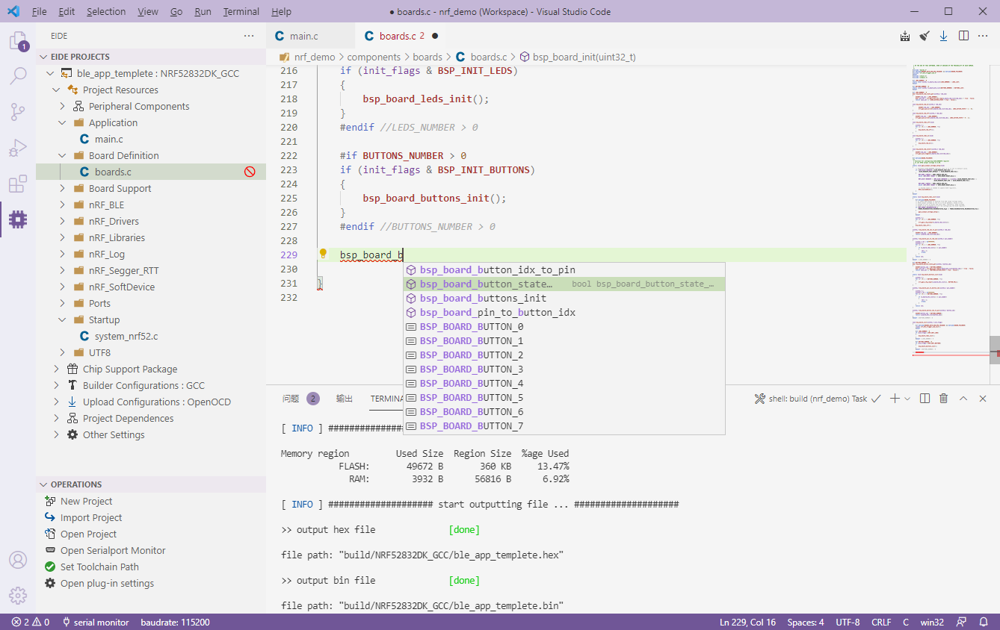

Document Update Time 🕔: {docsify-updated}

***

[Embedded IDE](https://marketplace.visualstudio.com/items?itemName=CL.eide) is a microcontroller development environment for 8051/STM8/Cortex-M/RISC-V. 

It can provide 8051, STM8, Cortex-m, RISC-V project development, compilation, and burning functions base on VS Code.

