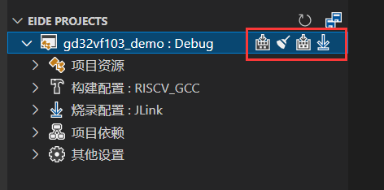
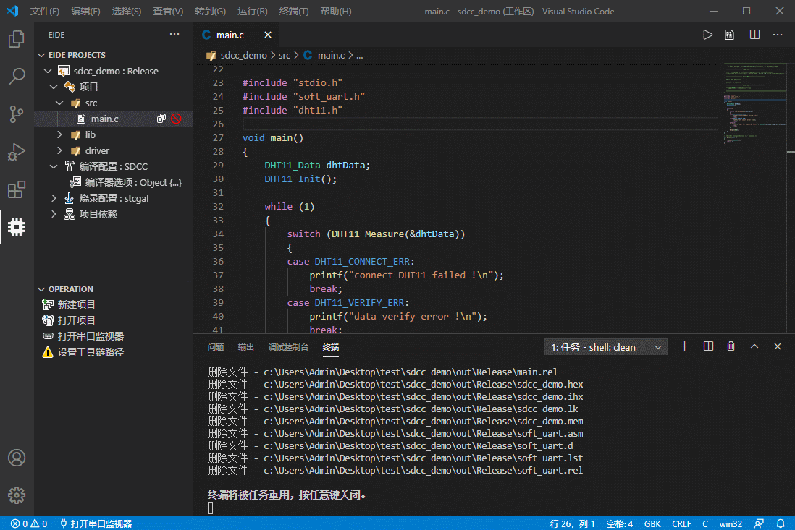
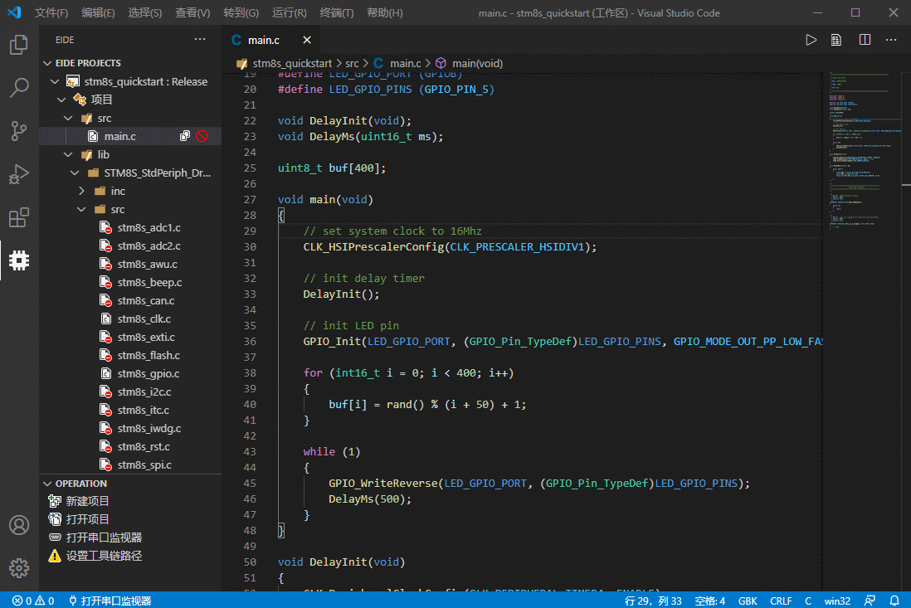
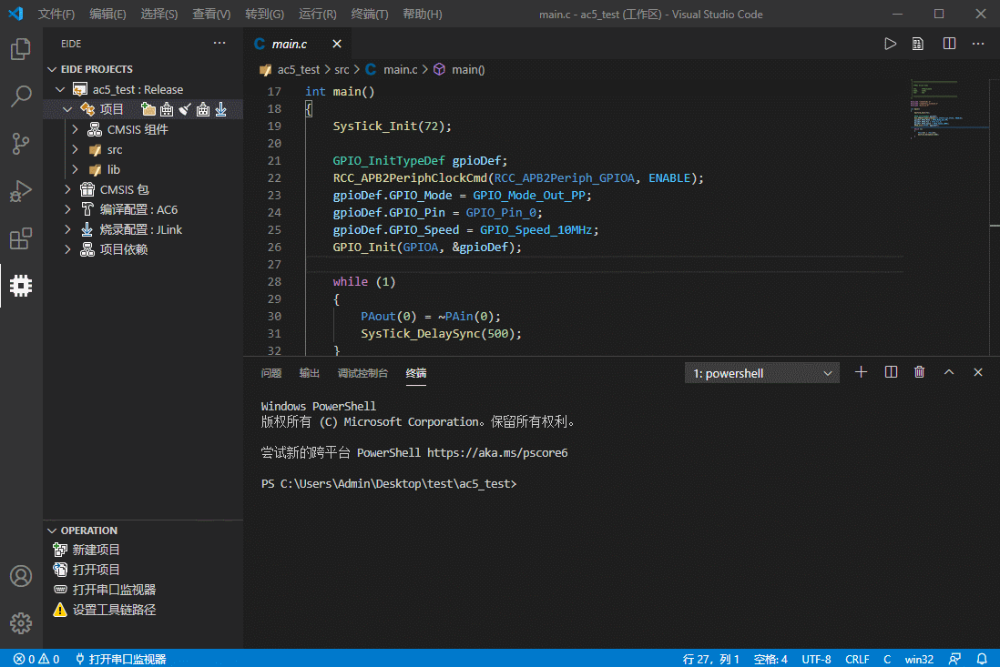

# Build Project 🔨

> Click  button to start build

## Toolbar

> 这里有几个常用的工具按钮：**编译**，**清理**，**重新编译**，**烧录**，它们的含义如下
> 
> 

- **编译 **: 增量构建，只编译更改过的文件
  
- **清理 **: 删除 `build` 目录下的所有内容
  
- **重新编译 **: 重新编译整个项目

- **烧录 **: 执行烧录命令，将程序烧录到芯片

***

## 操作展示

### C51 项目

> 使用 SDCC 工具链编译

### STM8 项目

> 使用 SDCC 工具链编译

### Cortex-M 项目

> 使用 ARMCC 工具链编译

