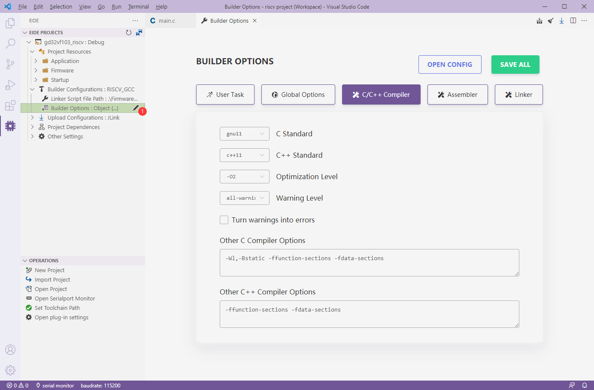

# Builder Configurations

## Builder Options

> Since v2.4.0, eide uses web pages to configure compiler parameters

Click the **Builder Configuration** -> **Builder Options** modify button to open the parameter configuration page



***

### 8051/STM8 Project

- **Builder Options**: Parameters and options about the compiler

***

### AC5/AC6 (ARMCC) Project


- **CPU Type**: Cortex series name
  
- **Hardware floating point option**: CPU hardware floating point switch
  
- **Use Custom Linker Script File**: Whether to use a custom linker script
  
  - If `True`, A **linker script path** option will be showed and you need to specify a link script path.
  
    

  - If `False`, A **RAM/FLASH layout** option will be showed, which you need to turn on to set the memory address size information for the chip.
  
    

    

- **Builder Options**: Parameters and options about the compiler

***

#### ARM-GCC Project


- **CPU Type**: Cortex series name
  
- **Hardware floating point option**: CPU hardware floating point switch
  
- **Linker script file path**: gcc linker script file path

- **Builder Options**: Parameters and options about the compiler

***

### RISC-V Project


- **Linker script file path**: risc-v gcc linker script file path

- **Builder Options**: parameters and options about the compiler

RISC-V CPU options are located in the **Builder Options**->**Global** and must be set for every project, as follows


- `arch` **Field**: 
  
  description: Corresponds to the `-march=` option, which specifies **the instruction set of target processor**.

  default: `rv32imac`

- `abi` **Field**:
  
  description: Corresponds to the `-mabi=` option, used to specify **integer and floating-point calling convention**.

  default: `ilp32`

- `code-model` **Field**:
  
  description: Corresponds to the `-mcmodel=` option, used to specify **code model**.

  default: `medlow`

***

## User Commands

> eide support add some custom user commands before compiling and after compiling to run other operations.

Open **Builder Options**->**User Task**:

  - `Prebuild Task`: Run tasks before build start.

  - `Post-build Task`: Run tasks after build done.


### Command Variables

There are some available **Variables** can be used in command, variable name **is case insensitive**:

|variable|description|
|:----|:----|
|`${targetName}`|Project Name| 
|`${ProjectRoot}`|Project Root Folder|
|`${OutDir}`|Build output folder|
|`${BuilderFolder}`|eide builder executable file folder|
|`${ToolchainRoot}`|Compiler Root Folder|
|`${CompilerPrefix}`|GCC Compiler Prefix, like: arm-none-eabi-|
|`${CompilerFolder}`|Compiler executable file folder|


exmaple: add this command to Post-build Task: `cd "${OutDir}" && del *.o`, Delete all files in the output directory that match `*.o` after compiling


***

### Utility Commands

> **There are some utility commands, sometimes it can be useful.**

```ini

# show internal environment variables
powershell -Command ls env:

# print GCC version
"${CompilerFolder}/${toolPrefix}gcc" -v

# generate S19 format file for Armcc
"${CompilerFolder}\fromelf" --m32combined -o "${OutDir}\${targetName}.s19" "${OutDir}\${targetName}.axf"

# generate bin file from hex file
"${BuilderFolder}\hex2bin.exe" -b -c "${outDir}\${targetName}.hex"

# copy the generated .hex .bin file to the dist directory
mkdir .\dist & copy /B "${OutDir}\${targetName}.hex" .\dist\ & copy /B "${OutDir}\${targetName}.bin" .\dist\

# copy the generated .a file to the dist directory
mkdir .\dist & copy /B "${OutDir}\${targetName}.a" .\dist\lib${targetName}.a

```
