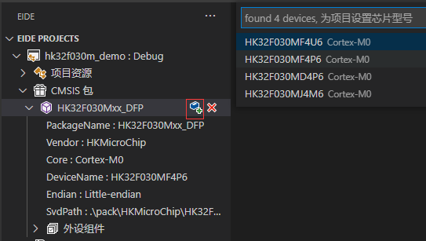

# 安装芯片支持包 (仅用于ARM工程)

> 你可以为芯片安装支持包，用来为项目添加芯片信息、添加外设组件, **芯片支持包不是项目所必须的，可根据需求决定是否安装**

## 下载

芯片支持包可以从以下位置下载：

 - [keil 官网](https://www.keil.com/dd2/pack)

 - [eide 共享文件夹](https://cloud.github0null.io/s/R4SY?path=%2FKEIL%20%E5%8C%85)

## 安装

- 单击 安装 按钮，从文件资源管理器中选择一个下载好的包，然后安装

 

- 安装成功后，你可以为你的项目选择芯片

 

- 之后，你还可以查看或启用 keil package 内部附带的外设库组件

 

## 从包中添加外设组件

> 外设组件包含的内容是与此外设相关的头文件，源文件，asm 文件；添加某个外设，该外设的所有内容将会被复制到 dependence/<包名>/<外设名> 目录下，此目录会被自动加入到源文件目录列表中，同时此目录的 创建，删除，更新 由 eide 管理，但目录里的文件可以由用户随意删改

!> 注意：每当发生如下事件，某些外设组件目录里的内容将会更新，因为对于不同的工具链和不同的芯片，外设组件的内容可能有所不同

- `切换芯片型号`
- `切换工具链`

***
