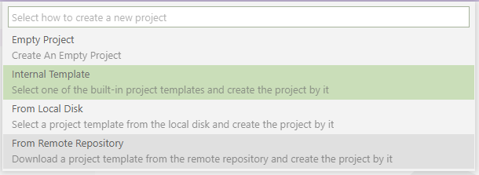
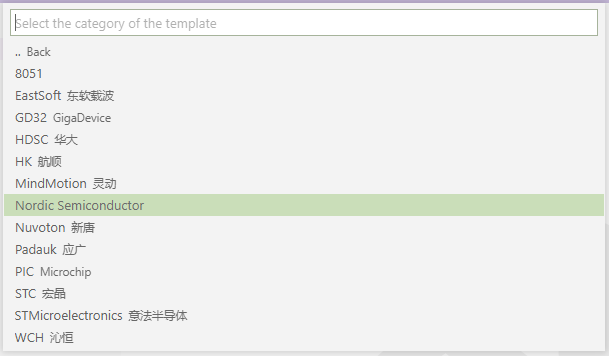
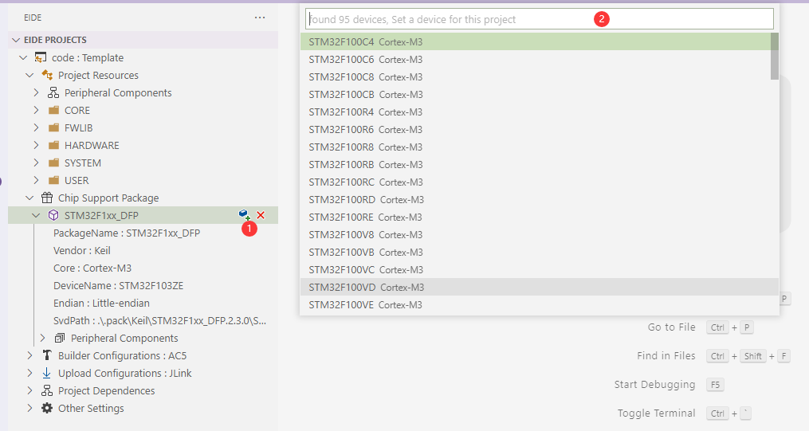
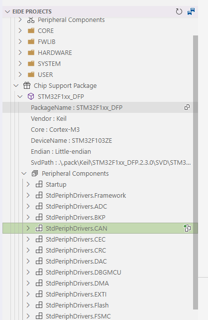
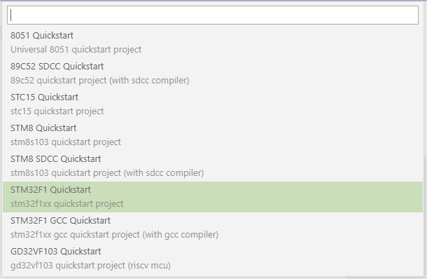

# Create Project 📂

Click `New Project` button in `Operations bar`, a pick box will be popped up

## Pull the template from the Github repository and create the project (recommended)

!> Note: This function requires network connection, please ensure that the network function is ok.

1. Open `Operations` bar, click `New Project`, select `From Remote Repository` 

 

 Eide will pull the template information from the default repository, and a dialog box will be popped up asking you to select the template and complete the creation.

 > Tip: You can configure your own template repository location in the plugin Settings. The default repository is the one provided by the author, and you are welcome to share your templates with the default repository via [PR](https://github.com/github0null/eide-resource/pulls)

 

2. Open the created project and start to configure some of the projects

3. If the template uses the CMSIS package (**if not, you can skip this step**), you need to change the chip type you **want to use**

 

 Enable/disable the standard peripherals you want to use by using the **Install/remove peripheral components** in the CMSIS package

 

4. Start Coding.

## Created from eide's built-in project template

> If there is no network and you cannot create from Github templates, Eide also provides some built-in templates, but the numbers are limited.

Open the Operation bar, click on `New Project` and select the `Internal Template` option

Eide will pop up a dialog asking you to select a `project template` and then create a sample project based on the template you have selected.

