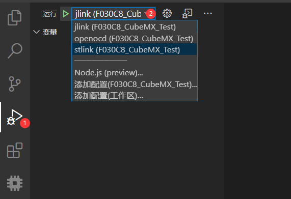
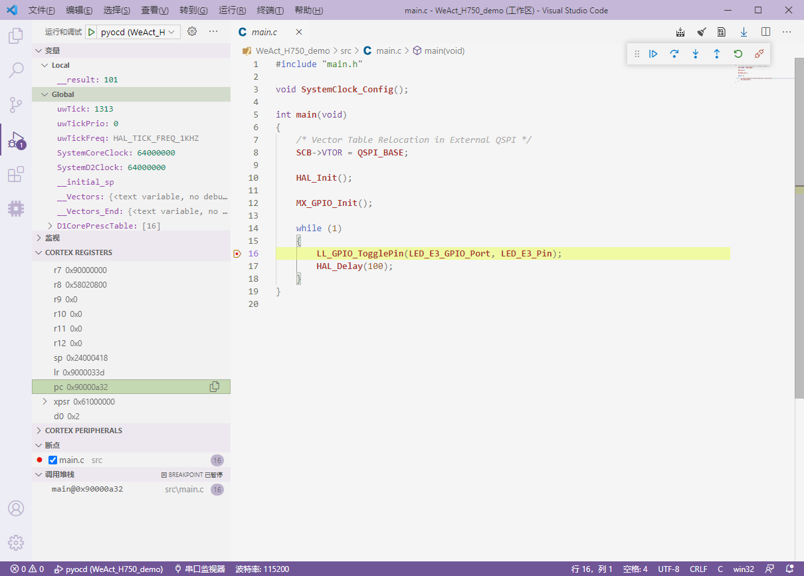

# Debug your program 🔧

Eide automatically generates debug configurations for different burners, which you can use as a template to write your own debug configurations

## Prepare Work

- Debug ARM project

  **To debug the ARM project, install [cortex-debug](https://marketplace.visualstudio.com/items?itemName=marus25.cortex-debug)**

  **For information on how to configure and use Cortex-Debug, see the Cortex-Debug home page or see this blog [Cortex-debug usage](https://discuss.em-ide.com/blog/67-cortex-debug)**

- Debug STM8 project

  **To debug the STM8 project, install [stm8-debugger](https://marketplace.visualstudio.com/items?itemName=CL.stm8-debug)**

- Debug 8051 project ?

  **No debugger for 8051 is available, so debugging of 8051 project is not supported !**

***

## Start Debug

1. Open the flash configuration, configure it (**Eide automatically generates debug configurations for different flasher**)
   
2. Open launch.json, check config，[how to config](https://discuss.em-ide.com/blog/67-cortex-debug)

3. Click the **Debug** icon in the vscode sidebar to switch to the Debug view, and click the Debug configuration drop-down to switch to the appropriate configuration

  

4. Connect your board, and when everything is ready, press F5 to start the debugger and start debugging.

  

***

## Attach Debug Mode

> Cortex-debug supports attaching a debugger to a running program, so that GDB can skip the process of downloading programs to FLASH before debugging.
>
> Attach debug Mode is suitable for programs running in external FLASH, because to program external FLASH, it needs to use the corresponding download algorithm. In normal debugging mode, GDB will download the program to FLASH before debugging, but for external FLASH, GDB does not know which download algorithm to use. Therefore, the download will fail, so that the debugging can not enter; The attach mode skips the download process and sends debugging commands directly to the chip to debug mode, which ensures that debugging can start normally

1. Open launch.json, make the following changes：
  
    - make `request` field value to `attach`

    - delete `runToMain` field

2. Click the **Debug** icon in the vscode sidebar to switch to the Debug view, and click the Debug configuration drop-down menu to switch to the modified configuration

3. Connect your board, and when everything is ready, press F5 to start the debugger and start debugging.

  This example uses STM32H750VBT6 + external QSPI-flash, the program is running in the external FLASH, the PC register value is `0x90000a32`

  

!> **Note:** Before debugging, you must ensure that the program has been downloaded to the chip and is running, so that the debugger can be attached to the program

