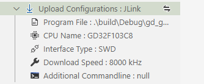

# Flash Program 💾

> Note: You may need to set the installation path for some flasher. If the installation path is set to empty, the plug-in will search the environment variable for the location of its executable file.

## Install Flasher

Eide supports a variety of flash tools, but these tools are not integrated into the eide installation package, so you will need to install the appropriate flash tools before using the flash function.

There are two installation methods: **automatic installation** and **manual installation**

### Automatic Installation

Click the download button to trigger the download. Eide will check whether the corresponding flash tool has been installed. If the flash tool is not found, a prompt box will pop up indicating whether to install it.


### Manual Installation

Download the corresponding flash tool and set the corresponding path in **plug-in Settings**.

How to do it ? See this section for a description of each flash tool.

***

## C51 Project

### Use stcgal

#### Install

> 1. Install **Python3**
>
> 2. Install **stcgal** module by command: `pip3 install stcgal --user`

!> Stcgal is a third-party flash tool. If it doesn't work, you are advised to use the flash tool provided by the chip manufacturer.

#### Chip Support

Stcgal supports a limited number of chip models, see: https://github.com/grigorig/stcgal/blob/master/doc/MODELS.md

```ini
# The following chip support information is taken from the stcgal documentation

stcgal should fully support STC 89/90/10/11/12/15/8 series MCUs.

So far, stcgal was tested with the following MCU models:

* STC89C52RC (BSL version: 4.3C/6.6C)
* STC90C52RC (BSL version: 4.3C)
* STC89C54RD+ (BSL version: 4.3C)
* STC12C2052 (BSL version: 5.8D)
* STC12C2052AD (BSL version: 5.8D)
* STC12C5608AD (BSL version: 6.0G)
* STC12C5A16S2 (BSL version: 6.2I)
* STC12C5A60S2 (BSL version: 6.2I/7.1I)
* STC11F02E (BSL version: 6.5K)
* STC10F04XE (BSL version: 6.5J)
* STC11F08XE (BSL version: 6.5M)
* STC12C5204AD (BSL version: 6.6H)
* STC15F104E (BSL version: 6.7Q)
* STC15F204EA (BSL version: 6.7R)
* STC15L104W (BSL version: 7.1.4Q)
* STC15F104W (BSL version: 7.1.4Q and 7.2.5Q)
* IAP15F2K61S2 (BSL version: 7.1.4S)
* STC15L2K16S2 (BSL version: 7.2.4S)
* IAP15L2K61S2 (BSL version: 7.2.5S)
* STC15W408AS (BSL version: 7.2.4T)
* STC15W4K56S4 (BSL version: 7.3.4T, UART and USB mode)
* STC8A8K64S4A12 (BSL version: 7.3.9U)
* STC8F2K08S2 (BSL version: 7.3.10U)
```

#### Usage

There are many configurations for downloading STC, which will be carried out in the configuration file. You can click the button below to open the configuration

**If this step is ignored, the default configuration is used**, [default configuration](https://github.com/grigorig/stcgal/blob/master/doc/USAGE.md)


**"[]" symbol** describes the chip models suitable for this configuration, for example: **\[ALL\]** Indicates applicable to **all** models


Note: stcgal is used in the same way as the official STC flash tool, after the panel outputs the **Cycling power done**, the STC chip needs to be **reset or turned off and then powered on** so that the chip can detect ISP commands and enter the download process.

### Use stcflash

#### Install

> 1. Install **Python3**
> 
> 2. Install **pyserial** module by command：`pip3 install pyserial --user`
> 
> 3. Download [stcflash.py](https://github.com/sms-wyt/stcflash/blob/master/stcflash.py), **and copy to the project directory**.

!> stcflash is a third-party flash tool. If it doesn't work, you are advised to use the flash tool provided by the chip manufacturer.

#### Usage

- First click to switch the flash tool to Custom, as shown below

  

- Then modify the `Command Line` property and fill in the burning command of stcflash, as shown in the following example([Custom Flash Command](en-us/docs/download_to_device?id=custom-flash-command)):
  
  `python ./tools/stcflash.py -p ${port} "${hexFile}"`

- Click download button, start flash process

- The command line prompts that the chip is being detected. In this case, you need to reset the chip to enter the download process

***

## STM8 Project

> For now, we only supports STVP flash tools for STM8.

### Use STVP

> STVP official version download address: https://www.st.com/zh/development-tools/stvp-stm8.html
> 
> STVP mini version download address：https://cloud.github0null.io/s/R4SY?path=%2F%E7%83%A7%E5%BD%95%E5%B7%A5%E5%85%B7

After installation, you need to set the absolute path of `stvp_cmdline.exe` in the eide plug-in settings

Open vscode settings, input: `EIDE.STM8.STVP.CliExePath` in search box, search to STVP after setting, the paths to fill in to it


The configuration page of the STVP tool is shown


!> **Note:** If you need to set option bytes to enable the related peripherals, open STVP to complete the configuration of option bytes, and then generate a hex or bin file. Then add this file path to the project's STVP flash setting: 'Option Byte file path'

After modifying the configuration, connect STLink and click the download button to start downloading


***

## ARM Project

eide support 4 flash tools


### Use JLink

> To use JLink, JLink software must be installed and the version of JLink software must be V6.50 or later
> 
> JLink_V650 download: https://www.segger.com/downloads/jlink/JLink_Windows_V650.exe

After installed, open vscode settings and type in the search bar: `EIDE.JLink.InstallDirectory`

After finding the JLink settings, enter the installation directory of the JLink in the input box to set the JLink path


Then open the "Flash Configuration" bar of the EIDE project, switch to JLink, and configure

After configuration, click "Download program" button for flash



#### Select Chip Name

- When using the JLink burn function, you can specify the **chip name** and type the name in the input box to filter from the list of available chips

  

- Eide will get a list of available chips at startup from **jlink.exe** and **jlinkdevices.xml in the JLink installation directory**

  If you want to use the **jlinkdevices.xml** file in another path, you can specify it through the plug-in setting **eide.jlink.DeviceXmlPath**

- When you change the contents of **jlinkdevices.xml**, you can use the **eide.ReloadJlinkDevs** command to reload the list of JLink chips

  

### Use STLink

> For STLink, This software uses 'STLink Utility' as the flash tool
> 
> STLink Utility download：https://www.st.com/zh/development-tools/stsw-link004.html
>
> V2.12.3 and later versions, we compatible with the use of **STM32CubeProgramer** tool for flash

After installed, open vscode settings and type in the search bar: `EIDE.STLink.ExePath`

After finding the STLink settings, **find the location of `xxx_CLI.exe` in `STLink Utility`/`STM32CubeProgramer` installation directory**, and fill the full path into the input box to complete the STLink path setting


Then open the "Flash Configuration" bar of the EIDE project, switch to STLink, and configure

After configuration, click "Download program" button for flash


### Use pyocd

> Note: Python3 support is required for Pyocd
>
> Pyocd is mainly used to support DAPLink and STLink

1. Input `pip3 install pyocd` in terminal to install pyocd

2. Download [usblib](https://github.com/libusb/libusb/releases/tag/v1.0.21)

**After unpacking usblib, copy libusb.dll to the python.exe directory. Note: The selected libusb.dll must be the same architecture as python installed on your computer, for example: Python3_x86 corresponds to the DLL in the MS32 directory**

 

1. Connect to the target board and type `Pyocd List` on the command line to check whether PyOCd works properly. If there is no problem, the list of connected devices will be output

 

4. Open the EIDE project and configure the flash settings
   
   - Type the name of the target chip

     

   - Run the `pyocd list -t` command to check the **built-in** chips that support. If the chip name specified in the previous step exists, **can skip the next step**; otherwise, proceed to the next step

     

   - Open the config property and configure the keil package path that contains the chip (the package path can use the **relative path** relative to the workspace root directory). If the full keil package is too large, use a simplified version of the repository address, repo addr: https://cloud.github0null.io/s/R4SY?path=%2Fpyocd%20%E8%8A%AF%E7%89%87%E5%8C%85

     Tip: This configuration file can also be filled in with other PyOCD configuration options. For details, see [pyocd config docs](https://github.com/pyocd/pyOCD/tree/master/docs)

     

5. Connect the target board and click download button to start the download

 

***

### Use OpenOCD

> OpenOCD-v0.10.0 download: https://cloud.github0null.io/s/R4SY?path=%2F%E7%83%A7%E5%BD%95%E5%B7%A5%E5%85%B7

1. Search `EIDE.OpenOCD.ExePath` in vscode settings, and setup openocd full path

 

2. Switch flash config to OpenOCD，setup `target` and `interface`。

 

3. Click download button to start flash

 


#### Notice:

- The plug-in will search for available `cfg` configuration files from the following directories

  - **Current workspace:**

    `.`

    `.eide`

    `tools`

  - **The OpenOCD installation directory:**

    `scripts`

    `share/openocd/scripts`

***

## **Custom Flash Command**

> If you want to use another program that supports the command line, you can use the `custom shell command` to flash

### Usage

Click first to switch the flash tool to shell, as shown below


Then modify the `command line` property and fill in the corresponding command for the burn tool you want to use

The command line supports some variables, such as:

- `${programFile}`: Program file path (`.hex, .bin, .s19`)

- `${port}`: `Available serialport` (**Note: If more than one serial port is available, this value is the first in the list of serial ports**)

### Example

> Tip: The flash software executable file path in the example command has been set to an environment variable

```bash
# Use NuLink to flash nuvoton mcu
NuLink -w APROM "${programFile}"

# Use stcflash flash 8051 mcu
python ./tools/stcflash.py -p ${port} "${programFile}"

# Use STM32CubeProgramer + STLink flash STM32
STM32_Programmer_CLI -c port=SWD FREQ=4000 mode=NORMAL reset=SWrst --download "${programFile}" -v --go

# Use STM32CubeProgramer + STLink And through the external loading algorithm to burn the program to STM32H750 QSPI Flash
STM32_Programmer_CLI -c port=SWD FREQ=4000 mode=NORMAL reset=SWrst -el ./STM32H7xx_W25Q128_WeAct.stldr --download "${programFile}" -v --go
```
