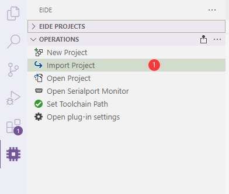
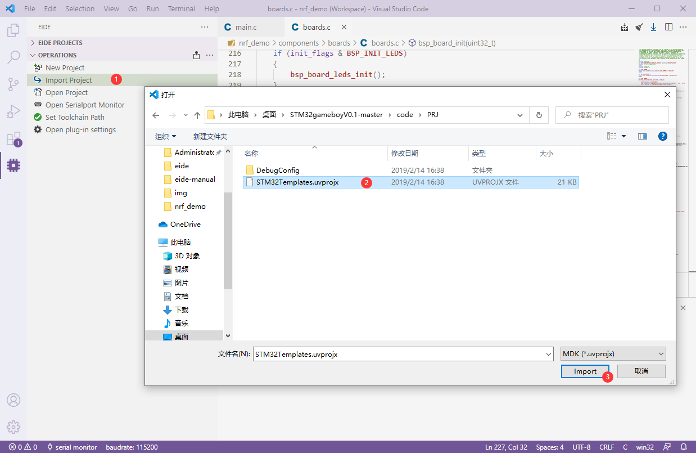
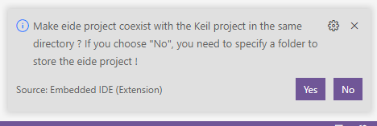
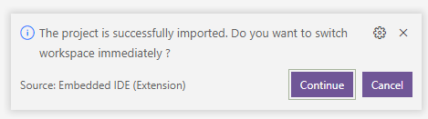
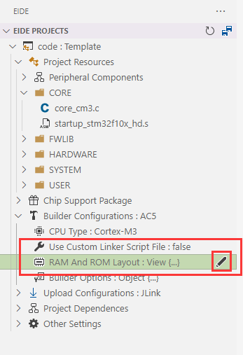
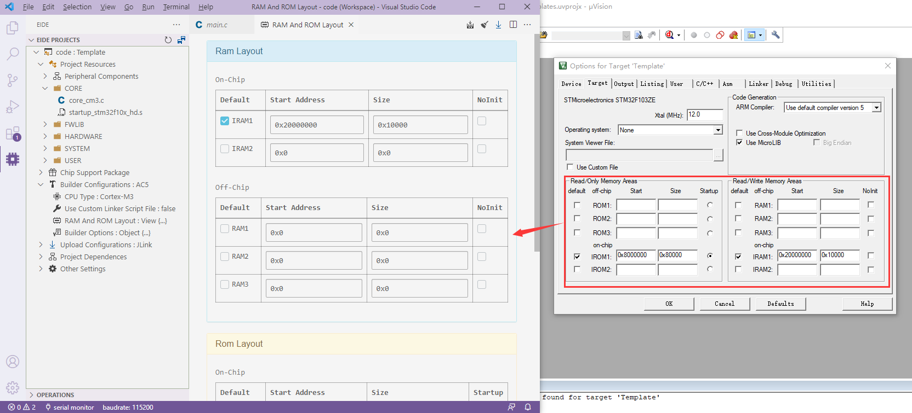
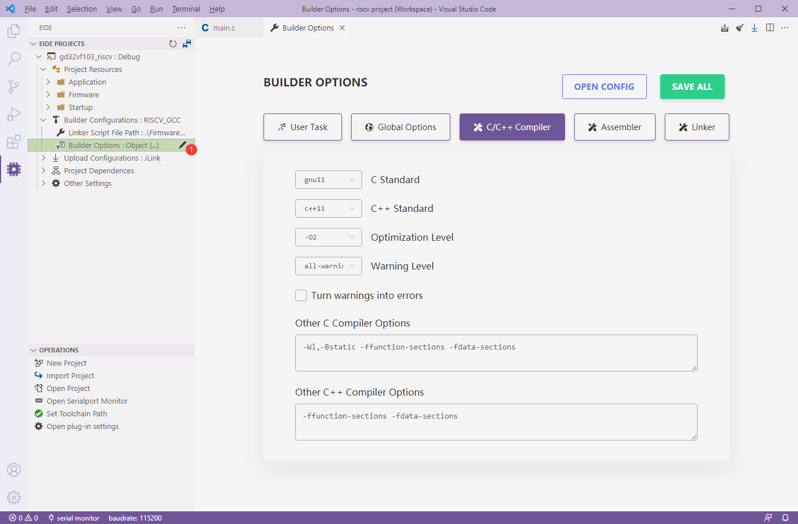
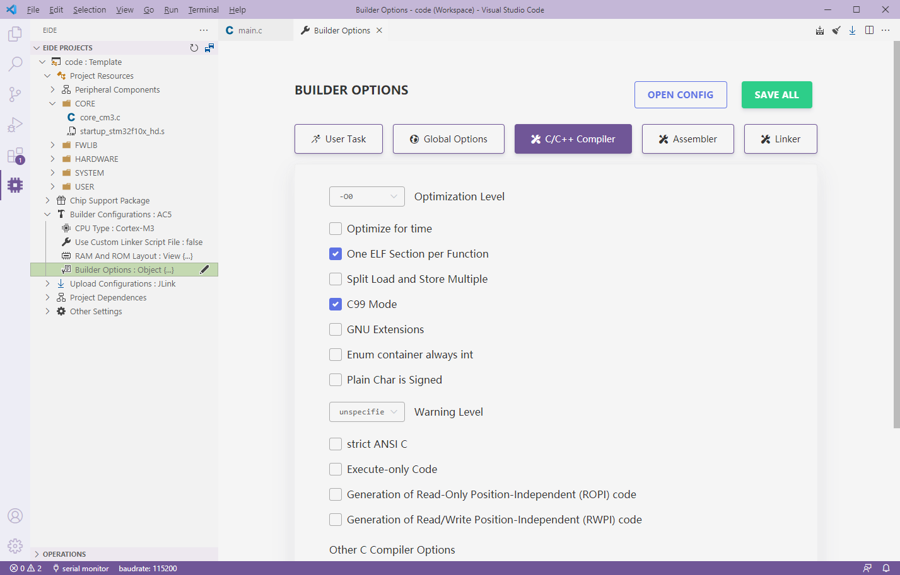
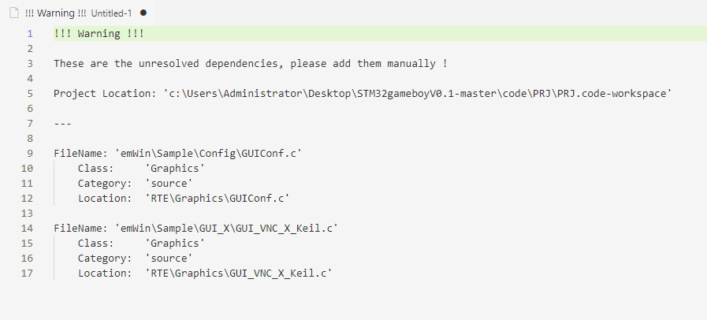

# Import Keil Project

> This function must be supported by V2.0.0 or later

Eide supports importing KEIL C51 and KEIL ARM projects and organizing source files by virtual folders

## Steps

1. Open **OPERATIONS** Toolbar, and click **Import Project**

  

2. Select Keil Project File. (KEIL ARM Project: `*.uvprojx`, KEIL C51 Project: `*.uvproj`)

  

3. Select the location to save the project; Select **Yes**, eide project will coexist with KEIL project **in the same folder**, select **No**, you will need **to specify a new folder for eide projects**

  

4. Import Done ! Select whether to switch workspaces immediately.

  

5. **If you import an ARM project, you also need to set the build configuration because the project import facility does not import the MDK build configuration**
   
   - Modify **Use custom linker Script** to `false`, and click **RAM/FLASH Layout** option to modify it.

   

   - This will open the FLASH layout editor, open your MDK project, copy the layout information to the appropriate location in the editor, and click the **below to save**
   
    

   - Open the **compiler option** of the project, set the configuration in the **C/C++, ASM, linker TAB** of MDK to the corresponding field, save after setting

   

6. After modification, you can click the build button to start the build

!> The import function only supports **KEIL 5** and later versions of the project, forcibly importing **KEIL 4** project will failed

## Notice

- When importing KEIL project, the **compilation option** of KEIL project will not be imported. Please set it in eide after importing KEIL project. For details, refer to `Step 5` above

  

  > Goto [Builder Options](en-us/docs/builder_config?id=builder-options) read docs

- Some projects use MDK RTE components. If the location of the components cannot be found during import, the plugin will pop up an **Import Warning**. You will need to manually add these unimported files to the project after import, as shown below:

  
