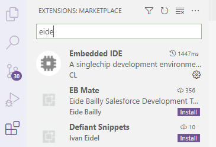
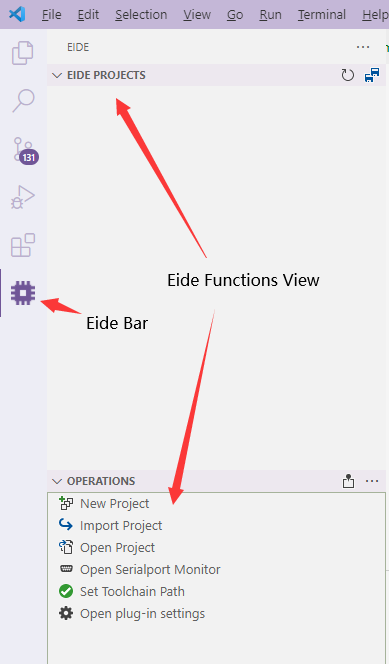

# Install

> **Environment Requirements**
> 
> - `OS Requirements`：Windows 7 and later
> 

!> Note: Since version **v2.9.0**, the runtime of the builder has been changed to 'Mono' and therefore does not require any .NET environment

*** 

- The Embedded IDE is integrated into vscode as a plug-in, so you first need to search for and install it in the vscode plug-in store

  

- After the plug-in is installed, the Embedded IDE icon will appear in vscode activity bar. Click on it to open the Embedded IDE feature area

  

