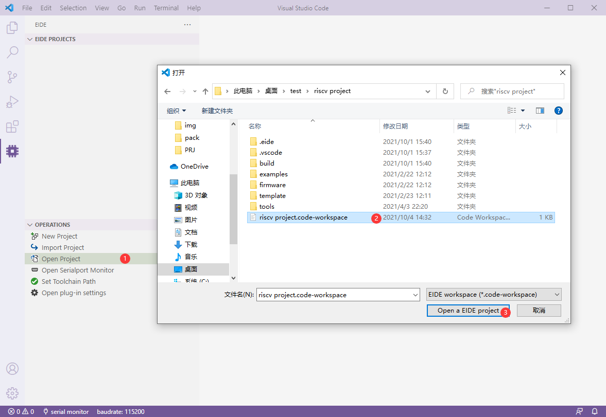

# Open Project

> There are two ways to open the project: `double click workspace file` or `click operations bar button`

## Double-click on the VsCode workspace file to open

> Double-click the .code-workspace file and vscode will open the workspace and eide will be able to load projects in the workspace.

!> Note: opening the project root directory directly with VsCode will not open the project, because eide will only search and load the project in the workspace.

## Click "Open Project" in the operations bar

