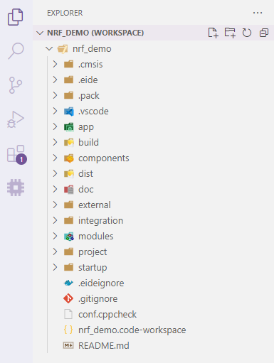

# Prepare Work

## Setup Toolchain Path

Compilers are too large to be packaged with extensions, so you must manually install the compiler tool you want to use, and then set its installation path in the 'Set toolchain Path' option so that EIDE can find it.

> **Note: You only need to set the installation path of the compiler you want to use**
> 
> Note: If the compiler installation path is set to empty, the plug-in will search the path in the system environment variables (except ARMCC,KEIL_C51)

**"Set Toolchain Path"** The icon of the option indicates the state of the toolchain path settings
 - : A toolchain has been setup
 - : Installation paths have not been set for any toolchains

## Project Structure

Before you start your project, you need to understand the basic folder structure of your EIDE project

### Project Files

- `.eide`: Eide project folder, which stores eIDE project information, logs and other files
- `.vscode`: vscode config folder
- `.pack`: The location where the chip support package is installed (it will only appear if the chip support package is installed for the project)
- `build`: EIDE's default compilation output directory, where compiled files are stored and can be modified in the project's `Other Settings`
- `*.code-workspace`: VS Code workspace file, which exists for every EIDE project. **!!! Don't Delete This File !!!**

### User Files

Files or folders other than `Project Files` belong to and are managed by users themselves

