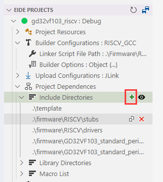

# Project Dependences 

## Include Directorys

**Add/Delete Include Directorys**

> You can add/remove search paths for header files by including directory functionality

!> Note: add the same path repeatedly will not have any effect, nor will any prompt appear.

**Show all include directorys**

> You can use this feature to view all the include paths of the current project

The image below shows the effect of this feature

> Each include path is followed by a label, which will appear in a darker color, that indicates where the path originated

- `custom`: This include path is manually added by the user
- `build-in`: This is the include path built into the toolchain
- `source`: This path is automatically searched from the source file directory
- `STMxxxx`: This path comes from the component installed in the Keil package. **The name of this label is the name of the Keil package**

***

## Library Directorys

Specify the search path for static libraries and linked scripts by adding the library directory (usually specified with the '-L' argument in the GCC family of toolchains)

!> Note: this function only supports **GCC**, **SDCC** series compilers, if you are using other series compilers, please add **static library binaries (xx.a, XXX.o...)** directly to the project.

***

## Macros

You can specify macros for source files by adding macro definitions

> Tip: You can add more than one macro at one time. For example: enter `ST;DEBUG;_RTE_` will add the macros `ST`, `DEBUG`, and `_RTE_` to the project at once

!> Note: This feature only works with C/C++ source files. **If you want add a macros for asm source files, go to 'Builder options' ->'Assembler' to add the macros. Format of the assembler shown below.**

**Assembler** Macros format:

| Assembler Type | Format (`<key>` is macro name，`<value>` is macro value) |
|:--|:--|
| ARMCC 5/6 | `"<key> SETA <value>"` |
| ARMCC 6（asm-clang） | `<key>=<value>` |
| ARM GCC | `<key>=<value>` |
| RISCV GCC | `<key>=<value>` |
| SDCC | `<key>=<value>` |
| IAR STM8 | `<key>=<value>` |

***
