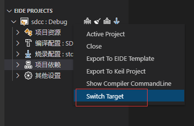
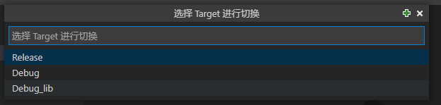

# 项目多目标

> 需要 v1.23.1 及以上版本

eide 允许为项目创建多个目标(Target)，即 **不同的项目配置**

每个目标(Target)的 **源文件排除列表**，**编译配置**，**烧录配置**，**项目依赖** 都是相互独立的

- 右键项目，点击 Switch Target

 

- 出现一个对话框，现在可以 **切换** 到不同的 Target, 或者 **新建**，**删除** 一个 Target

 

 > 在 **新建** Target 时, 相关项目参数会从当前 Target 进行继承

