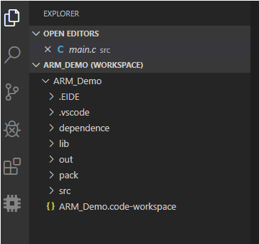

[EIDE](https://marketplace.visualstudio.com/items?itemName=CL.eide): A Keil C51/STM32 **project migration tool** and **IDE** with multiple toolchains. Provide development, compilation, burning, management functions for **8051**, **stm32** projects on vscode. Keil 5 version is mainly supported.

***

[TOC]

***

## last update time: 2020/3/29 11:55
***

## Be sure to check the plug-in's CHANGE.LOG after each update for version changes
### [CHANGE.LOG](https://marketplace.visualstudio.com/items/CL.eide/changelog)

***
## Project directory basic structure

- `.EIDE` Directory of project files and EIDE log location
- `dependence` Dependencies of project, where the content is automatically added, created, and managed by EIDE, and added by using [add-dependencies](# 从包中添加依赖项)
- `out` Default output directory, where the compiled files are stored
- `pack` ARM package installation location, the user does not need to change the contents of this folder
- `src` Directory of source files. You can add new directories to it by [add-source-dir](#添加新的源文件目录到搜索列表中)

> Other unlisted directories are not managed by EIDE, are not created by EIDE, and are managed by the developer

## Start

Before start your project, you need to set path of the keil's **TOOLS.INI** file, otherwise the **Compilation** function will not work properly because the plug-in needs to use keil's compilation tool

**For non-keil toolchains, go to plug-in Settings to set the toolchain path**

**The two paths are set as required. If you only need to develop 8051, then the ARM path can be ignored. And vice versa**

- ### Keil path settings
	- `Green`✅: All path ok !
	- `Orange exclamation point`⚠: One of paths is invalid, click 'Set Keil path', there is a description behind of option: **Verified** or **Invalid**. This description represents the state of the path Settings, as shown in the figure below
	
	- `red`❌：All of paths are invalid
	
***

- ### Open project

Open project: You can not only open a project by the **Open project** menu option, but also open **workspace file** directly by vscode. I suggest using to use **the latter**

***
	
- ### Create and import project

- #### Manually create


- #### Import from Keil 5

**Attention:** Files with **".uvproj"** suffix must be C51 project. Files with **".uvprojx"** suffix must be Keil MDK project


The **storageLayout** is RAM/ROM layout. if you choose **useCustomScatterFile**(use custom ARM/GCC linker file)，the option **storageLayout** will be ignore.

- #### Create by projetct template
	> Creating a project is a tedious process, especially with STM32, and you may feel boring with copying and pasting folders.
	With the template function, we can quickly build the main framework of the project, remove those tedious and meaningless process.
	There are two ways to choose a template: **from disk** or **from Github remote repository**.
	for Github way, Users can set their own template repository location, repository must be public, beacause plug-in can't access to private repository
	default repository location [eide-doc](https://github.com/github0null/eide-doc), The author keeps some simple project templates in the repository, The author will continue to add.
    

***
## Install Keil package

> If you don't want to manually copy the chip's HAL library; You can do this by installing the Keil package and then installing the peripheral components. The installed components will appear in the "dependence" directory, the content includes the required source files, header files, and so on, which are automatically added to the compilation process


***

## Compile project

### Toolchain description (For non-keil toolchains, go to plug-in Settings to set the toolchain path)

#### 8051

**Supported toolchain**: Keil_C51, SDCC

**Attention**: The Keil_C51 linker and assembler used by the plug-in are **LX51** and **AX51**, not **BL51** and **A51**

***

#### ARM

**Supported toolchain**：ARMCC V5, ARMCC V6, GCC for ARM

***

### Compile configuration

#### Path variable

The available path variables in afterBuildTasks, beforeBuildTasks, with case-insensitive variable names

> variables name: ${targetName}, 		meaning: Output the file name for hex
> variables name: ${exeDir}, 			meaning: Directory where the build tool resides
> variables name: ${binDir}, 			meaning: Tool chain root directory
> variables name: ${OutDir}, 			meaning: Project output directory
> variables name: ${CompileToolDir}, 	meaning: Directory where the compiler is located
> variables name: ${toolPrefix}, 		meaning: Toolchain prefix for GCC, like: "arm-none-eabi-"
> .
> example: del "${OutDir}\\*.o", 		meaning: Delete all .o files in the output directory
> 

***

#### C51/SDCC

For **SDCC** configurations, as shown in the figure below

1. Where there is an option with **<>**, the content contained by **<>** should be replaced with **a certain value**, as shown in the figure below
2. When you successfully replace the value in <>, the json validator will generate a warning and you should ignore it, as shown below
3. Hover of option with **[]**, and the content contained by **[]** represents **the device for which this option applies**, as shown below


***

#### ARM

Open**Compile Configuration**: Click **options** button to open configuration


**Compile Configuration**:


**Switch toolchain**:

***

### Start compile

shortcut key:

 - **Build**: F6
 - **Fast Build**: F9, description: Only the source files that have changed are compiled

***

#### C51

***

#### ARM


##### 多线程编译模式（v1.6.0+）

**If multithreaded mode is turned on (by default) and the number of files compiled is >= 16, the compilation is done using multithreaded mode, mainly to speed up the compilation**
       
**Here are some comparisons. 'compile time' is a stable value after multiple compilations**

`Disable multithreaded`


`Enable multithreaded`


`keil Enable multithreaded`


***

## Download to device board

### C51 (only supported for STC, [stcgal tools](https://github.com/grigorig/stcgal))

> This tool requires **Python3** support
> Before start, you need to install the stcgal tool
> Install command: **pip3 install stcgal --user**

- There are a lot of downloaded configuration of STC 51, which will be carried out in the configuration file. You can click the button below to open the configuration (if there is no configuration, a new configuration file will be created in the EIDE directory).

**If you ignore this step, the default configuration is used**, The default configuration is [stcgal usage](https://github.com/grigorig/stcgal/blob/master/doc/USAGE.md)


"[]" describes the type of chip suitable for this configuration, for example: "[ALL]" means suitable for ALL types


**Start download**:

[stcgal tool](https://github.com/grigorig/stcgal) usage is the same as STC's official recording tool，**After the panel outputs "Cycling power done"**，You need to reset the STC chip so that you can detect the ISP command and enter the download process.

If there is no problem with the configuration, the connection will exit after the download is completed. If there is an error in the configuration, it will fail and prompt. Please pay attention to the **prompt message** after the failure.


###  ARM

**v1.8.0** and later versions **will not come with the built-in JLink flash tool**, **please go to the plug-in options to set the JLink installation path**

**You must configure the chip type and other Settings before downloading**

***

## Export project

### Export as a Keil project


### Export as a project template
> If you want to share your template with others, you can use pull-request to submit it to the default repository [eide-doc](https://github.com/github0null/eide-doc)

**The compression project will take some time, and the prompt will pop up after the export**


**The default exclude directory, which will not be included in the exported template**


***

## Serialport Monitor

> Before using the serial port monitor, you must set up the serial port configuration in plug-in settings.
> Default setting: `Baud rate`：9600, `bit width`：8, `Parity`：无, `stop bit`：1，`mode`：Receive Mode(only receive)

### Monitor mode


#### Receive Mode (receive mode, receive only, for log printing)


#### Send and Receive Mode (two-way mode, transceiver, suitable for debugging serial port)
`The following figure is an example of debugging WIFI module ESP-01S`

***

## General Options

### Add dependencies from keil package
- 'dependence' directory is used to hold the added dependencies;Dependencies contain header files, source files, and asm files related to peripherals, All added dependencies are added to the compilation process

***
### add a source dir
- All subdirectories of the added directory are also automatically added to the search directory, so there is no need to add subdirectories separately

***

### Removes a source directory from the search list. The operation does not remove the directory from disk

****

### Add include directories


***

### Add a precompiled macro

***

## Attentions and FAQ

### Attention

#### SDCC

##### Compiler Options

When SDCC starts the link, **the first .rel file to be linked must be generated from the source file with the main() function**, so you must set the source file name with the main() function

**default name is main** (The main() function is in main.c)，as shown in the figure below

***

#### Fast build

Compile only the files that have been modified, which means that if you change only some global macro switches in the macro definition list, you must recompile completely. If you still compile quickly, the files affected by these macros **will not participate in the compilation** and will not produce the desired results.
***

### C51 FAQ
#### QUESTIONS: Can not open the serialport
It is possible that other programs occupied the serial port, causing conflicts; `Answer` : close the program occupying the serial port to retry

***

### STM32 FAQ

none

***

## tips

### Hex to bin, the ARM project has been added automatically
Add command to **Compile options**->**afterBuildTasks**

```json
{
	"name": "Output bin",
    "command": "\"${exeDir}\\hex2bin\" -b -c \"${outDir}\\${targetName}.hex\""
}
```
***

### 
