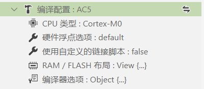
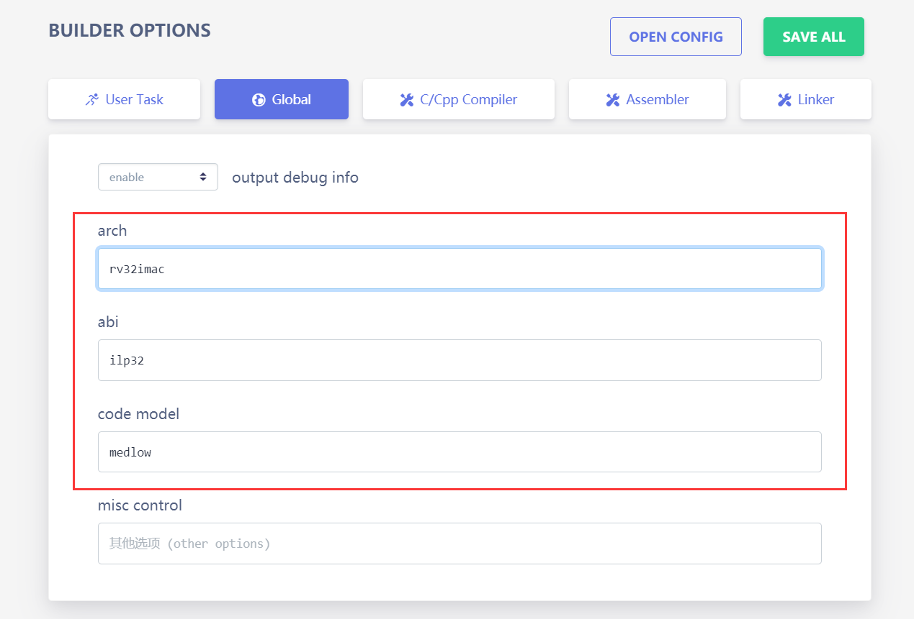
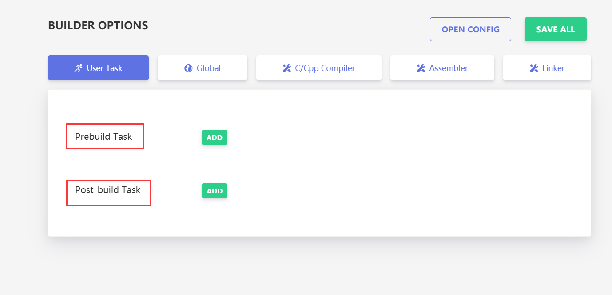
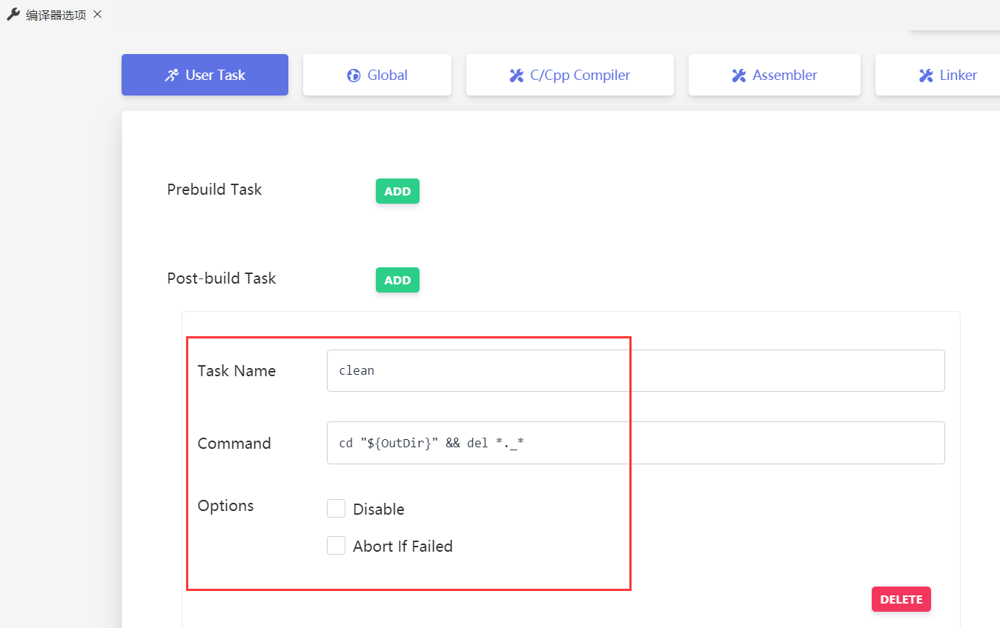

# 构建配置介绍

## 编译选项

> 自 v2.4.0 版本起，eide 使用 Web 页面进行编译器参数的配置

点击 **构建配置** -> **编译器选项** 的修改按钮即可打开参数配置页面


### 8051/STM8 工程

?> 略

***

### ARM工程

> 对于 ARM 工程，会有一些公共的构建配置，如下



- **CPU 类型**：Cortex 系列名
  
- **硬件浮点选项**：CPU 的硬件浮点开关
  
- **使用链接脚本**：是否要使用自定义的链接脚本
  - `打开`此项，会出现一个**链接脚本路径**选项，你需要指定一个链接脚本路径
  
    

  - `关闭`此项，会出现一个**RAM/FLASH布局**选项，你需要打开它为芯片设置储存器的地址大小信息
  
    


#### AC5/AC6 (ARMCC) 工具链

?>略

***

#### ARM-GCC 工具链

?>略

***

### RISC-V 工程

RISC-V 有一些比较重要的选项字段，需要根据情况设置, 如下



- `arch` **字段**: 
  
  含义：对应 `-march=` 选项，用于指定 **目标处理器的指令集**

  默认值：`rv32imac`

- `abi` **字段**:
  
  含义：对应 `-mabi=` 选项，用于指定 **整数和浮点调用约定 (integer and floating-point calling convention)**

  默认值：`ilp32`

- `code-model` **字段**:
  
  含义：对应 `-mcmodel=` 选项，用于指定 **代码模型 (code model)**

  默认值：`medlow`

***

## 用户命令

> eide 支持在 **编译前** 和 **编译完成后** 附加一些自定义的用户命令，方便进行其他操作

打开 **编译器选项**->**User Task** 其中：

  - `Prebuild Task` 代表**构建开始前**要执行的操作

  - `Post-build Task` 代表**构建结束后**要执行的操作



命令中可用的 **路径变量**, 变量名不区分大小写：

>变量名：\${targetName}，含义：项目名称；
>
>变量名：\${exeDir}，含义：eide 内置构建工具所在目录；
>
>变量名：\${ToolDir}，含义： 编译工具链根目录；
>
>变量名：\${OutDir}，含义：项目输出目录；
>
>变量名：\${CompileToolDir}，含义：编译工具所在目录；
>
>变量名：\${toolPrefix}, 含义：GCC 工具链前缀，如: arm-none-eabi-

示例，加入以下命令到 Post-build Task：`cd "${OutDir}" && del *._*`，含义：在编译结束后删除输出目录下所有匹配 `*._*` 的文件



***

### 常用命令

#### 通过 HEX 生成 Bin 文件

命令:

```ini
"${exeDir}\hex2bin.exe" -b -c "${outDir}\${targetName}.hex"
```

#### ARMCC 生成 S19 格式的烧录文件

命令:

```ini
"${CompileToolDir}\fromelf" --m32combined -o "${OutDir}\${targetName}.s19" "${OutDir}\${targetName}.axf"
```

