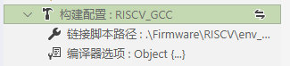

# 构建配置介绍

## 编译选项

> 自 v2.4.0 版本起，eide 使用 Web 页面进行编译器参数的配置

点击 **构建配置** -> **编译器选项** 的修改按钮即可打开参数配置页面


***

### 8051/STM8 工程

- **编译器选项**：关于编译器的相关参数和选项

***

### AC5/AC6 (ARMCC) 工程


- **CPU 类型**：Cortex 系列名
  
- **硬件浮点选项**：CPU 的硬件浮点开关
  
- **使用链接脚本**：是否要使用自定义的链接脚本
  
  - `打开`此项，会出现一个**链接脚本路径**选项，你需要指定一个链接脚本路径
  
    

  - `关闭`此项，会出现一个**RAM/FLASH布局**选项，你需要打开它为芯片设置储存器的地址大小信息
  
    

    

- **编译器选项**：关于编译器的相关参数和选项

***

#### ARM-GCC 工程


- **CPU 类型**：Cortex 系列名

- **链接脚本路径**：GCC 的链接脚本路径

- **编译器选项**：关于编译器的相关参数和选项

***

### RISC-V 工程



- **链接脚本路径**：RISCV GCC 的链接脚本路径

- **编译器选项**：关于编译器的相关参数和选项

RISC-V 的 CPU 选项位于 **编译器选项**->**Global**，需要根据情况设置, 如下


- `arch` **字段**: 
  
  含义：对应 `-march=` 选项，用于指定 **目标处理器的指令集**

  默认值：`rv32imac`

- `abi` **字段**:
  
  含义：对应 `-mabi=` 选项，用于指定 **整数和浮点调用约定 (integer and floating-point calling convention)**

  默认值：`ilp32`

- `code-model` **字段**:
  
  含义：对应 `-mcmodel=` 选项，用于指定 **代码模型 (code model)**

  默认值：`medlow`

***

## 用户命令

> eide 支持在 **编译开始前** 和 **编译完成后** 附加一些自定义的用户命令（**命令使用 cmd 执行**），方便进行其他操作

打开 **编译器选项**->**User Task** 其中：

  - `Prebuild Task` 代表**构建开始前**要执行的操作

  - `Post-build Task` 代表**构建结束后**要执行的操作


### 命令变量

命令中可用的 **变量**, 变量名**不区分**大小写：

|变量名|含义|
|:----|:----|
|`${targetName}`|项目名称| 
|`${ProjectRoot}`|项目根目录|
|`${OutDir}`|编译输出目录|
|`${BuilderFolder}`|eide 内置构建工具所在目录|
|`${ToolchainRoot}`|编译器根目录|
|`${CompilerPrefix}`|GCC 编译器前缀, 例如: arm-none-eabi-|
|`${CompilerFolder}`|编译器可执行文件所在目录|


示例，加入以下命令到 Post-build Task：`cd "${OutDir}" && del *._*`，含义：在编译结束后删除输出目录下所有匹配 `*._*` 的文件


***

### 常用命令

> **这里有一些常用的命令可供参考**

```ini

# 查看内部的环境变量
powershell -Command ls env:

# 打印 GCC 版本
"${CompilerFolder}/${toolPrefix}gcc" -v

# ARMCC 生成 S19 格式的烧录文件
"${CompilerFolder}\fromelf" --m32combined -o "${OutDir}\${targetName}.s19" "${OutDir}\${targetName}.axf"

# GCC 生成 hex 文件
"${CompilerFolder}\${CompilerPrefix}objcopy" -O ihex "${OutDir}\${TargetName}.elf" "${OutDir}\${TargetName}.hex"

# GCC 生成 bin 文件
"${CompilerFolder}\${CompilerPrefix}objcopy" -O binary "${OutDir}\${TargetName}.elf" "${OutDir}\${TargetName}.bin"

# 使用 hex2bin 从 hex 文件生成 bin 文件
"${BuilderFolder}\hex2bin.exe" -b -c "${outDir}\${targetName}.hex"

# 复制生成的 .hex .bin 文件到 dist 目录
mkdir .\dist & copy /B "${OutDir}\${targetName}.hex" .\dist\ & copy /B "${OutDir}\${targetName}.bin" .\dist\

# 复制生成的 .a 文件到 dist 目录
mkdir .\dist & copy /B "${OutDir}\${targetName}.a" .\dist\lib${targetName}.a

```
