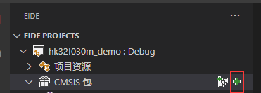
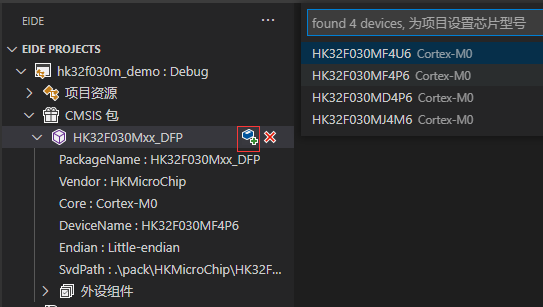
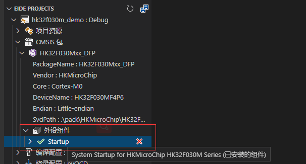

# 安装芯片支持包 (仅用于ARM工程)

> 你可以为芯片安装支持包，用来为项目添加芯片信息、添加外设组件
> 
> **安装芯片支持包不是必须的，可根据需求决定是否安装**

## 下载

芯片支持包可以从以下位置下载：

 - [keil 官网](https://www.keil.com/dd2/pack)

 - [eide 共享文件夹](https://cloud.github0null.io/s/R4SY?path=%2FKEIL%20%E5%8C%85)

## 安装

- 单击 安装 按钮，从文件资源管理器中选择一个下载好的包，然后安装

 

- 安装成功后，你可以为你的项目选择芯片

 

- 之后，你还可以查看或启用 keil package 内部附带的外设库组件

 
