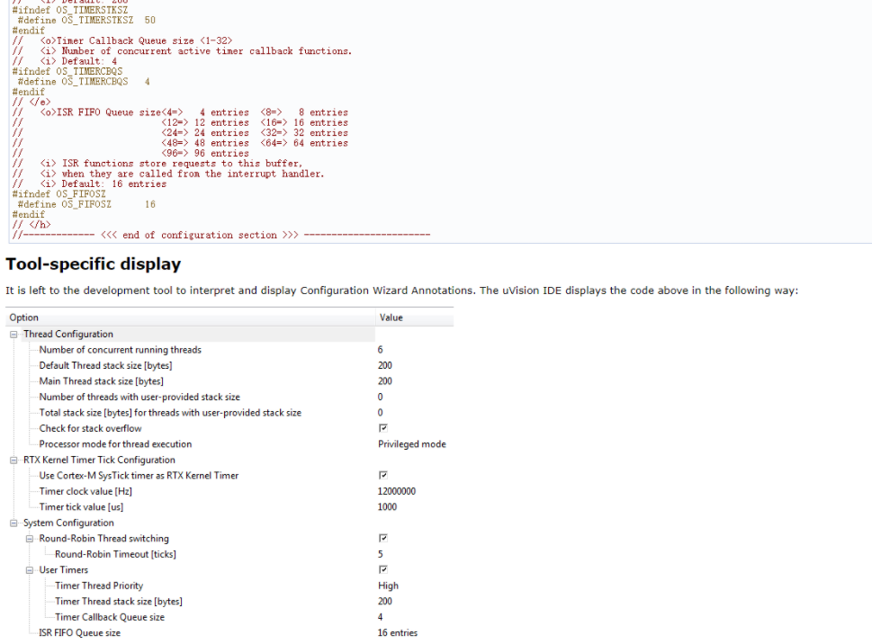

# CMSIS Configuration Wizard

[CMSIS Configuration Annotations](https://arm-software.github.io/CMSIS_5/Pack/html/configWizard.html) 是一种注释格式，用于结构化地描述内含大量宏定义头文件

通过一定的工具对其进行解析，可以生成 GUI 配置向导，方便用户查看和修改头文件中的配置

Keil上效果如下（截图来自官网）：



***

## 用法

目前 eide 上也集成了 CMSIS Configuration Wizard 功能，使用起来也十分简单。

1. 打开 **带有 CMSIS Configuration Annotations 格式** 的头文件，右键菜单选择 CMSIS Configuration Wizard 即可打开
   
   !> **不带有 CMSIS Configuration Annotations 格式** 的头文件，**无法使用该功能**

   

2. CMSIS Configuration Wizard 配置 UI 会以一个新的页面打开，修改相应配置，按下 `Save All` 或者 `ctrl+s` 即可保存
   
   
   
   选中相应的配置项，点击 `Open Header`，即可跳转至相应的行

   

***

## CMSIS Configuration 格式

### 基本规则

Configuration Wizard Annotations consist of annotation items and annotation modifiers. They create GUI-like elements in IDEs for configuration files (see Tool-specific display). Using a GUI-like approach makes it easier for the user to check and adapt configuration files to the application needs. The following rules apply:

- The Configuration Wizard section must begin within the first 100 lines of code and must start with the following comment line:
```
// <<< Use Configuration Wizard in Context Menu >>>
```
- The Configuration Wizard section can end with the following optional comment:
```
// <<< end of configuration section >>>
```
- Annotations are written as comments in the code. Each annotation line must start with a double forward slash (//).
- By default, the next code symbol that follows the annotation is modified.
- Items marked with * in the table below can be followed by a skip-value. A skip-value omits a number of code symbols (see skip example in table). This overwrites the previous rule.
- Items marked with + in the table below can be followed by an identifier. When an identifier is present, the next code symbol following the symbol that matches the identifier is modified. See identifier example in the table. An identifier can not be used together with a skip-value.
- A descriptive text can be added to items. This text is displayed on screen (see table).
- Whitespace characters are ignored in annotation items or annotation modifiers (text excluded).
- You must not use < or > within configuration wizard lines other than for enclosing annotation items.

### 语法细节

<table class="cmtable" summary="Annotations Tab">
<tbody><tr>
<th>Item </th><th>Text </th><th>Description  </th></tr>
<tr>
<td>&lt;h&gt; </td><td>yes </td><td>Heading. Creates a header section. All items and options enclosed by &lt;h&gt; and &lt;/h&gt; belong to one group and can be expanded. This entry makes no changes to code symbols. It is just used to group other items and modifiers. <br>
 Excerpt from the <a class="el" href="configWizard.html#configWizard_codeExample">Code Example</a> <div class="fragment"><div class="line"><span class="comment">// &lt;h&gt;Thread Configuration                               -- header without checkbox to group other items</span></div>
<div class="line"><span class="comment">//   ...</span></div>
<div class="line"><span class="comment">// &lt;/h&gt;</span></div>
</div><!-- fragment --> Is the header entry as shown in <a class="el" href="configWizard.html#configWizard_display">Tool-specific display</a>.   </td></tr>
<tr>
<td>&lt;e&gt;<sup>*+</sup> </td><td>yes </td><td>Heading with enable. Creates a header section with a checkbox to enabled or disabled all items and options enclosed by &lt;e&gt; and &lt;/e&gt;. Excerpt from the <a class="el" href="configWizard.html#configWizard_codeExample">Code Example</a>. <div class="fragment"><div class="line"><span class="comment">// &lt;e&gt;Round-Robin Thread switching                       -- header with checkbox</span></div>
<div class="line"><span class="comment">// ===============================</span></div>
<div class="line"><span class="comment">//</span></div>
<div class="line"><span class="comment">// &lt;i&gt; Enables Round-Robin Thread switching.             -- tooltip information for the header</span></div>
<div class="line"><span class="preprocessor">#ifndef OS_ROBIN</span></div>
<div class="line"><span class="preprocessor"></span><span class="preprocessor">#define OS_ROBIN 1                                       -- this value is set through the checkbox</span></div>
<div class="line"><span class="preprocessor"></span><span class="preprocessor">#endif</span></div>
<div class="line"><span class="preprocessor"></span><span class="comment">// &lt;o&gt;Round-Robin Timeout [ticks] &lt;1-1000&gt;</span></div>
<div class="line"><span class="comment">// &lt;i&gt; Defines how long a thread will execute before a thread switch.</span></div>
<div class="line"><span class="comment">// &lt;i&gt; Default: 5</span></div>
<div class="line"><span class="comment">// &lt;d&gt; 5</span></div>
<div class="line"><span class="preprocessor">#ifndef OS_ROBINTOUT</span></div>
<div class="line"><span class="preprocessor"></span><span class="preprocessor">#define OS_ROBINTOUT 5</span></div>
<div class="line"><span class="preprocessor"></span><span class="preprocessor">#endif</span></div>
<div class="line"><span class="preprocessor">// &lt;/e&gt;</span></div>
</div><!-- fragment --> The entry <code>&lt;e&gt;Round-Robin Thread switching ... &lt;/e&gt;</code> sets OS_ROBIN to <span class="XML-Token">1</span> (checkbox enabled) or <span class="XML-Token">0</span> (checkbox disabled) and encloses the <em>OS_ROBINTOUT</em> (Round-Robin Timeout) setting. See screen outcome in <a class="el" href="configWizard.html#configWizard_display">Tool-specific display</a>.   </td></tr>
<tr>
<td>&lt;e.<em>i</em>&gt;<sup>*+</sup> </td><td>yes </td><td>Heading with Enable: modifies a specific bit (<em>i</em>) (example: &lt;e.4&gt; - changes bit 4 of a value). <div class="fragment"><div class="line"><span class="comment">// &lt;e.4&gt;Serial Number</span></div>
<div class="line"><span class="comment">// &lt;i&gt;Enable Serial Number String.</span></div>
<div class="line"><span class="comment">// &lt;i&gt;If disabled, Serial Number String will not be assigned to USB Device.</span></div>
<div class="line"><span class="preprocessor">#define USBD0_STR_DESC_SER_EN           1</span></div>
</div><!-- fragment --> The example creates the heading <span class="XML-Token">Serial Number</span> and a checkbox to set the value. If enabled, then bit 4 of <span class="XML-Token">USBD0_STR_DESC_SER_EN</span> is set.   </td></tr>
<tr>
<td>&lt;/h&gt;, &lt;/e&gt;, or &lt;/c&gt; </td><td>yes </td><td>Heading, Enable, or Comment end.  </td></tr>
<tr>
<td>&lt;n&gt; </td><td>yes </td><td>Notification text displayed <div class="fragment"><div class="line"><span class="comment">// &lt;n&gt; This is shown as plain text</span></div>
</div><!-- fragment -->   </td></tr>
<tr>
<td>&lt;i&gt; </td><td>yes </td><td>Tooltip help for previous item. <div class="fragment"><div class="line"><span class="comment">// &lt;i&gt;This is shown as a tooltip when hovering over a text.</span></div>
</div><!-- fragment --> Many examples in this table have tooltip examples.   </td></tr>
<tr>
<td>&lt;d&gt; </td><td>yes </td><td>Default value for previous item. <div class="fragment"><div class="line"><span class="comment">// &lt;o MODE&gt; Operation Mode</span></div>
<div class="line"><span class="comment">// &lt;modeOne=&gt; Mode 1</span></div>
<div class="line"><span class="comment">// &lt;modeTwo=&gt; Mode 2</span></div>
<div class="line"><span class="comment">// &lt;d&gt; modeOne</span></div>
<div class="line"><span class="comment">// #define MODE       modeTwo</span></div>
</div><!-- fragment --> Binary options, such as &lt;e&gt; and &lt;q&gt;, use <code>0</code> and <code>1</code> to signify "disabled" and "enabled", respectively. Annotating options with a default value enables tools to implement "reset to default" functionality.   </td></tr>
<tr>
<td>&lt;c&gt;<sup>*</sup> </td><td>yes </td><td>Code enable: creates a checkbox to uncomment or comment code. All lines, including those with white spaces, get commented with double slashes (//) at the first found character when you disable the checkbox. <div class="fragment"><div class="line"><span class="comment">// &lt;c1&gt; Comment sequence block until block end when disabled</span></div>
<div class="line"><span class="comment">//&lt;i&gt; This may carry the block's description</span></div>
<div class="line"></div>
<div class="line">foo</div>
<div class="line"></div>
<div class="line">+bar</div>
<div class="line"></div>
<div class="line">-xFoo</div>
<div class="line"><span class="comment">// &lt;/c&gt;</span></div>
</div><!-- fragment --> In this example, the item is enabled, so that the sequence block is not commented.   </td></tr>
<tr>
<td>&lt;!c&gt;<sup>*</sup> </td><td>yes </td><td>Code disable: creates a checkbox to comment or uncomment code. All lines, including those with white spaces, get commented with double slashes (//) at the first found character when you enable the checkbox. <div class="fragment"><div class="line"><span class="comment">// &lt;!c1&gt; Comment sequence block until block end when enabled</span></div>
<div class="line"><span class="comment">//&lt;i&gt; This may carry the block's description</span></div>
<div class="line"><span class="comment">//</span></div>
<div class="line"><span class="comment">//foo</span></div>
<div class="line"><span class="comment">//</span></div>
<div class="line"><span class="comment">//+bar</span></div>
<div class="line"><span class="comment">//</span></div>
<div class="line"><span class="comment">//-xFoo</span></div>
<div class="line"><span class="comment">// &lt;/c&gt;</span></div>
</div><!-- fragment --> In this example, the item is enabled, so that the sequence block is commented.   </td></tr>
<tr>
<td>&lt;q&gt;<sup>*+</sup> </td><td>yes </td><td>Option for bit values which can be set via a checkbox. <div class="fragment"><div class="line"><span class="comment">//  &lt;h&gt; Chip-select control</span></div>
<div class="line"><span class="comment">//     &lt;q&gt; ASYNCWAIT: Wait signal during asynchronous transfer</span></div>
<div class="line"><span class="comment">//      &lt;i&gt; Enables the FSMC to use the wait signal even during an asynchronous protocol.</span></div>
<div class="line"><span class="comment">// &lt;/h&gt;</span></div>
<div class="line"><span class="preprocessor">#define RTE_FSMC_BCR1_ASYNCWAIT         0                             -- this is changed via a checkbox</span></div>
</div><!-- fragment -->   </td></tr>
<tr>
<td>&lt;o&gt;<sup>*+</sup> </td><td>yes </td><td>Option with selection or number entry. <div class="fragment"><div class="line"><span class="comment">// &lt;o&gt;Round-Robin Timeout [ticks] &lt;1-1000&gt;                             -- text displayed on screen. Range of [ticks] is [1..1000] </span></div>
<div class="line"><span class="comment">// &lt;i&gt; Defines how long a thread will execute before a thread switch.  -- tooltip info</span></div>
<div class="line"><span class="comment">// &lt;i&gt; Default: 5                                                      -- tooltip info. Both displayed in one tooltip.</span></div>
<div class="line"><span class="comment">// &lt;d&gt; 5                                                               -- default value</span></div>
<div class="line"><span class="preprocessor">#ifndef OS_ROBINTOUT</span></div>
<div class="line"><span class="preprocessor"></span><span class="preprocessor">#define OS_ROBINTOUT 5</span></div>
<div class="line"><span class="preprocessor"></span><span class="preprocessor">#endif</span></div>
<div class="line"><span class="preprocessor">// &lt;/e&gt;</span></div>
</div><!-- fragment --> The example creates an option with the text <span class="XML-Token">Round-Robin Timeout [ticks]</span> and a field to enter values that can range between [1..1000].   </td></tr>
<tr>
<td>&lt;o.<em>i</em>&gt;<sup>*+</sup> </td><td>yes </td><td>Modify a single bit (example: &lt;e.4&gt; - modifies bit 4). <div class="fragment"><div class="line"><span class="comment">// &lt;o.4&gt; &lt;o.0&gt;High-speed</span></div>
<div class="line"><span class="comment">//   &lt;i&gt;Enable High-speed functionality (if device supports it).</span></div>
<div class="line"><span class="preprocessor">#define USBD0_HS                        0</span></div>
</div><!-- fragment --> The example creates a heading with the text <span class="XML-Token">High-speed</span> and a checkbox. If enabled, then bit 4 of <span class="XML-Token">USBD0_HS</span> is set.   </td></tr>
<tr>
<td>&lt;o.<em>x</em>..<em>y</em>&gt;<sup>*+</sup>  </td><td>yes </td><td>Modify a range of bits. (example: &lt;o.4..5&gt; - bit 4 to 5). <div class="fragment"><div class="line"><span class="comment">//   &lt;h&gt;String Settings</span></div>
<div class="line"><span class="comment">//   &lt;i&gt;These settings are used to create the String Descriptor.</span></div>
<div class="line"><span class="comment">//     &lt;o.0..15&gt;Language ID &lt;0x0000-0xFCFF&gt;</span></div>
<div class="line"><span class="comment">//     &lt;i&gt;English (United States) = 0x0409.</span></div>
<div class="line"><span class="comment">//   &lt;/h&gt;</span></div>
<div class="line"><span class="preprocessor">#define USBD0_STR_DESC_LANGID           0x0409</span></div>
</div><!-- fragment --> This example creates an expandable header with the text <span class="XML-Token">String Settings</span> and an option <span class="XML-Token">Language ID</span>. The range of values is set to <span class="XML-Token">&lt;0x0000-0xFCFF&gt;</span>. Users can enter a value from within that range. The option changes the bits <span class="XML-Token">0..15</span>.   </td></tr>
<tr>
<td>&lt;s&gt;<sup>*+</sup> </td><td>yes </td><td>Option with ASCII string entry. <div class="fragment"><div class="line"><span class="comment">//  &lt;s&gt;Manufacturer String</span></div>
<div class="line"><span class="comment">//  &lt;i&gt;String Descriptor describing Manufacturer.</span></div>
<div class="line"><span class="preprocessor">#define USBD0_STR_DESC_MAN              L"Keil Software"</span></div>
</div><!-- fragment --> Displays an option with the text <span class="XML-Token">Manufacturer String</span> and creates a field in which the user can enter a text. The size of the string is not limited.   </td></tr>
<tr>
<td>&lt;s.<em>i</em>&gt;<sup>*+</sup> </td><td>yes </td><td>Option with ASCII string entry and a size limit of <em>i</em> characters. <div class="fragment"><div class="line"><span class="comment">//  &lt;s.126&gt;Manufacturer String</span></div>
<div class="line"><span class="comment">//  &lt;i&gt;String Descriptor describing Manufacturer.</span></div>
<div class="line"><span class="preprocessor">#define USBD0_STR_DESC_MAN              L"Keil Software"</span></div>
</div><!-- fragment --> The example sets a size limit of 126 character. Default string is "Keil Software".   </td></tr>
<tr>
<td>&lt;a.<em>i</em>&gt;<sup>*+</sup> </td><td>yes </td><td><p class="starttd">Option for array entry and a size of <em>i</em> elements. </p>
<div class="fragment"><div class="line"><span class="comment">//  &lt;a.16 PUBLIC_KEY&gt; Public key for signing &lt;0..255&gt; &lt;f.h&gt;</span></div>
<div class="line"><span class="comment">//  &lt;d&gt; {0x00, 0x00, 0x00, 0x00, 0x00, 0x00, 0x00, 0x00, 0x00, 0x00, 0x00, 0x00, 0x00, 0x00, 0x00, 0x00}</span></div>
<div class="line"><span class="preprocessor">#define PUBLIC_KEY  {0x00, 0x01, 0x02, 0x03, 0x04, 0x05, 0x06, 0x07, 0x08, 0x09, 0x0A, 0x0B, 0x0C, 0x0D, 0x0E, 0x0F}</span></div>
</div><!-- fragment --><p> The example makes use of the value range modifier to constrain each array element to byte size, has a default value of all-zero, and uses the format specifier to ensure it is displayed as hexadecimal in the tool.</p>
<p class="endtd">GUI tools should support array lengths up to 64 elements.   </p>
</td></tr>
<tr>
<td><em><b>skip example</b></em> <br>
 &lt;q<em>n&gt;</em>; <br>
 &lt;o<em>n&gt;</em>; &lt;o<em>n</em>.<em>i&gt;</em>; <br>
 &lt;s<em>n&gt;</em>; &lt;s<em>n</em>.<em>i&gt;</em>  </td><td>n/a </td><td>Skip <em>n</em> items. Can be applied to all annotation items marked with a <code>*</code> in this table. <div class="fragment"><div class="line"><span class="comment">// &lt;o2&gt;Skip 2 and modify the third item after this entry &lt;1-9&gt;</span></div>
<div class="line"><span class="preprocessor">#define VALUE1       1000</span></div>
<div class="line"><span class="preprocessor"></span><span class="preprocessor">#define VALUE2       2000</span></div>
<div class="line"><span class="preprocessor">#define MODIFY_THIS  3000</span></div>
</div><!-- fragment --> The example skips 2 items and modifies the third.   </td></tr>
<tr>
<td><em><b>identifier example</b></em> <br>
 &lt;q <em>identifier&gt;</em> <br>
 &lt;e <em>identifier&gt;</em> <br>
 &lt;o <em>identifier&gt;</em> <br>
 &lt;s <em>identifier&gt;</em> <br>
 &lt;e.<em>i</em> <em>identifier&gt;</em> <br>
 &lt;o.<em>i</em> <em>identifier&gt;</em> <br>
 &lt;s.<em>i</em> <em>identifier&gt;</em>  </td><td>n/a </td><td>Modify the item given by the identifier. Can be applied to all annotation items marked with a <code>+</code> in this table. <div class="fragment"><div class="line"><span class="comment">// &lt;o MODIFY_THIS&gt;Modify the item after "MODIFY_THIS" &lt;1-9&gt;</span></div>
<div class="line"><span class="preprocessor">#define VALUE1       1000</span></div>
<div class="line"><span class="preprocessor"></span><span class="preprocessor">#define VALUE2       2000</span></div>
<div class="line"><span class="preprocessor">#define MODIFY_THIS  3000</span></div>
</div><!-- fragment --> The example modifies the third item, as it follows the given identifier.   </td></tr>
<tr>
<th>Modifier </th><th>&nbsp; </th><th>Description  </th></tr>
<tr>
<td>&lt;0-31&gt; </td><td>no </td><td><b>(deprecated<sup>1</sup>, see new range modifier below)</b><br>
Value range for option fields. Both endpoints are inclusive.  </td></tr>
<tr>
<td>&lt;0-100:10&gt; </td><td>no </td><td><b>(deprecated<sup>1</sup>, see new range modifier below)</b><br>
Value range for option fields with step 10. Both endpoints are inclusive.  </td></tr>
<tr>
<td>&lt;0x40-0x1000:0x10&gt; </td><td>no </td><td><b>(deprecated<sup>1</sup>, see new range modifier below)</b><br>
Value range in hex format and step 16. Both endpoints are inclusive.  </td></tr>
<tr>
<td>&lt;-32..31&gt; </td><td>no </td><td>Value range for option fields supporting negative numbers. Both endpoints are inclusive.  </td></tr>
<tr>
<td>&lt;-50..100:10&gt; </td><td>no </td><td>Value range for option fields with step 10 supporting negative numbers. Both endpoints are inclusive.  </td></tr>
<tr>
<td>&lt;-0x40..0x1000:0x10&gt; </td><td>no </td><td>Value range in hex format and step 16 supporting negative numbers. Both endpoints are inclusive.  </td></tr>
<tr>
<td>&lt;<em>value</em>=&gt; </td><td>yes </td><td>Creates a drop down-list and displays the <em><b>text</b></em>. <em><b>value</b></em> is written to the next item. Excerpt from the <a class="el" href="configWizard.html#configWizard_codeExample">Code Example</a>. <div class="fragment"><div class="line"><span class="comment">//   &lt;o&gt;Timer Thread Priority                                            -- creates a drop-down with the list below.</span></div>
<div class="line"><span class="comment">//                        &lt;1=&gt; Low</span></div>
<div class="line"><span class="comment">//     &lt;2=&gt; Below Normal  &lt;3=&gt; Normal  &lt;4=&gt; Above Normal</span></div>
<div class="line"><span class="comment">//                        &lt;5=&gt; High</span></div>
<div class="line"><span class="comment">//                        &lt;6=&gt; Realtime (highest)</span></div>
<div class="line"><span class="comment">//   &lt;i&gt; Defines priority for Timer Thread                               -- tooltip info</span></div>
<div class="line"><span class="comment">//   &lt;i&gt; Default: High                                                   -- tooltip info</span></div>
<div class="line"><span class="comment">//   &lt;d&gt; 5                                                               -- default value</span></div>
<div class="line"><span class="preprocessor">#ifndef OS_TIMERPRIO</span></div>
<div class="line"><span class="preprocessor"></span><span class="preprocessor">#define OS_TIMERPRIO   5</span></div>
<div class="line"><span class="preprocessor">#endif</span></div>
</div><!-- fragment --> In this example, the screen would show the option <span class="XML-Token">Timer Thread Priority</span>. The field Value would display the text <span class="XML-Token">High</span>. OS_TIMERPRIO is set to <span class="XML-Token">5</span>. When clicking on the field, a drop-down would show all options. See <a class="el" href="configWizard.html#configWizard_display">Tool-specific display</a>.   </td></tr>
<tr>
<td>&lt;<em>identifier</em>=&gt; </td><td>yes </td><td><p class="starttd">Creates a drop down-list and displays the <em><b>text</b></em> following the definition of the identifiers <span class="XML-Token">dwt</span>, <span class="XML-Token">systick</span> and <span class="XML-Token">user</span>. Note that this can only be used with options taking a key identifier (&lt;o <em>identifier&gt;</em>). The <em><b>identifier</b></em> corresponding to the selected text replaces the identifier following the key-identifier specified by the &lt;o ...&gt; tag. </p>
<div class="fragment"><div class="line"><span class="comment">//   &lt;o TIMESTAMP_SRC&gt;Time Stamp Source</span></div>
<div class="line"><span class="comment">//      &lt;dwt=&gt;     DWT Cycle Counter</span></div>
<div class="line"><span class="comment">//      &lt;systick=&gt; SysTick</span></div>
<div class="line"><span class="comment">//      &lt;user=&gt;    User Timer </span></div>
<div class="line"><span class="comment">//   &lt;i&gt;Selects source for 32-bit time stamp</span></div>
<div class="line"><span class="preprocessor">#define TIMESTAMP_SRC  dwt</span></div>
</div><!-- fragment --><p> In this example, the screen would show the option <span class="XML-Token">Time Stamp Source</span>. The field value would display the text <span class="XML-Token">DWT Cycle Counter</span>. TIMESTAMP_SRC is set to <span class="XML-Token">dwt</span>. When clicking on the field, a drop-down would show all options. See <a class="el" href="configWizard.html#configWizard_display">Tool-specific display</a>.</p>
<p class="endtd">Use case for an assignment of an enumeration to a variable: </p>
<div class="fragment"><div class="line"><span class="comment">//   &lt;o redPortMode&gt; Red port mode</span></div>
<div class="line"><span class="comment">//     &lt;OutPushPull_GPIO=&gt;  PushPull</span></div>
<div class="line"><span class="comment">//     &lt;OutOpenDrain_GPIO=&gt; OpenDrain</span></div>
<div class="line"><span class="comment">//   &lt;i&gt;Selects GPIO output</span></div>
<div class="line">ledConf.redPortMode = OutOpenDrain_GPIO;</div>
</div><!-- fragment --><p> The example creates an option with the text <span class="XML-Token">Red port mode</span> and a drop down-list showing the text items <span class="XML-Token">PushPull</span> and <span class="XML-Token">OpenDrain</span>. The corresponding identifier <span class="XML-Token">OutPushPull_GPIO</span> or <span class="XML-Token">OutOpenDrain_GPIO</span> will be used to replace the identifier after the key-identifier <span class="XML-Token">redPortMode</span>.  </p>
</td></tr>
<tr>
<td>&lt;#+1&gt;&nbsp;&nbsp; &lt;#-1&gt;<br>
 &lt;#*8&gt;&nbsp;&nbsp; &lt;#/3&gt; </td><td>no </td><td>Modifies the entered or displayed value according to the operator (add, sub, mul, div). The changed value is set for the code symbol. <br>
 Excerpt from <a class="el" href="configWizard.html#configWizard_codeExample">Code Example</a>. <div class="fragment"><div class="line"><span class="comment">// &lt;o&gt;Default Thread stack size [bytes] &lt;64-4096:8&gt;&lt;#/4&gt;</span></div>
<div class="line"><span class="comment">// &lt;i&gt; Defines default stack size for threads with osThreadDef stacksz = 0</span></div>
<div class="line"><span class="comment">// &lt;i&gt; Default: 200</span></div>
<div class="line"><span class="preprocessor">#ifndef OS_STKSIZE</span></div>
<div class="line"><span class="preprocessor"></span><span class="preprocessor">#define OS_STKSIZE 50</span></div>
<div class="line"><span class="preprocessor">#endif</span></div>
</div><!-- fragment --> The option <em>Default Thread stack size [bytes]</em> accepts values in the range <span class="XML-Token">[64..4096]</span>. The value (here <span class="XML-Token">200</span>) set in the field is divided by <span class="XML-Token">4</span> (&lt;#/4&gt;) . The result of the division (200/4) is put into the code symbol <em>OS_STKSIZE</em>, which was set to <span class="XML-Token">50</span>. The screen will display the number <span class="XML-Token">200</span>. See <a class="el" href="configWizard.html#configWizard_display">Tool-specific display</a>.   </td></tr>
<tr>
<td>&lt;f.<em>format-specifier</em>&gt; </td><td>no </td><td>Format specifier for graphical display of integer value. The <em>format-specifier</em> must be one of <dl>
<dt>d</dt>
<dd>Decimal </dd>
<dt>h</dt>
<dd>Hexadecimal </dd>
<dt>o</dt>
<dd>Octal </dd>
<dt>b</dt>
<dd>Binary </dd>
</dl>
<div class="fragment"><div class="line"><span class="comment">// &lt;o MY_DECIMAL_1&gt; A decimal option &lt;f.d&gt;</span></div>
<div class="line"><span class="preprocessor">#define MY_DECIMAL_1    13         -- displayed as decimal "13" in the tool</span></div>
<div class="line"><span class="preprocessor"></span></div>
<div class="line"><span class="comment">// &lt;o MY_DECIMAL_2&gt; Another decimal option &lt;f.d&gt;</span></div>
<div class="line"><span class="preprocessor">#define MY_DECIMAL_2    0x10       -- displayed as decimal "16" in the tool</span></div>
<div class="line"><span class="preprocessor"></span></div>
<div class="line"><span class="comment">// &lt;o MY_HEX&gt; A hexadecimal option &lt;f.h&gt;</span></div>
<div class="line"><span class="preprocessor">#define MY_HEX          52         -- displayed as hexadecimal "0x34" in the tool</span></div>
</div><!-- fragment -->   </td></tr>
</tbody></table>

***

## 实现细节

本配置向导的功能细节参考 keil 中的实现，并没有完全实现 [CMSIS Configuration Annotations](https://arm-software.github.io/CMSIS_5/Pack/html/configWizard.html) 中的所有语法

**目前未实现的语法如下：**

1. 数组类型 
   
   

2. 以 `..` 作为分隔符的 Modifier

   

3. 数字的格式化显示功能

   

**注意事项：**

1. 对于 string 类型的宏定义，宏定义的值**必须为一个正常的字符串**，如下图：

   

   **不得为**任何其他的宏定义或者表达式，例如：

   ```cpp
   // <s> APP_USBD_STRINGS_LANGIDS - Supported languages identifiers.
   // <i> Note: This value is not editable in Configuration Wizard.
   // <i> Comma-separated list of supported languages.
   #ifndef APP_USBD_STRINGS_LANGIDS
   #define APP_USBD_STRINGS_LANGIDS APP_USBD_LANG_AND_SUBLANG(APP_USBD_LANG_ENGLISH, APP_USBD_SUBLANG_ENGLISH_US)
   #endif
   ```


