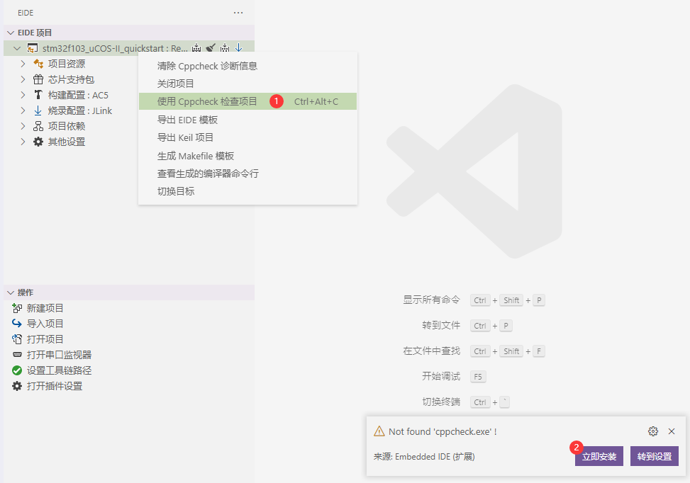
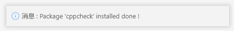
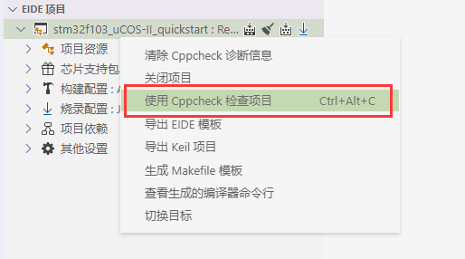
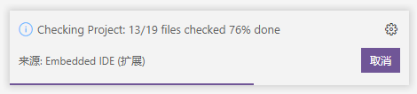
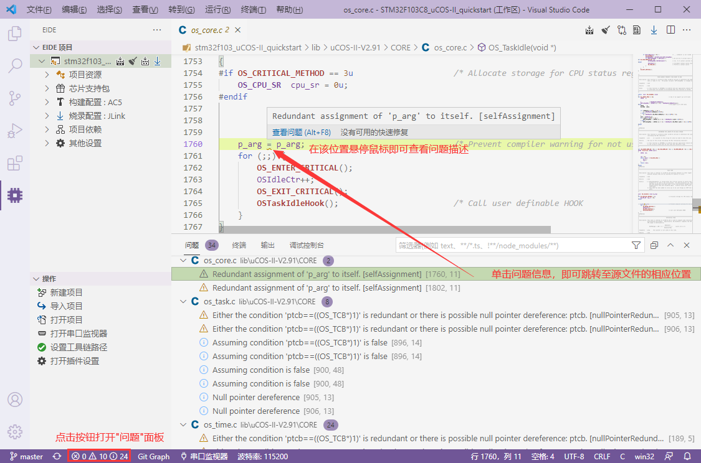
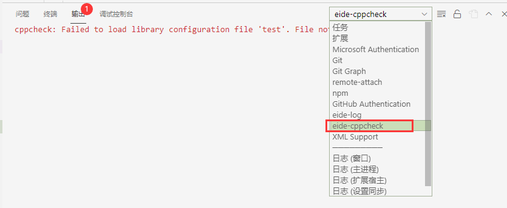

# 使用 Cppcheck 对项目进行静态检查

自 **v2.10.0** 起，eide 支持使用 cppcheck 对项目进行静态检查

## 安装

右键项目，在菜单中选择 `使用 Cppcheck 检查项目`，如果没有发现 cppcheck 可执行文件，则会弹出提示，点击 `立即安装`



安装完毕后，会弹出提示



!> 注意：若要手动下载安装，必须使用 [eide-resource](https://github.com/github0null/eide-resource/tree/master/packages) 仓库中的 cppcheck.7z 安装包，否则将缺失相关的配置文件 

***

## 使用

!> 注意：静态检查将忽略带有中文路径的文件

右键项目，在菜单中选择 `使用 Cppcheck 检查项目`，即可启动静态检查



启动后会弹出进度提示框，提示检查进度



检查完成后，点击状态栏的 `"问题"` 按钮即可打开**问题面板**查看相应的问题信息



> 如果要清除所有的诊断消息，右键项目，在菜单中选择 `清除 Cppcheck 诊断信息` 即可

***

## 相关细节

- 在运行静态检查前，eide 会生成一个 cppcheck 配置模板到当前工作区目录下，文件名为 `conf.cppcheck`

  如果要更改相关的 cppcheck 配置，可以修改该模板文件，保存后重新执行静态检查即可

  **注意：该文件的格式为 XML, 不正确的 XML 会导致 cppcheck 无法运行**
  
  该文件的默认内容为：

  ```xml
<?xml version="1.0" encoding="UTF-8"?>
<!-- !!! Embedded IDE: Cppcheck config template !!! -->
<project version="1">
    <builddir>${cppcheck_build_folder}</builddir>
    <platform>${platform}</platform>
    <analyze-all-vs-configs>false</analyze-all-vs-configs>
    <check-headers>true</check-headers>
    <check-unused-templates>true</check-unused-templates>
    <max-ctu-depth>2</max-ctu-depth>
    <max-template-recursion>100</max-template-recursion>
    <includedir>
        <!-- !!! DON'T MODIFY THE FLOLLOWING CONTENTS !!! -->
        ${include_list}
    </includedir>
    <defines>
        <!-- example: <define name="DEF=123"/> -->
        ${macro_list}
    </defines>
    <undefines>
        <!-- example: <undefine>UNDEF</undefine> -->
    </undefines>
    <paths>
        <!-- !!! DON'T MODIFY THE FLOLLOWING CONTENTS !!! -->
        ${source_list}
    </paths>
    <libraries>
        <!-- example: <library>gnu</library> -->
        ${lib_list}
    </libraries>
</project>

  ```

- 如果 cppcheck 运行不正常，或者无法启动，请打开输出面板，选择 `eide-cppcheck` 查看相关的错误提示，并进行反馈

  


- cppcheck 的中间临时目录位于 `<项目输出根目录>/.cppcheck`，一些临时文件将会被生成到该目录下

