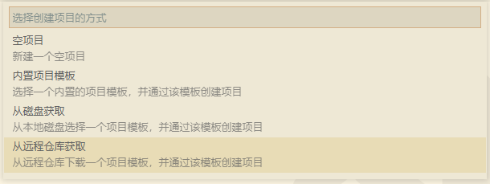
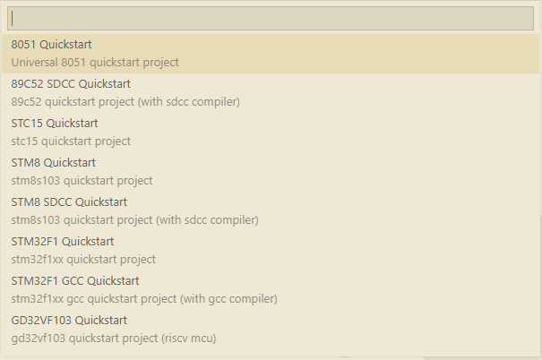
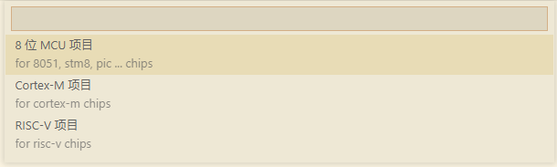
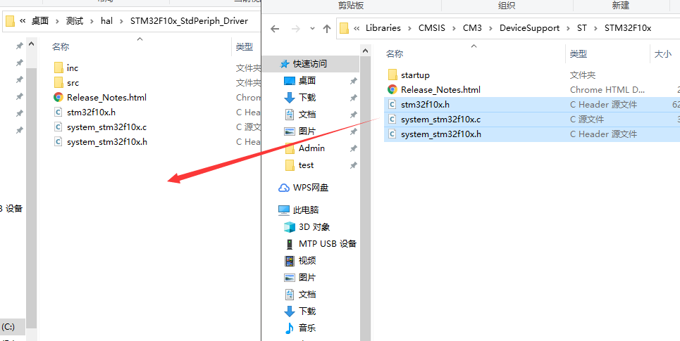
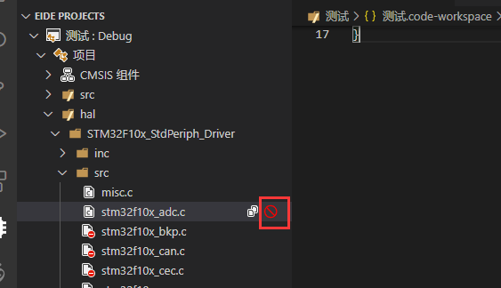
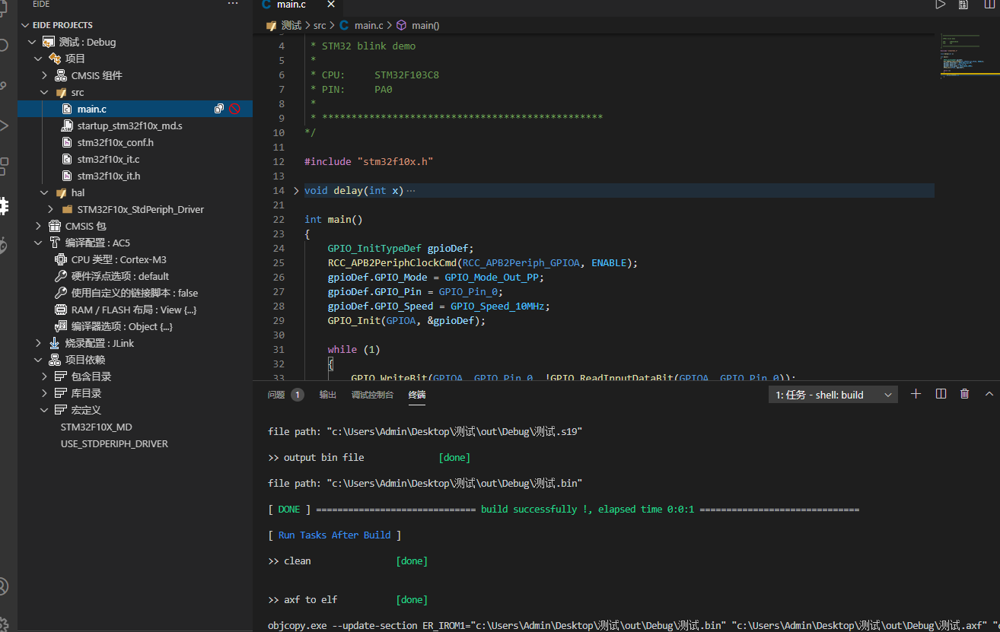

# 创建项目 📂

在 Operation 栏点击 `新建项目`, 会出现一个列表，可以选择 3 种创建项目的方式



## 从 Github 仓库拉取模板并创建工程 （建议使用此方式）

!> 注意：由于需要连接 Github，请确保网络良好，否则可能会连接失败

作者正在向[模板仓库](https://github.com/github0null/eide-doc)不断增加新的模板工程，这将会使创建项目更加快捷方便

没有找到你想要的模板？ 这里有一个[模板心愿单](https://discuss.em-ide.com/d/14)，在下方评论，描述你想要的模板，作者会尽可能实现的


1. 打开 Operation 栏，点击 `新建项目`, 选择 `Get Template From Disk or Github ...` 项

 

 然后选择从 `磁盘` 或者 [Github 模板仓库](https://github.com/github0null/eide-doc) 创建获取模板.

 

 如果选择从 Github 获取模板，eide 会从默认仓库拉取模板信息，然后弹出对话框让你选择模板，然后完成创建

 > 提示：你可以在插件设置中配置自己的模板仓库位置，默认使用作者提供的仓库，也欢迎大家将自己的模板通过 PR 分享到默认仓库

 

2. 打开创建好的项目，开始进行一些项目的配置

3. 如果模板使用了 CMSIS 包（如果没有，可跳过此步骤），你需要先修改你**要使用的芯片型号**

 

 通过 CMSIS 包里的 **安装/删除 外设组件功能** 来 **启用/禁用 你要使用的标准外设**

 

4. 开始编写程序。

## 从 EIDE 内置的项目模板创建

> 如果没有网络，导致无法从 Github 模板创建，eide 也提供了一些内置的模板，但十分有限

打开 Operation 栏，点击 `新建项目`, 选择 `Create Project By Internal Template` 项


eide 会弹出对话框让你选择 `项目模板`，然后根据你选择的模板创建一个示例项目



## 从空项目开始（以 stm32f1 为例） 

> 注：你需要手动复制文件，组织你的代码和文件夹结构

在开始之前需要下载并解压相应芯片的外设库，此处为 [STM32F1 标准外设驱动](https://www.st.com/content/st_com/zh/products/embedded-software/mcu-mpu-embedded-software/stm32-embedded-software/stm32-standard-peripheral-libraries/stsw-stm32054.html#get-software)

### 1. 创建一个空的项目

 打开 Operation 栏，点击 `新建项目`, 选择 `Create Empty Project` 项

 

 eide 会弹出对话框让你选择 `项目类型`，此处要创建 stm32 项目，应该选择 `Empty Cortex-M Project`

 

 创建完成的项目根目录如下

 

### 2. 创建完成之后打开项目，开始复制文件

 在项目目录下新建一个 `hal` 文件夹用于存放库，将解压好的外设库目录里的 Libraries/STM32F10x_StdPeriph_Driver 文件夹复制到 hal 文件夹内；

 
 
 然后将 Libraries/CMSIS/CM3/DeviceSupport/ST/STM32F10x/startup/arm 目录里的启动文件 startup_stm32f10x_x.s 复制到项目的 src 目录下

 

 将 Libraries/CMSIS/CM3/DeviceSupport/ST/STM32F10x 目录里的源文件复制到项目的 hal 目录下

 

 将 Project/STM32F10x_StdPeriph_Examples/USART/Printf 目录（可以是其他的示例程序目录）里的 示例程序 复制到 src 文件夹

 > system_stm32f10x.c 已在上一步中复制过了，这里不用复制，因为重复的源文件在链接时会导致 `重复的定义` 这类错误

 

### 3. 将 hal 文件夹添加到项目结构中

 

 点击 `install CMSIS Header` 将 CMSIS 的头文件添加到项目中

 

### 4. 使用 **排除功能** 排除不使用的外设源文件

 

### 5. 根据你要使用的芯片，添加一些必要的 **宏** 到项目

 

### 6. 设置要使用的工具链，本例选择 AC5 (ARMCC 5),  选择好 CPU 类型为 Cortex-M3, 然后将 `使用自定义的脚本/UseCustomScatterFile` 选项设置为 false, 然后点击 `RAM/FLASH layout 选项` 开始设置芯片的 RAM/ROM 地址信息

 

 设置芯片的地址信息，然后保存

 

### 7. 打开 main.c 开始编写示例代码，保存然后编译

 本处的示例代码：

 ```cpp
  /*
  * ************************************************
  * 
  * STM32 blink demo
  * 
  * CPU:     STM32F103C8
  * PIN:     PA0
  * 
  * ************************************************
  */

  #include "stm32f10x.h"

  void delay(int x)
  {
      for (int i = 0; i < x; i++)
      {
          // nop ;
      }
  }

  int main()
  {
      GPIO_InitTypeDef gpioDef;
      RCC_APB2PeriphClockCmd(RCC_APB2Periph_GPIOA, ENABLE);
      gpioDef.GPIO_Mode = GPIO_Mode_Out_PP;
      gpioDef.GPIO_Pin = GPIO_Pin_0;
      gpioDef.GPIO_Speed = GPIO_Speed_10MHz;
      GPIO_Init(GPIOA, &gpioDef);

      while (1)
      {
          GPIO_WriteBit(GPIOA, GPIO_Pin_0, !GPIO_ReadInputDataBit(GPIOA, GPIO_Pin_0));
          delay(500000);
      }
  }
 ```

 编译项目：

 

