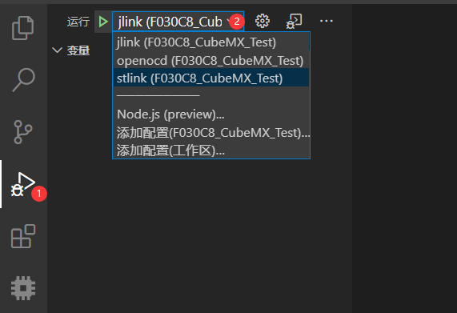

# 调试你的程序 🔧

> **提示：** 在完成编译之后，eide 会生成一个默认的 调试配置，你可以将其当作模板来编写自己的调试配置

- 调试 ARM 的工程

  **要调试 ARM 的工程，需要安装 [cortex-debug](https://marketplace.visualstudio.com/items?itemName=marus25.cortex-debug)**

  **关于配置 和 使用 cortex-debug 的方法，请参阅 Cortex-Debug 首页 或者 参见此博客 [Cortex-debug 使用介绍](https://blog.em-ide.com/index.php/vscode/16.html)**

- 调试 STM8 的工程

  **要调试 STM8 的工程，需要安装 [stm8-debugger](https://marketplace.visualstudio.com/items?itemName=CL.stm8-debug)**

- 调试 8051 工程 ?

  **没有 8051 的调试器可用，因此暂不支持 8051 项目的调试**

***

## 步骤

1. 打开烧录配置，选择好烧录器，并配置相关选项 (**eide 会根据不同的烧录器自动生成相应的调试配置**)

2. 点击 vscode 侧边栏的 **Debug** 图标切换到调试视图，点击调试配置下拉菜单，切换到相应的配置

  

3. 打开 launch.json, 检查生成的配置是否完整

4. 连接你的板子，在一切就绪之后，按 F5 启动调试器进入调试。

***
