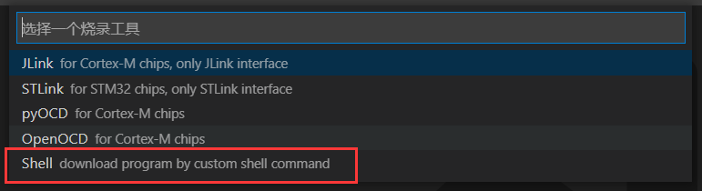
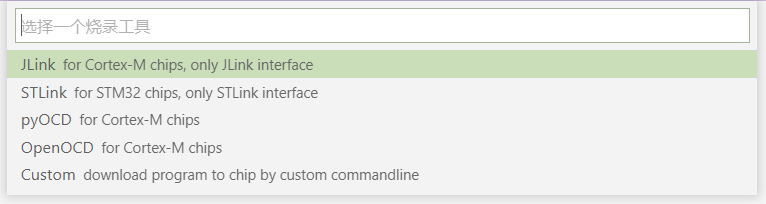
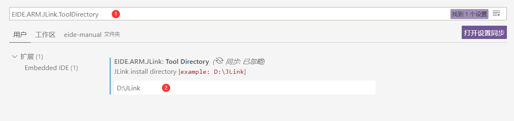
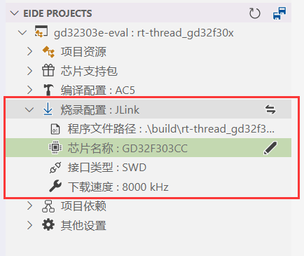
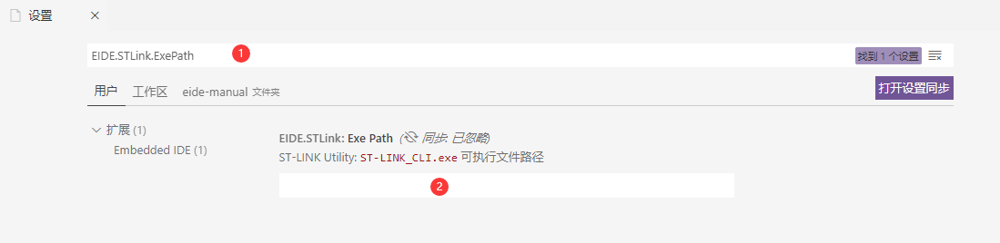
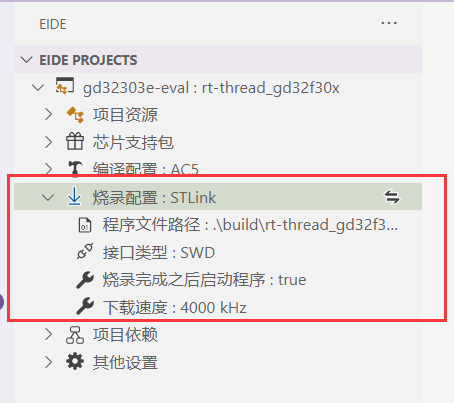

# 烧录程序到目标芯片 💾

## C51 工程

> 需要 **Python3** 支持
>
> 在**开始**之前，需要安装 [stcgal 工具](https://github.com/grigorig/stcgal)
>
> 使用命令：**pip3 install stcgal --user** 完成安装

STC 的下载配置较多，将在配置文件里进行，可以点击下图按钮打开配置

**如果忽略此步骤，将使用默认配置**，默认配置见 [stcgal usage](https://github.com/grigorig/stcgal/blob/master/doc/USAGE.md)


配置文件的配置描述翻译自 [stcgal usage](https://github.com/grigorig/stcgal/blob/master/doc/USAGE.md)，带有悬停提示和自动补全

**"[]" 号**里描述了适用于此配置的芯片型号，例如：**\[ALL\]** 表示适用于所有型号


!> 注意：[stcgal 工具](https://github.com/grigorig/stcgal) 用法与 STC 官方的烧录工具一样，**在面板输出 Cycling power done 之后**，需要**复位 stc 芯片 或者 关闭然后打开芯片电源**，这样才能检测到 ISP 命令，进入到下载流程；如果配置没有问题，下载完成之后将会退出连接，配置有错误会失败并提示，请注意阅读失败后的**提示信息**；
	
## STM8 工程

> STM8 工程需要使用 [STVP 下载器](https://www.st.com/zh/development-tools/stvp-stm8.html)完成下载，因此需要安装 STVP
>
> 安装完成之后在 eide 插件设置中设置 **STVP_CmdLine.exe** 的绝对路径

STVP 工具配置界面如图


!> **注意：** 如果需要设置选项字节以开启相关外设，请打开 STVP 完成选项字节的配置，然后生成为 hex 或 bin 文件，将此文件路径添加到项目的 STVP 烧录设置: `选项字节文件路径` 中

在修改好配置之后，连接好 STLink，点击下载按钮开始下载


## 使用自定义命令烧录

> 如果你想使用一些其他的烧录程序，但 eide 不支持，你可以使用 `自定义shell命令` 来进行烧录

首点击切换烧录工具到 Custom, 如下图



之后修改 `命令行` 属性，填写你要使用的烧录工具的相应的命令即可

命令行中所需要的 `hex/bin 文件路径` 可以由变量 \${programFile}/\${hexFile}/\${binFile} 进行替换, 例如：

```bash
NuLink.exe -w APROM "${hexFile}"
```

## ARM 工程

eide 支持主流的 4 种烧录工具



### 使用 JLink 烧录程序

> 要使用 JLink, 必须先安装 JLink 软件，并且 JLink 软件的版本必须在 V6.50 及以上
> 
> JLink_V650 下载地址：https://www.segger.com/downloads/jlink/JLink_Windows_V650.exe

安装完之后，打开 vscode 设置，在搜索栏输入：`EIDE.ARM.JLink.ToolDirectory`

搜索到 JLink 设置后，将 JLink 安装目录位置填写到输入框内即可完成 JLink 路径设置



之后打开 eide 项目的 “烧录配置” 栏，切换到 JLink，进行配置

配置完毕之后，即可点击 “下载程序” 按钮进行烧录



### 使用 STLink 烧录程序

> 要使用 STLink, 必须先安装 STLink Utility 软件
> 
> STLink Utility 下载地址：https://www.st.com/zh/development-tools/stsw-link004.html

安装完之后，打开 vscode 设置，在搜索栏输入：`EIDE.ARM.StlinkExePath`

搜索到 STLink 设置后，**在 STLink Utility 安装目录中找到 `STLink_CLI.exe` 的位置**，并将其填写到输入框内即可完成 STLink 路径设置



之后打开 eide 项目的 “烧录配置” 栏，切换到 STLink，进行配置

配置完毕之后，即可点击 “下载程序” 按钮进行烧录



### 使用 pyocd 烧录程序

> 注意：pyocd 需要 python3 支持，必须先安装 python3
>
> pyocd 主要被用来支持 DAPLink 和 STLink

1. 命令行输入 `pip3 install pyocd` 安装 pyocd

2. 从 github 下载 [usblib](https://github.com/libusb/libusb/releases/tag/v1.0.21)

 **解压 usblib 后，将 libusb.dll 复制到 python.exe 所在的目录，注意：所选择的 libusb.dll 必须要和电脑上安装的 python 是同一体系结构，例如：python3_x86 版本对应 MS32 目录下的 dll**

 

3. 连接 目标板，命令行输入 `pyocd list` 检查 pyocd 是否能够正常工作，如果没有问题则会输出已连接的设备列表

 

4. 打开 EIDE 项目，配置烧录设置

 4.1. 填写目标芯片名称

 

 4.2. 命令行输入 `pyocd list -t`，**查看所有支持的芯片，如果存在你所需要的芯片，则忽略步骤 4.3**

 

 4.3. 打开 config 属性，**配置包含该芯片的 keil 包路径**

 提示：此配置文件里也可以填写一些其他的 pyocd 配置选项，具体参考 [pyocd 配置文档](https://github.com/pyocd/pyOCD/tree/master/docs)**

 

5. 连接目标板，点击下载按钮启动下载

 

***

### 使用 OpenOCD 烧录程序

1. 设置好 OpenOCD.exe 的路径

 

2. 将烧录配置切换到 OpenOCD，设置 `target` 和 `interface`。

 !> **注意：** eide 将从 <OpenOCD安装目录>/scripts/target 和 <OpenOCD安装目录>/scripts/interface 目录读取配置文件列表，**如果 openOCD.exe 路径是无效的，可选的列表将为空**

 

3. 点击下载按钮完成下载

 

