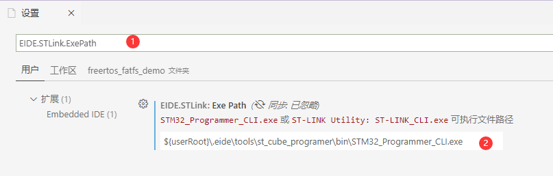
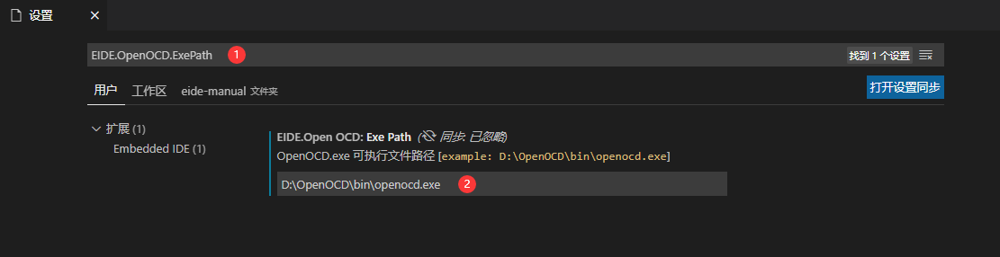

# 烧录程序到目标芯片 💾

> 注：使用某些烧录器时可能需要设置其安装路径，如果安装路径设置为空，插件将在环境变量中搜索其可执行文件的位置

## 安装烧录工具

eide 支持多种烧录工具，但这些工具并不集成到 eide 安装包内，因此在使用烧录功能前，你需要安装相应的烧录工具程序

安装方法有两种：**自动安装** 和 **手动安装**

### 自动安装

直接点击下载按钮触发下载，eide 会检查相应的烧录工具是否已安装，如果没有找到下载工具，则会弹出是否安装的提示框，选择立即安装即可


### 手动安装

自行下载相应的烧录工具，并在**插件设置**中进行相应的路径设置

如何操作？ 见本章中对每种烧录工具的相应介绍

***

## 程序文件路径

自 v2.15.0 起，**烧录配置->程序文件路径** 支持指定多个文件，用来一次烧录多个程序文件

程序文件路径填写格式：`<filePath>[,addr][;<filePath>...]`

> 提示：若烧录器不支持一次烧录多个文件，则默认烧录**第一个**文件

### 示例

- `./bootloader.hex;$(ExecutableName).hex`：按顺序烧录 './bootloader.hex' 和 '$(ExecutableName).hex'
  
- `./bootloader.bin,0x08000000;$(ExecutableName).hex`：先烧录 './bootloader.bin' 至地址 '0x08000000'，再烧录 '$(ExecutableName).hex'
  
- `./bootloader.bin,0x08000000;$(ExecutableName).bin,0x08100000`：先烧录 './bootloader.bin' 至地址 '0x08000000'，再烧录 '$(ExecutableName).bin' 至地址 '0x08100000'

***

## 全片擦除

自 v2.15.0 起，增加了一条 vscode 命令 "`Erase Chip`"，用于全片擦除芯片；

按下快捷键 `ctrl+shift` 打开命令面板，输入 `Erase Chip` 回车即可执行


***

## C51 工程

### 使用 stcgal 烧录

#### 安装

> 1. 安装 **Python3**
>
> 2. 安装 **stcgal** 模块, 命令：`pip3 install stcgal --user`

!> stcgal 属于第三方的烧录工具，如果无法正常烧录，建议使用芯片厂家提供的烧录工具

#### 芯片支持

stcgal 支持的芯片型号有限，详见：https://github.com/grigorig/stcgal/blob/master/doc/MODELS.md

```ini
# 以下芯片支持信息摘自 stcgal 文档

stcgal should fully support STC 89/90/10/11/12/15/8 series MCUs.

So far, stcgal was tested with the following MCU models:

* STC89C52RC (BSL version: 4.3C/6.6C)
* STC90C52RC (BSL version: 4.3C)
* STC89C54RD+ (BSL version: 4.3C)
* STC12C2052 (BSL version: 5.8D)
* STC12C2052AD (BSL version: 5.8D)
* STC12C5608AD (BSL version: 6.0G)
* STC12C5A16S2 (BSL version: 6.2I)
* STC12C5A60S2 (BSL version: 6.2I/7.1I)
* STC11F02E (BSL version: 6.5K)
* STC10F04XE (BSL version: 6.5J)
* STC11F08XE (BSL version: 6.5M)
* STC12C5204AD (BSL version: 6.6H)
* STC15F104E (BSL version: 6.7Q)
* STC15F204EA (BSL version: 6.7R)
* STC15L104W (BSL version: 7.1.4Q)
* STC15F104W (BSL version: 7.1.4Q and 7.2.5Q)
* IAP15F2K61S2 (BSL version: 7.1.4S)
* STC15L2K16S2 (BSL version: 7.2.4S)
* IAP15L2K61S2 (BSL version: 7.2.5S)
* STC15W408AS (BSL version: 7.2.4T)
* STC15W4K56S4 (BSL version: 7.3.4T, UART and USB mode)
* STC8A8K64S4A12 (BSL version: 7.3.9U)
* STC8F2K08S2 (BSL version: 7.3.10U)
```

#### 用法

STC 的下载配置较多，将在配置文件里进行，可以点击下图按钮打开配置

**如果忽略此步骤，将使用默认配置**，默认配置见 [stcgal usage](https://github.com/grigorig/stcgal/blob/master/doc/USAGE.md)


配置文件的配置描述翻译自 [stcgal usage](https://github.com/grigorig/stcgal/blob/master/doc/USAGE.md)，带有悬停提示和自动补全

**"[]" 号**里描述了适用于此配置的芯片型号，例如：**\[ALL\]** 表示适用于所有型号


注意：stcgal 用法与 STC 官方的烧录工具一样，在面板输出 **Cycling power done** 之后，需要**复位 stc 芯片 或者 关闭然后打开芯片电源**，这样芯片才能检测到 ISP 命令，进入到下载流程

### 使用 stcflash 烧录

#### 安装

> 1. 安装 **Python3**
> 
> 2. 安装 **pyserial** 模块, 命令：`pip3 install pyserial --user`
> 
> 3. 下载 [stcflash.py](https://github.com/sms-wyt/stcflash/blob/master/stcflash.py), **并复制到项目的目录下**，快捷下载地址：https://cloud.github0null.io/s/R4SY?path=%2F%E7%83%A7%E5%BD%95%E5%B7%A5%E5%85%B7

!> stcflash 属于第三方的烧录工具，如果无法正常烧录，建议使用芯片厂家提供的烧录工具

#### 介绍

```ini
#
# 以下摘自 stcflash 文档 (https://github.com/sms-wyt/stcflash/blob/master/README.md)
#

# stcflash
  Add support for STC8 series(STC8A,STC8F,STC8H,STC8C) and STC15 series

# 介绍
  stcflash主要是基于https://github.com/laborer/stcflash 的stcflash修改而来，原版的stcflash只支持一些比较旧系列的STC单片机，
  我在此基础上，添加了对STC8全系列（STC8A、STC8F、STC8H、STC8C）和STC15系列的下载支持。

# 新增功能
  1、添加对STC8和STC15系列单片机的下载支持
  2、对于STC8系列和STC15系列，新增最高波特率设置指令--highbaud
  3、对于STC8系列和STC15系列，新增最高波特率支持到460800
  3、新增对于STC8和STC15系列单片机的基本信息读取显示,包括芯片型号、版本、程序空间和出厂序列号等。

# stcflash基本使用方法

## 使用条件
  1、需要python环境，推荐python3
  2、安装pyserial模块

## 使用命令
  1、按照默认参数
    ./stcflash.py xxx.hex
  2、指定最低波特率、最高波特率和通信端口
    ./stcflash.py xxx.hex --port COM3 --lowbaud 2400 --highbaud 460800
  3、其他命令可以参考https://github.com/laborer/stcflash 的README.md

# 注意事项
  1、对于STC8系列和STC15系列，如果没有指定最低波特率和最高波特率，默认最低波特率为2400，最高波特率为115200
  2、最低波特率建议使用默认2400，以便单片机的正常检测
  3、对于STC8系列和STC15系列，最高波特率虽然可以指定1200-460800的任意数字，但为了增加下载的成功率，建议按照固定波特率设置，常见波特率如下：
  460800、230400、115200、57600、38400、28800、19200、14400、9600、4800、2400、1200
  4、对于STC15系列，最高波特率不宜设置过低（建议不小于115200），否则可能出现下载失败情况。因为STC15系列型号较多，握手协议有差别，没法做到全波特率兼容
  5、本人测试的单片机有STC89C52、STC15W4K48S4、STC15L2K08S2、STC8A8K64S4A12和STC8H8K64U，由于样本实在太稀少，所以不能保证全部型号都能正常识别下载
  6、单片机的型号是通过特殊的手段诱骗STC-ISP(V6.87H)得到的，把这些型号整合到代码中也是比较繁琐的，纯粹是体力劳动。
     我在原先的代码当中添加了新的键来映射新添加的型号，详细可以查看代码。如果后面STC再出新型号，如果协议不一样，还是需要做兼容，方法也是类似
  7、如果有任何意见和建议，欢迎提出，共同探讨！

```

#### 用法

- 首点击切换烧录工具到 Custom, 如下图

  

- 之后修改 `命令行` 属性，填写 stcflash 的烧录命令, 示例命令如下 (详见：[自定义命令烧录](zh-cn/download_to_device?id=自定义烧录命令))：
  
  `python ./tools/stcflash.py -p ${port} "${hexFile}"`

- 点击下载按钮，开始烧录

- 命令行会提示正在检测芯片，这时需要复位芯片，才能进入到下载流程

***

## STM8 工程

> STM8 暂时仅支持 STVP 烧录工具

### 使用 STVP 烧录

> STVP 官方下载地址：https://www.st.com/zh/development-tools/stvp-stm8.html
> 
> STVP 精简版下载地址：https://cloud.github0null.io/s/R4SY?path=%2F%E7%83%A7%E5%BD%95%E5%B7%A5%E5%85%B7

安装完成之后需要在 eide 插件设置中设置 `STVP_CmdLine.exe` 的绝对路径

打开 vscode 设置，搜索栏输入：`EIDE.STM8.STVP.CliExePath`, 搜索到 STVP 设置后，将路径填写到其中即可


STVP 工具配置界面如图


!> **注意：** 如果需要设置选项字节以开启相关外设，请打开 STVP 完成选项字节的配置，然后生成为 hex 或 bin 文件，将此文件路径添加到项目的 STVP 烧录设置: `选项字节文件路径` 中

在修改好配置之后，连接好 STLink，点击下载按钮开始下载


***

## ARM 工程

eide 支持主流的 4 种烧录工具


### 使用 JLink 烧录

> 要使用 JLink, 必须先安装 JLink 软件，并且 JLink 软件的版本必须在 V6.50 及以上
> 
> JLink_V650 下载地址：https://www.segger.com/downloads/jlink/JLink_Windows_V650.exe

安装完之后，打开 vscode 设置，在搜索栏输入：`EIDE.JLink.InstallDirectory`

搜索到 JLink 设置后，将 JLink 安装目录位置填写到输入框内即可完成 JLink 路径设置


之后打开 eide 项目的 “烧录配置” 栏，切换到 JLink，进行配置

配置完毕之后，即可点击 “下载程序” 按钮进行烧录


#### 选择芯片名称

- 在使用 JLink 烧录功能的时候，可以指定 **芯片名称**，在输入框内键入名称，将从可用的芯片列表中进行筛选

  

- eide 将在**启动时**从 **JLink.exe** 以及 **JLink 安装目录下的 JLinkDevices.xml** 中获取可用的芯片列表

  如果想使用其他路径下的 **JLinkDevices.xml** 文件，可以通过插件设置 **EIDE.JLink.DeviceXmlPath** 进行指定

- 当你更改了 **JLinkDevices.xml** 的内容后，可以使用 **eide.ReloadJlinkDevs** 命令重新加载 JLink 芯片列表

  

### 使用 STLink 烧录

> 对于 STLink, 本软件使用 `STLink Utility` 作为烧录工具
> 
> STLink Utility 官方下载地址：https://www.st.com/zh/development-tools/stsw-link004.html
>
> 共享下载地址：https://cloud.github0null.io/s/R4SY?path=%2F%E7%83%A7%E5%BD%95%E5%B7%A5%E5%85%B7

> V2.12.3 及以后版本，兼容使用 `STM32CubeProgramer` 工具进行烧录

安装完之后，打开 vscode 设置，在搜索栏输入：`EIDE.STLink.ExePath`

搜索到 STLink 设置后，**在 `STLink Utility`/`STM32CubeProgramer` 安装目录中找到 `xxx_CLI.exe` 的位置**，并将其填写到输入框内即可完成 STLink 路径设置



之后打开 eide 项目的 “烧录配置” 栏，切换到 STLink，进行配置

配置完毕之后，即可点击 “下载程序” 按钮进行烧录


### 使用 pyocd 烧录

> 注意：pyocd 需要 python3 支持，必须先安装 python3
>
> pyocd 主要被用来支持 DAPLink 和 STLink

1. 命令行输入 `pip3 install pyocd` 安装 pyocd

2. 从 github 下载 [usblib](https://github.com/libusb/libusb/releases/tag/v1.0.21)

 **解压 usblib 后，将 libusb.dll 复制到 python.exe 所在的目录，注意：所选择的 libusb.dll 必须要和电脑上安装的 python 是同一体系结构，例如：python3_x86 版本对应 MS32 目录下的 dll**

 > 提示：当 libusb 在 python 根目录无法被 pyocd 识别时，可以尝试将 libusb.dll 放在 C:\Windows\System32 下

 

3. 连接 目标板，命令行输入 `pyocd list` 检查 pyocd 是否能够正常工作，如果没有问题则会输出已连接的设备列表

 

4. 打开 EIDE 项目，配置烧录设置
   
   - 填写目标芯片名称

     

   - 命令行输入 `pyocd list -t`，查看 **内置支持** 的芯片，如果上一步填写的芯片名存在，**则可以跳过后续步骤**，否则继续下一步

     

   - 打开 config 属性，配置包含该芯片的 keil 包路径（包路径可以使用相对于工作区根目录的**相对路径**），如果完整的 keil 包太大，可以用简化版的, 仓库地址: https://cloud.github0null.io/s/R4SY?path=%2Fpyocd%20%E8%8A%AF%E7%89%87%E5%8C%85

     提示：此配置文件里也可以填写一些其他的 pyocd 配置选项，具体参考 [pyocd 配置文档](https://github.com/pyocd/pyOCD/tree/master/docs)

     

5. 连接目标板，点击下载按钮启动下载

 

***

### 使用 OpenOCD 烧录

> OpenOCD-v0.10.0 下载地址：https://cloud.github0null.io/s/R4SY?path=%2F%E7%83%A7%E5%BD%95%E5%B7%A5%E5%85%B7

1. 打开设置搜索：`EIDE.OpenOCD.ExePath`, 设置好 OpenOCD.exe 的路径

 

2. 将烧录配置切换到 OpenOCD，设置 `target` 和 `interface`。

 

3. 点击下载按钮完成下载

 


#### 注意事项：

- 插件将从以下目录中搜索可用的 cfg 配置文件

  - **当前工作区内：**

    `.`

    `.eide`

    `tools`

  - **OpenOCD安装目录内：**

    `scripts`

    `share/openocd/scripts`

***

## **自定义烧录命令**

> 如果你想使用支持命令行的其他烧录程序，你可以使用 `自定义shell命令` 来进行烧录

### 用法

首点击切换烧录工具到 Shell, 如下图


之后修改 `命令行` 属性，填写你要使用的烧录工具的相应的命令即可

命令行支持一些变量，如下：

- `${programFile}`：代指程序文件（`.hex, .bin, .s19`）路径

- `${port}`：代指 `可用的串口`（**注意：如果有多个串口可用，该值是串口列表的第一个**）

当存在多个可烧录的程序文件时，则以下变量可用：

- `${programFile[n]}`：第 `n` 个程序文件的路径（n 从零开始）

- `${binAddr[n]}`：第 `n` 个程序文件的烧录地址（n 从零开始）

### 示例

> 提示：示例命令中的烧录软件可执行文件路径已设置到环境变量中

```bash
# 使用 NuLink 烧录新唐 mcu
NuLink -w APROM "${programFile}"

# 使用 stcflash 烧录 8051
python ./tools/stcflash.py -p ${port} "${programFile}"

# 使用 STM32CubeProgramer + STLink 烧录程序到 STM32
STM32_Programmer_CLI -c port=SWD FREQ=4000 mode=NORMAL reset=SWrst --download "${programFile}" -v --go

# 使用 STM32CubeProgramer + STLink 并通过外部加载算法烧录程序到 STM32H750 片外 QSPI Flash
STM32_Programmer_CLI -c port=SWD FREQ=4000 mode=NORMAL reset=SWrst -el ./STM32H7xx_W25Q128_WeAct.stldr --download "${programFile}" -v --go
```
