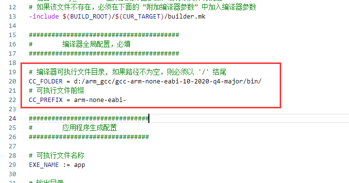
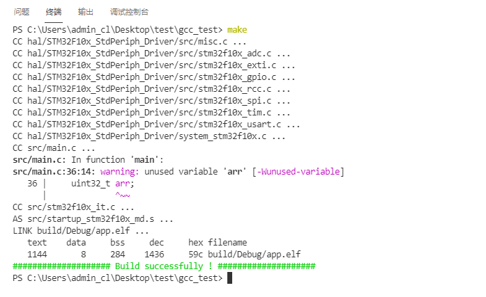

# 生成 Makefile 模板

> [下载 make 工具](https://cloud.github0null.io/s/R4SY?path=%2F%E5%85%B6%E4%BB%96%E5%B7%A5%E5%85%B7)

eide 项目在构建时会将项目信息以 Makefile 格式生成到 build 目录下的 2 个文件中，分别是：

  - `build/target.mk`：该文件主要包含 eide 项目的源文件信息
  
  - `build/<目标名>/builder.mk`：该文件主要包含编译过程中传递给编译器的参数

因此利用上述两个文件内的信息，可以编写相关 Makefile，然后通过 make 来构建项目

## 操作流程

1. 使用 eide 构建一次项目，确保上述的两个 .mk 文件能够正常生成

2. 在项目右键菜单中点击 **生成 Makefile 模板**，操作完成后，在项目目录下会生成一个 Makefile 模板文件

3. 打开 Makefile 文件，修改**编译器路径**和**编译器前缀**（如果编译器在环境变量中，可以将相应字段置空）

  

4. 安装好 make 工具，在项目根目录下打开终端，执行 `make`，即可开始构建项目

  

> eide 生成的 Makefile 模板支持的编译器：SDCC, GCC, ARMCC, ARMCLANG, IAR-STM8

