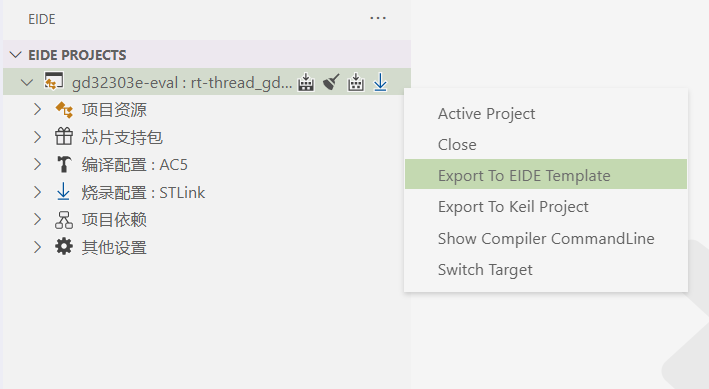

# 导出项目 🔩

## 导出 eide 模板

> 在项目视图中点击导出模板，即可将此工程打包压缩，压缩格式为 7z
>
> 如果你想与大家分享你的模板，可以使用 pull request 提交到默认的仓库 [eide-doc](https://github.com/github0null/eide-doc)

右键项目，在菜单中点击 `Export EIDE Template` 就会将你的项目打包为模板，压缩工程需要耗费一定时间，完成导出后会弹出提示



**下面是默认的排除目录，导出的模板中将不会含有这些目录**

```txt
'.git',
'.git\\*',
`${prjOutFolder}`,
`${prjOutFolder}\\*`,
'*.eide-template',
'*.log'

其中 ${prjOutFolder} 代指 项目的编译输出目录
```

如果你还要在打包时排除其他目录，你可以在项目根目录下新建一个 .eideignore 文件，在里面填写需要排除的文件


***

## 导出 MDK 项目

> 可以将 EIDE 项目导出为 MDK 项目

!> 注意：只能导出 KEIL5 版本的工程

操作完成后，在项目目录下会生成一个 <项目名>.uvprojx 文件（C51 工程为 <项目名>.uvproj）


