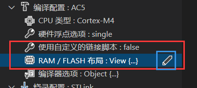
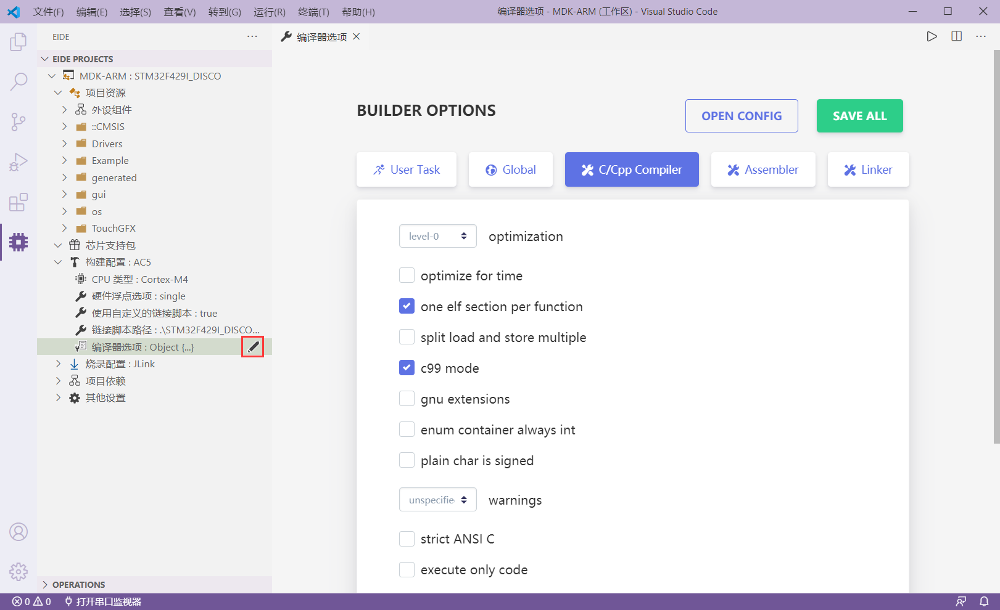

# 导入KEIL项目

> 此功能需要 v2.0.0 及以上版本支持

eide 支持导入 KEIL C51 和 KEIL MDK 项目，并以虚拟文件夹的形式组织源文件

## 使用步骤

1. 打开 **OPERATIONS** 栏，点击 **导入项目**

  

2. 选择一个 KEIL 项目文件，MDK 项目为 `*.uvprojx`, KEIL C51 项目为 `*.uvproj`

  

3. 选择项目保存位置；选择 **Yes**, eide 项目将和 KEIL 项目处于同一个文件夹下，选择 **No**, 你需要指定一个文件夹用于存放 eide 项目

  

4. 导入完成，选择是否立即切换工作区

  

5. **如果是 ARM 项目，还需要在导入后设置构建配置，因为项目导入功能不会导入 mdk 构建配置**
   
   - 修改 **使用自定义链接脚本** 为 `false`，并点击修改 **RAM/FLASH** 布局选项

   

   - 此时会打开 FLASH 布局编辑器，打开你的 MDK 项目，将布局信息复制到编辑器内的相应位置, 点击下方的 **保存** 即可
   
    

   - 打开项目的 **编译器选项**，将 MDK 的 **C/C++, asm, linker 选项卡**里的配置设置到相应字段中，设置完毕后保存即可

   

6. 修改完毕后，即可点击构建按钮启动构建

!> 导入功能只支持 **KEIL 5** 及以上版本的项目，强行导入 **KEIL 4** 项目会导致失败

## 注意事项

导入 KEIL 项目时，KEIL 项目的 **编译选项** 不会一并导入，请在导入完毕后自行在 eide 中完成设置，具体参考上面的步骤 5

> 前往 [构建配置](zh-cn/builder_config?id=编译选项) 查看文档
