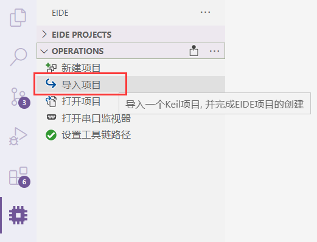
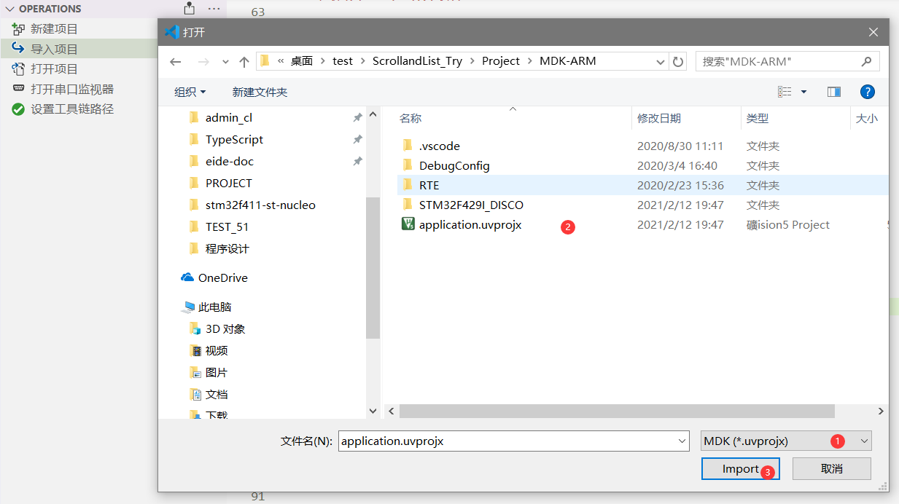
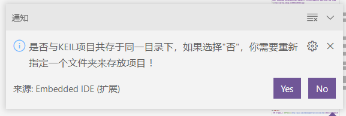
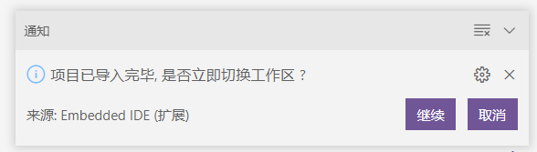
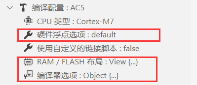

# 导入KEIL项目

> 此功能需要 v2.0.0 及以上版本支持

eide 支持导入 KEIL C51 和 KEIL MDK 项目，并以虚拟文件夹的形式组织源文件

## 使用步骤

1. 打开 **OPERATIONS** 栏，点击 **导入项目**

  

2. 选择一个 KEIL 项目文件，MDK 项目为 `*.uvprojx`, KEIL C51 项目为 `*.uvproj`

  

3. 选择项目保存位置；选择 **Yes**, eide 项目将和 KEIL 项目处于同一个文件夹下，选择 **No**, 你需要指定一个文件夹用于存放 eide 项目

  

4. 导入完成，选择是否立即切换工作区

  

!> 导入功能只支持 **KEIL 5** 及以上版本的项目，强行导入 **KEIL 4** 项目会导致失败

## 注意事项

导入 KEIL 项目时，**KEIL 项目的编译设置**不会一并导入，请在导入完毕后自行在 eide 中完成设置

> 前往 [构建配置](zh-cn/toolchain_and_builder?id=编译配置) 查看文档
