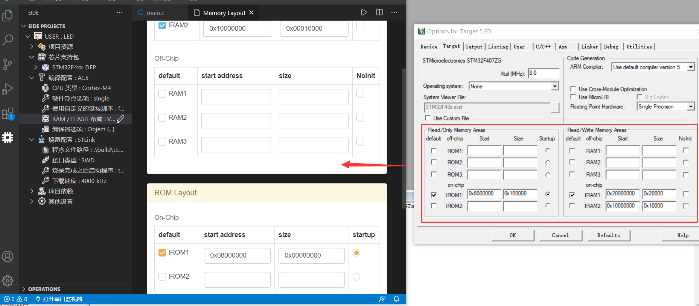
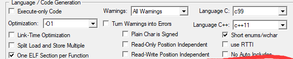
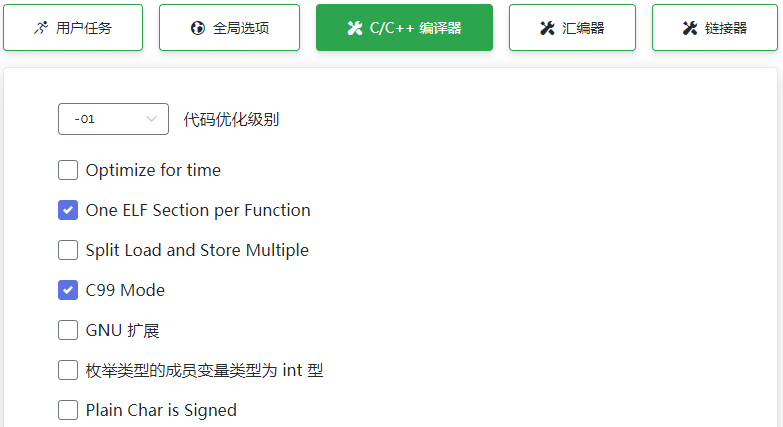
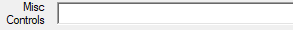
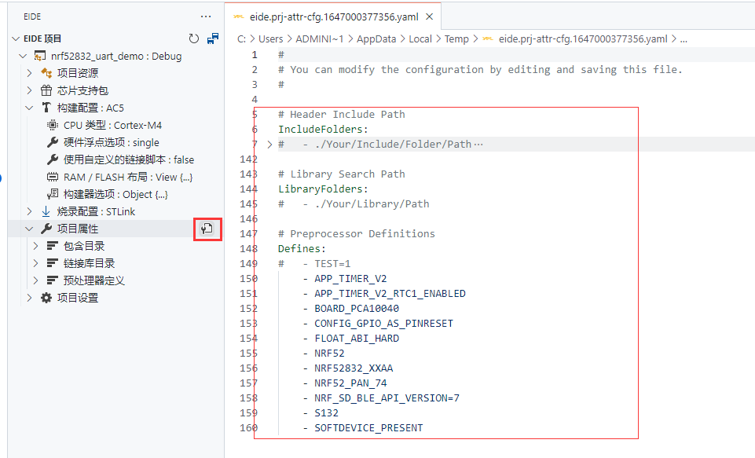
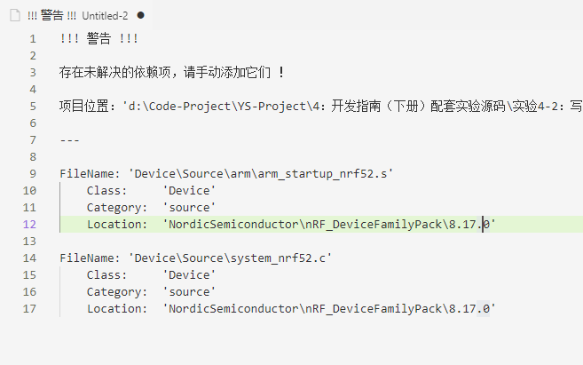

# 导入KEIL项目

!> **注意**：该导入功能并**不能** 100% 适合任意的 Keil 项目，点击此 (说明)[https://discuss.em-ide.com/d/289-keil] 查看该功能的限制

eide 支持导入 KEIL C51 和 KEIL MDK 项目，并以虚拟文件夹的形式组织源文件

## 使用步骤

1. 打开 **OPERATIONS** 栏，点击 **导入项目**

  

2. 选择一个 KEIL 项目文件，MDK 项目为 `*.uvprojx`, KEIL C51 项目为 `*.uvproj`

  

3. 选择项目保存位置；选择 **Yes**, eide 项目将与 KEIL 项目**共存于同一个文件夹下**，选择 **No**, 你需要**指定一个新的文件夹用于存放 eide 项目**

  

4. 导入完成，选择是否立即切换工作区

  

5. **如果是 ARM 项目，还需要在导入后设置构建配置，因为项目导入功能不会导入 mdk 构建配置**
   
   - 修改 **使用自定义链接脚本** 为 `false`，并点击修改 **RAM/FLASH** 布局选项

   

   - 此时会打开 FLASH 布局编辑器，打开你的 MDK 项目，将布局信息复制到编辑器内的相应位置, 点击下方的 **保存** 即可
   
    

   - 打开项目的 **编译器选项**，先把 Keil 对话框里这些勾选框，在 **eide 的 C/C++ 页面** 里勾上，没有的先不管

     

     

   - 然后将 Keil `Misc-Controls` 框里的内容填到 C/C++ 页面的 `C编译器附加选项` 里

     
     
     

6. 打开 **项目属性**，检查导入后项目的 `包含路径`，`宏定义` 是否与**原 Keil 项目**一致，**若存在缺失/错误项，请手动将其补全**

   

7. 修改完毕后，即可点击构建按钮启动构建

   - 若存在编译错误，根据错误信息百度自行排查；无法解决的，可在[论坛](https://discuss.em-ide.com)发帖寻求帮助

!> 注意：导入功能只支持 **KEIL 5** 及以上版本的项目，强行导入 **KEIL 4** 项目会导致失败

## 注意事项

- 导入 KEIL 项目时，KEIL 项目的 **编译选项** 不会一并导入，请在导入完毕后自行在 eide 中完成设置，具体参考上面的步骤 5

  

  > 前往 [构建配置](zh-cn/builder_config?id=编译选项) 查看文档

- 某些工程使用了 MDK 的 RTE 组件，如果在导入时无法找到组件的位置，插件会弹出**导入警告**，你需要在导入完成后手动将这些未导入的文件加入到项目，如下图所示：

  
