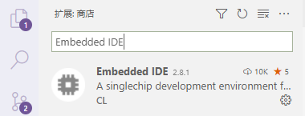
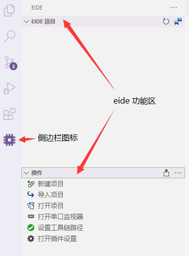

# 安装

> **运行环境要求**
> 
> - `系统要求`：Windows 7 及以上
> 

!> 注意：从 **v2.9.0** 开始，构建程序的运行时已更改为 Mono 因此无需任何 .NET 环境

*** 

- Embedded IDE 是以插件的方式集成到 vscode 中的，因此首先需要在 vscode 插件商店中搜索并安装

  

- 插件安装完毕后，vscode 左侧活动栏会出现 Embedded IDE 的图标，点击它即可打开 Embedded IDE 的功能区域

  

