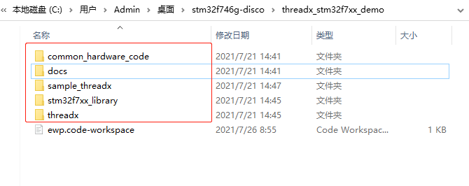
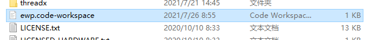
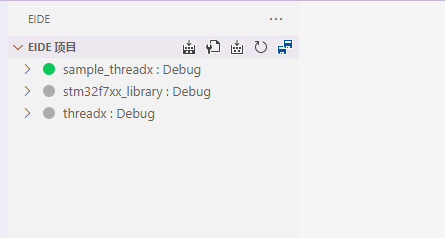
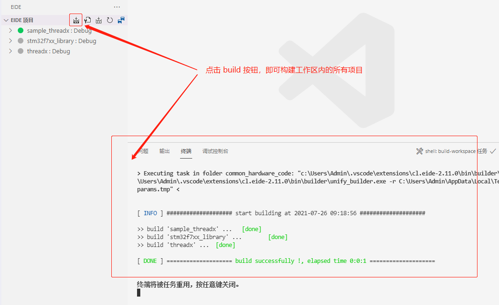

# 多项目工作区

使用 vscode 工作区特性，可以将多个存在依赖关系的项目放到同一工作区内，进行管理

## 新建工作区

下面是一个操作示范，用于创建一个多项目工作区

1. 新建一个空文件夹，用于存放所有的项目，本例为: `threadx_stm32f7xx_demo`

2. 新建一些 eide 项目，将项目存放到上一步创建的文件夹内，如下图所示

  

3. 在当前文件夹内新建一个 vscode 工作区文件（`*.code-workspace`），如下图所示

  

  修改该工作区文件，将当前文件夹内的 eide 项目添加到工作区内，本例中内容如下：

  ```json
   {
       "folders": [
           {
               "name": "common_hardware_code",
               "path": "common_hardware_code"
           },
           {
               "name": "sample_threadx",
               "path": "sample_threadx"
           },
           {
               "name": "stm32f7xx_library",
               "path": "stm32f7xx_library"
           },
           {
               "name": "threadx",
               "path": "threadx"
           }
       ],
       "tasks": {
           "version": "2.0.0",
           "tasks": [
               {
                   "label": "clean",
                   "type": "shell",
                   "command": [
                       "Get-ChildItem ../* -Include dist,build -Recurse | rm -Verbose -Recurse -Force"
                   ],
                   "group": "build",
                   "problemMatcher": []
               }
           ]
       }
   }
  ```

4. 使用 vscode 打开该工作区文件，eide 会自动加载该工作区内的项目，如下图所示

  

***

## 构建工作区

  使用 vscode 打开该工作区

  工作区打开后，**项目栏**将出现一些功能按钮，可以对该工作区内的所有项目进行构建，重新构建，如下图所示

  

***

## 构建优先级

> 项目的默认构建顺序为 *.code-workspace 文件内项目被添加时所使用的顺序，见本章 `新建工作区`->`第 3 小节`

可以通过修改项目的构建优先级，决定在构建所有项目时构建的顺序

- 打开项目的 **其他设置** -> **环境变量**

- 向环境变量配置文件中，添加如下内容：

  ```ini
  # obsoleted at v2.15.3^
  [workspace]
  # workspace build order
  order = 0
  ```

  !> 注意：v2.15.3 以后，**构建优先级** 使用字段 `EIDE_BUILD_ORDER` 代替（**上述的配置将失效**），应使用如下配置：

  ```ini
  # workspace build order
  EIDE_BUILD_ORDER = 0
  ```

  其中 order 的值即为项目的优先级（不设置默认为 100），**其值越小，优先级越高**

- 修改之后保存配置文件，点击 `构建所有项目`，即可按照指定顺序完成构建

> 本例使用的示例工程：[threadx_stm32f7xx_demo](https://github.com/github0null/eide-resource/blob/master/eide-template-list/threadx_stm32f7xx_demo.ewt)
