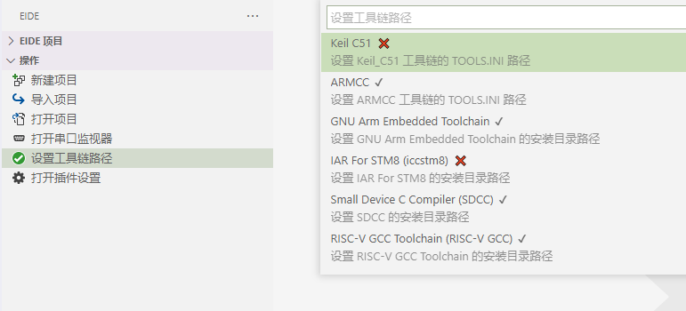

# 准备工作

## 运行环境

`系统要求`：Windows 7 及以上

`.NET环境`：.NET FrameWork 3.5

> 提示：.NET FrameWork 4 及以上可能不兼容 .NET FrameWork 3 的程序。 如果构建工具无法启动，可能需要单独安装一下 .NET FrameWork 3.5

## 设置编译工具路径

由于各种编译器的体积过大，不适合与扩展打包到一起，因此你必须手动安装你要使用的编译器工具，然后在 `设置工具链路径` 选项中设置其安装路径

> 注：只需设置你要使用的编译工具的安装路径，不使用的可以不设置

**"设置工具链路径"** 选项的图标表明了工具链路径设置的总体状态
 - ：所有的工具链已完全设置完毕
 - ：某一个工具链路径是无效的
 - ：还没有为任何工具链设置安装路径

## 项目目录结构

基本文件夹结构如下：

### 项目文件

- `.eide` eide 项目文件夹，**不要手动更改此文件夹下的内容**
- `.vscode` vscode 配置文件目录
- `build` EIDE 的默认编译输出目录, 编译产生的文件存放在此处，可以在项目的 `其他设置` 里进行修改
- `pack`  芯片支持包的安装位置（只有为项目安装了芯片支持包才会出现）, **不要手动更改此文件夹下的内容**
- `*.code-workspace` vscode 工作区文件，每个 eide 项目都存在此文件，**不要删除此文件**

### 用户文件

`项目文件` 之外的文件或文件夹属于用户自己，由用户自行管理
