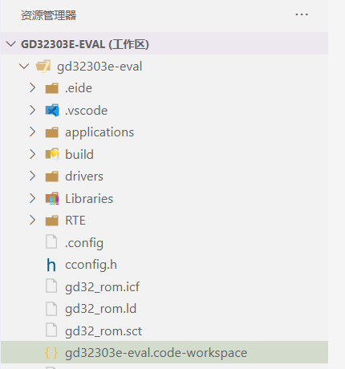

# 准备工作

## 设置编译工具路径

> 由于各种编译器的体积过大，不适合与扩展打包到一起，因此你必须手动安装你要使用的编译器工具，然后在 `设置工具链路径` 选项中设置其安装路径，以便 eide 能够找到它。
> 
> 默认情况下，插件将在环境变量中搜索编译器位置（ARMCC,KEIL_C51 除外）

**"设置工具链路径"** 选项的图标表明了工具链路径设置的总体状态
 - ：某一个工具链已设置完毕
 - ：还没有为任何工具链设置安装路径

只需设置你需要使用的编译器的安装路径，不使用的可以不设置，**此处的 "编译器安装路径" 是指 `bin` 文件夹所在的路径**；

例如：如果你的编译器位置为 `c:\my_tools\compiler\8bit\sdcc_dir\bin\sdcc.exe`，那么你需要设置的值应为： `c:\my_tools\compiler\8bit\sdcc_dir`

!> 警告：插件通过检查 `<你设置的路径>/bin` 是否为有效目录来更新 "工具链路径设置项" 的状态，如果你设置的错误路径下刚好有一个 bin 文件夹，设置项的状态将显示为 `✔`，但实际上该路径为无效的

## 了解项目结构

在开始项目之前，需要简单认识一下 eide 项目基本的文件夹结构：

### 项目文件

- `.eide` eide 项目文件夹，此处存放 eide 项目信息，日志等文件
- `.vscode` vscode 配置文件目录
- `build` EIDE 的默认编译输出目录, 编译产生的文件存放在此处，可以在项目的 `其他设置` 里进行修改
- `pack`  芯片支持包的安装位置（只有为项目安装了芯片支持包才会出现）, **不要手动更改此文件夹下的内容**
- `*.code-workspace` vscode 工作区文件，每个 eide 项目都存在此文件，**不要删除此文件**

### 用户文件

`项目文件` 之外的文件或文件夹属于用户自己，由用户自行管理

