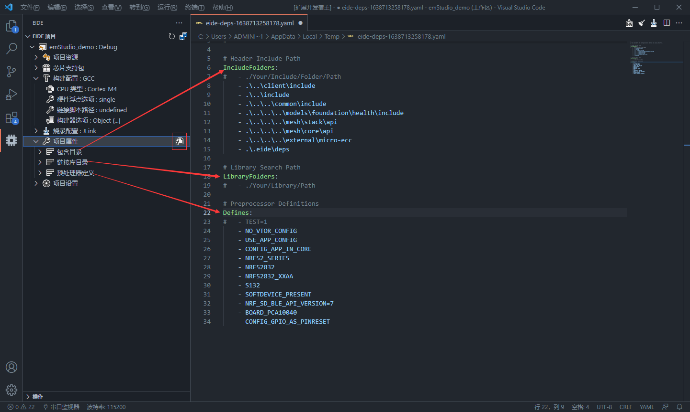
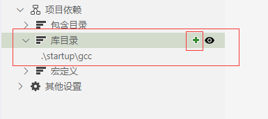

# 项目属性

项目属性主要包含项目中一些必要的特征

在 eide 中主要有 `包含目录`， `链接库目录`, `预处理器定义` 这几项

打开项目视图，`项目属性` 右侧会有一个修改按钮，点击它即可以 yaml 格式打开一个配置文件，修改这个文件的内容，**然后保存**，即可完成配置的更改

配置也可以单独以 UI 的形式进行更改，主要包含以下内容：

## 包含目录

**添加/删除包含目录**

> 可以通过 包含目录 功能来 添加/删除 头文件的搜索路径

!> 注意：重复添加同一个路径将不会有任何效果出现，也不会弹出任何提示

**查看包含目录**

> 你可以通过这个功能查看当前项目所有的包含路径

下图展示了这个功能的效果

> 每个包含路径后都有一个标签，将以较暗的颜色显示，这个标签说明了这个路径源自何处

- `custom`：表示这个包含路径是用户手动添加的
- `build-in`：表示这是工具链内置的包含路径
- `source`：表示这个路径是从源文件目录中自动搜索到的
- `STMxxxx`：表示这个路径来自 keil 包 里安装的组件，**此标签的名字就是 keil 包的名字**

***

## 链接库目录

可以通过添加 链接库目录 来指定 **静态链接库**和**链接脚本** 的搜索路径（在 gcc 系列工具链中，这种参数通常用 `-L` 参数进行指定）

!> 注意：该功能仅支持 **GCC**, **SDCC** 系列编译器，使用其他系列编译器的，请将 **静态库二进制文件（xx.a, xxx.o ...）** 直接添加到项目中

***

## 预处理器定义

可以通过添加 预处理器定义 来为源文件指定 宏开关

> 提示：你可以一次添加多个宏，不同的宏之间必须以 “;” 作为间隔，例如: 输入 `ST;DEBUG;_RTE_` 将会把 `ST`，`DEBUG`，`_RTE_` 这三个宏一次性添加到项目中

!> 注意：该功能只适用于 C/C++ 源文件，**要为 ASM 汇编源文件添加宏开关，请到 '构建器选项' -> '汇编器' 中添加，汇编器宏开关格式见下方**

**汇编器**宏开关格式：

| 汇编器类型 | 格式（`<key>`为宏名称，`<value>` 为宏的值） |
|:--|:--|
| ARMCC 5/6 | `"<key> SETA <value>"` |
| ARMCC 6（asm-clang） | `<key>=<value>` |
| ARM GCC | `<key>=<value>` |
| RISCV GCC | `<key>=<value>` |
| SDCC | `<key>=<value>` |
| IAR STM8 | `<key>=<value>` |

***
