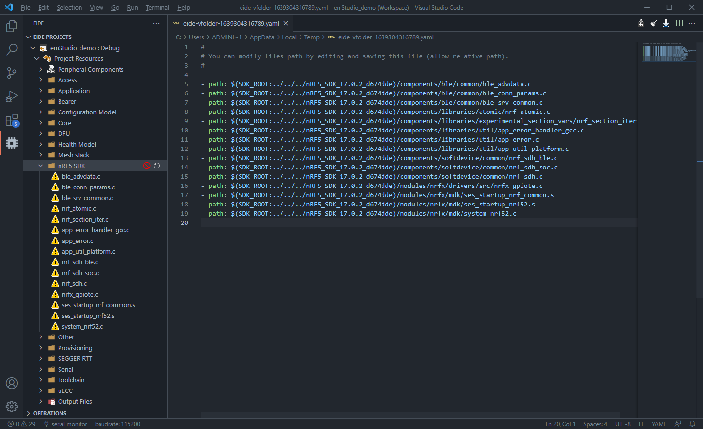
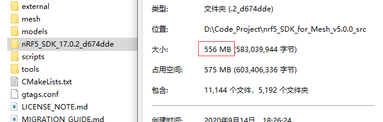
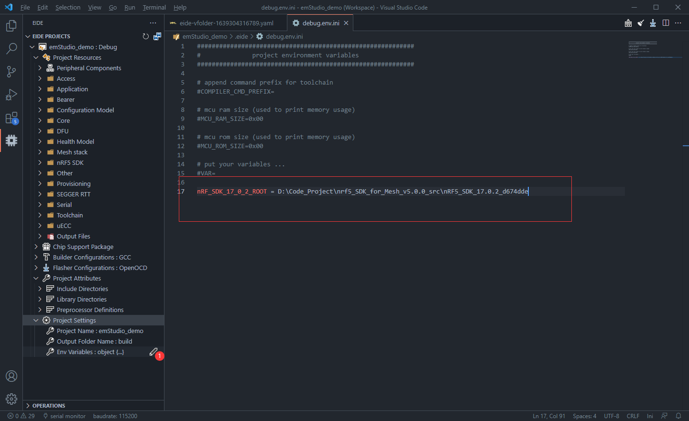
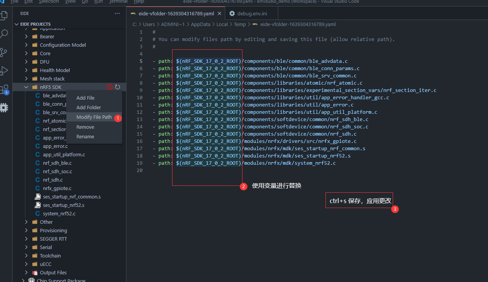

# 项目环境变量

eide 支持在 `文件路径`，`编译选项`，`自定义烧录器命令` 中使用环境变量

## 在文件路径中使用变量

有时候我们的项目会引用一些 `SDK` 中的源文件，如果这些 SDK 比较占用磁盘空间，我们可以将 SDK 单独存放到项目之外的地方，
然后使用变量来控制源文件的路径，这样可以减小项目的体积；同时当 SDK 路径发生变化时，我们只需重新修改变量的值，然后重启项目，就能完成源文件路径的更新，
这样就不用去手动修改源文件的路径了

> 文件路径变量也支持在 **烧录设置->程序文件** 选项中使用

文件路径中支持的变量如下：

- `$(OutDir)`： 输出目录
- `$(ProjectName)`： 项目名
- `$(ExecutableName)`： 输出的可执行文件路径，不含后缀
- `$(ProjectRoot)`： 项目根目录
- `$(环境变量)`：**项目设置->环境变量** 中的变量

!> 注意：**项目设置->环境变量** 中的变量名必须只包含字母，数字或下划线，不符合该命名规则的变量将被忽略

### 示例

本处导入了一个 `Segger Studio` 项目，该项目中使用了 `nRF52_SDK`，由于我的电脑没有安装 `nRF52_SDK`，因此下图源文件夹中的源文件处于**未找到**的状态

接下来我们下载 `nRF52_SDK` 并解压，该 SDK 总计大小 `556MB`，因此我们应该找一个地方单独存放该 SDK，然后使用变量来进行引用

打开 **项目设置->环境变量**，新建一个变量（名称任意，本处为：`nRF_SDK_17_0_2_ROOT`），将其值设置为上一步下载的 `SDK` 的安装目录路径

打开**第一步图示中文件路径异常的源文件夹**，使用上一步新建的变量 `nRF_SDK_17_0_2_ROOT` 对其中的源文件路径进行替换，`ctrl+s` 保存，可以发现源文件的状态已刷新为**正常**

这样，该源文件目录下的源文件就直接关联到 `SDK` 目录中的文件了，以后如果 `SDK` 在磁盘中的位置发生变化，
我们直接修改变量 `nRF_SDK_17_0_2_ROOT` 的值，重启项目，就能完成文件路径的刷新

***

## 在 Shell 命令中使用变量

有时候我们需要执行一些已在系统中安装的程序，进行一些 编译前命令 或者 烧录命令，
我们可以在命令中使用 **系统变量** 或者 **'项目设置->环境变量'中的变量** 指定文件或资源的位置

在 Windows 中，要引用变量 `APP=C:/app.exe`，将 `%APP%` 填写到命令中，
则命令中所有出现 `%APP%` 的位置，将被替换为 `C:/app.exe`
