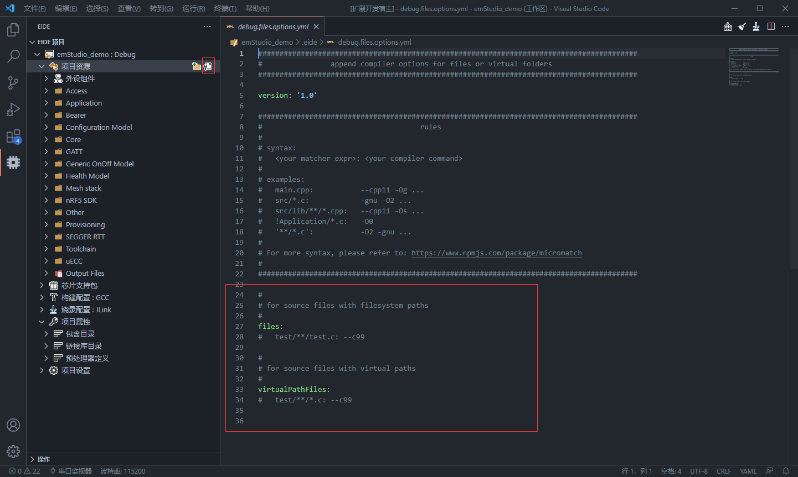
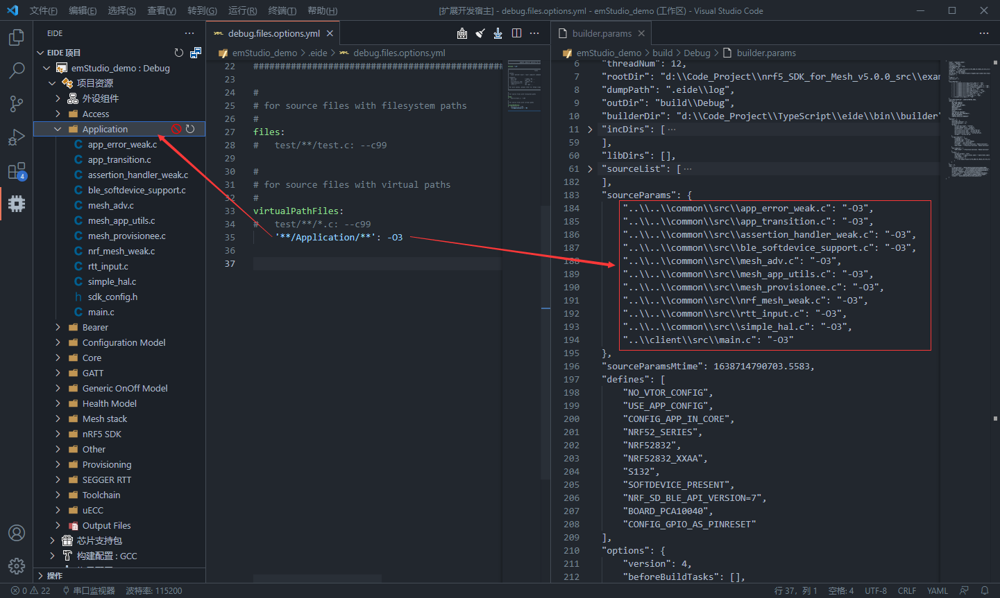
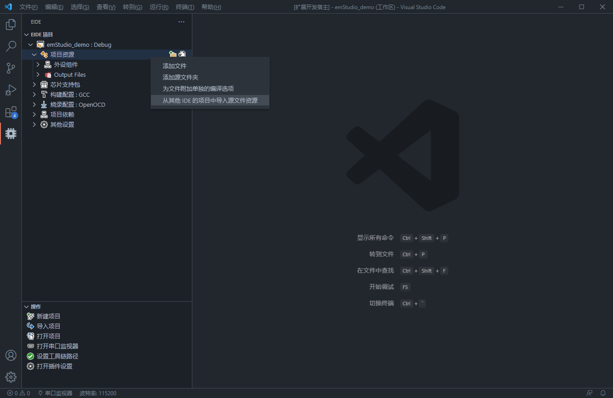
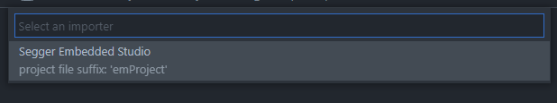
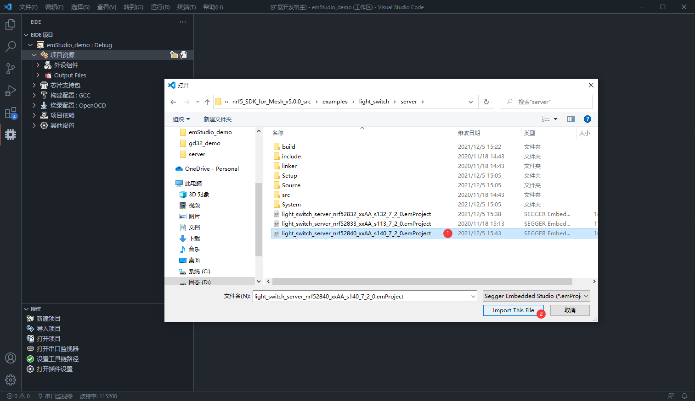
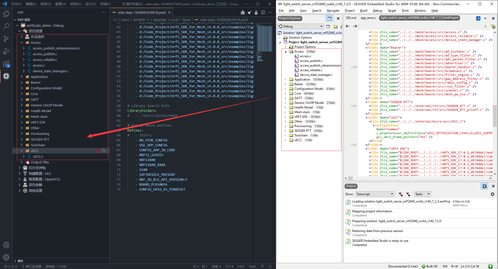

# 项目资源管理器

**项目资源管理器** 用于管理项目的源文件资源, 如下图


## 受支持的源文件类型

> 文件后缀名不区分大小写

- **C文件**：`.c`
  
- **C++文件**：`.cpp .cxx .cc .c++`
  
- **汇编文件**：`.s .asm .a51`

- **二进制库文件**：`.lib .a .o .obj`

!> 注意：不符合上述后缀格式的源文件将在编译流程中被忽略, 并且不会产生任何提示

***

## 为项目添加源文件资源

通过点击 **项目资源** 栏上的  图标，可以为项目添加 **源文件夹**


可以添加的文件夹类型有两种：**文件系统中的文件夹** 和 **虚拟文件夹**，当：

- 选择 **文件系统中的文件夹**，你需要在文件系统中选择一个文件夹，然后 eide 将这个文件夹下的所有源文件直接添加到项目中

  同时 eide 会监听此文件夹的变化，如果在该文件夹内创建/删除文件，eide 会自动重新搜索该目录下的源文件并添加到项目

- 选择 **虚拟文件夹**，会提示你输入一个文件夹名称，eide 将创建一个虚拟文件夹（这个文件夹在文件系统中是**不存在**的）并添加到项目中，用来组织源文件

  右键某个虚拟文件夹，会弹出菜单项，你可以进行 **添加源文件**，**添加虚拟文件夹**，**重命名** 等操作

  

  右键虚拟文件夹中的某个源文件，会弹出菜单项，你可以进行 **移除** 操作

  

!> 注意：如果要添加 **文件系统文件夹**，不能添加处于 **项目根目录** 之外的文件夹，即：要添加的文件夹必须处于 **项目根目录** 之下

***

## 排除源文件

> eide 支持为**源文件**和**文件夹**设置排除标志

每个源文件和文件夹上都会有一个 **排除** 或者 **取消排除** 的图标，用于将源文件资源从项目中排除或者取消排除


***

## 为源文件附加单独的编译选项

eide 支持**为单个的文件或文件夹增加任意编译选项**，使用 glob 模式匹配源文件和组

打开 **项目资源** 视图，点击右侧的配置按钮，即可打开一个 yaml 临时配置文件



通过指定一个 **模式匹配字符串** 和 **要附加的编译命令**，即可将 **编译参数** 应用到相应的源文件

对于路径的匹配，eide 提供了两种模式：

 - 位于 `files` 下的项，使用源文件的物理路径来进行匹配

 - 位于 `virtualPathFiles` 下的项，使用源文件的虚拟文件夹路径来进行匹配

> 关于 glob 模式匹配的语法，参见：https://www.npmjs.com/package/micromatch

!> 注意：yaml 临时文件只能通过 eide 提供的 UI 打开，文档在打开配置前创建，在关闭后被销毁；强行保存并编辑这个文件是无效的

### 示例

打开配置，向 `Application` 虚拟目录下的所有源文件附加 `-O3` 编译选项，**ctrl+s 保存配置文件应用更改**
   
然后编译项目，即可发现 `builder.params` 文件中已经为这些被匹配的文件附加了编译选项



***

## 从其他 IDE 项目导入源文件资源

在迁移其他 IDE 的项目时，往往要重新添加项目的**源文件，包含路径，宏定义**等，当项目较大时，就会是一个繁琐的工作

对于这些公共的项目资源，eide 支持通过编写外部 js 脚本来进行导入

> 注意：该功能只导入项目的 `源文件`, `包含路径`, `宏定义列表`，不导入其他内容

### 使用示例

1. 首先，创建一个空的 eide 项目，然后打开它

2. 右键 `项目资源` 打开菜单，选择 `从其他IDE导入源文件资源`

  

3. 此时 eide 会搜索安装目录下的 `bin/scripts/importer` 文件夹获取可用的导入脚本，根据你要导入项目的 IDE 类型作一个选择

  目前支持：`Segger Embedded Studio`, `IAR For ARM`, `IAR For STM8` 的项目资源导入，后续会增加更多

  > 提示：新增的 js 脚本会随着 [eide_binaries](https://github.com/github0null/eide-resource/tree/master/binaries) 一起更新，因此当发现仓库中新增了脚本之后，使用 `ctrl+shift+p` 打开命令面板，输入 `重新安装 eide_binaries` 即可下载到最新的 js 脚本

  

4. 本处选择 `Segger Embedded Studio`，接着会弹出文件选择框，此时选择一个 `Segger Embedded Studio` 项目文件，即可开始导入

  

5. 等待导入过程完成，左侧 `项目资源` 视图下将刷新，可以看到所选项目的源文件资源已被成功导入，打开 `项目依赖视图`，可以发现相关的 头文件，宏定义资源也已经成功导入

  

导入完成后记得检查一下是否有未导入成功的文件，一切无误后，接下来即可设置一些编译选项，开始进行编译

### 增加更多导入脚本

脚本的作用是解析特定 IDE 的 XML 项目文件，提取其中的项目信息并转化为 eide 定义的格式，然后返回，之后 eide 即可根据这些信息来导入该项目

- 打开 eide 安装目录下的 `bin/scripts/importer` 文件夹，添加一个 js 脚本

  脚本命名格式：`<IDE名称>.<IDE项目文件后缀名>.js`，IDE名称中的空格可由 `_` 代替，示例名称：`Segger_Embedded_Studio.emProject.js`

  !> 错误的命名格式将无法被识别

- 新建一个 `main` 函数作为入口，并将其导出，如下：

  `export function main(xmlParser, prjTxt, prjRootPath)`

  **脚本入口参数**：

    `xmlParser`（class x2js 类型）：一个 xml 解析器

    `prjTxt`（string类型）：被导入项目的 xml 项目文件的内容

    `prjRootPath`（string类型）：xml 项目文件所在目录

  **脚本返回值**：
  
    脚本返回一个 `ProjectInfo[]` 类型的数组对象，里面包含这个项目的信息

    `ProjectInfo` 类型定义如下

    ```ts
    type VirtualRootName = '<virtual_root>'

    interface VirtualFile {
        // 文件路径，必须使用绝对路径
        path: string; 
    }

    interface VirtualFolder {

        // 虚拟文件夹名（如果该文件夹为项目的根文件夹，则名称必须为 `<virtual_root>`）
        name: string;               

        // 该文件夹下的文件
        files: VirtualFile[];       
        
        // 该文件夹下的子文件夹
        folders: VirtualFolder[];
    }

    interface ProjectInfo {
        
        // 项目名称
        name: string;         

        // 项目 target 名，一般为 `Debug` 之类的，没有则置空
        target?: string;      
        
        // 包含路径，必须使用绝对路径
        incList: string[];    
        
        // 宏定义
        defineList: string[]; 
        
        // 源文件树
        files: VirtualFolder; 
    }
    ```

了解完上述的信息，即可开始编写一个脚本，完整的示例可以参考 `bin/scripts/importer` 下的 `Segger_Embedded_Studio.emProject.js`，该脚本是为导入 Segger Embedded Studio 项目所编写的
