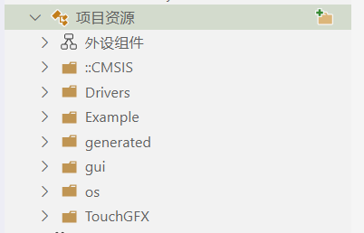
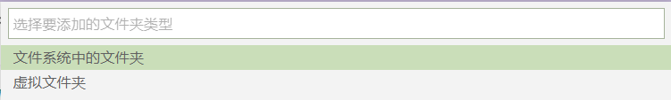
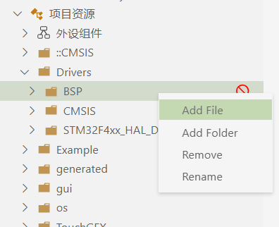
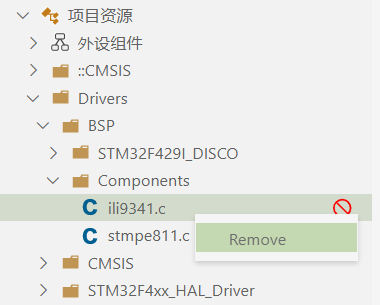
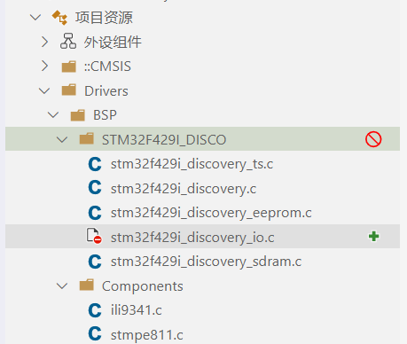

# 项目资源管理器

> 自 v2.0.0 起，eide 支持以虚拟文件夹的形式组织源文件

**项目资源管理器** 用于管理项目的源文件资源, 如下图

## 为项目添加源文件资源

通过点击 **项目资源** 栏上的  图标，可以为项目添加 **源文件夹**

可以添加的文件夹类型有两种：**文件系统中的文件夹** 和 **虚拟文件夹**，当：

- 选择 **文件系统中的文件夹**，你需要在文件系统中选择一个文件夹，然后 eide 将这个文件夹下的所有源文件直接添加到项目中

  同时 eide 会监听此文件夹的变化，如果在该文件夹内创建/删除文件，eide 会自动重新搜索源文件

- 选择 **虚拟文件夹**，会提示你输入一个文件夹名称，eide 将创建一个虚拟文件夹（这个文件夹在文件系统中是**不存在**的）并添加到项目中，用来组织源文件

  右键某个虚拟文件夹，会弹出菜单项，你可以进行 **添加源文件**，**添加虚拟文件夹**，**重命名** 等操作

  

  右键虚拟文件夹中的某个源文件，会弹出菜单项，你可以进行 **移除** 操作

  

## 排除源文件

> eide 支持为**源文件**和**文件夹**设置排除标志

每个源文件和文件夹上都会有一个 **排除** 或者 **取消排除** 的图标，用于将源文件资源从项目中排除或者取消排除

