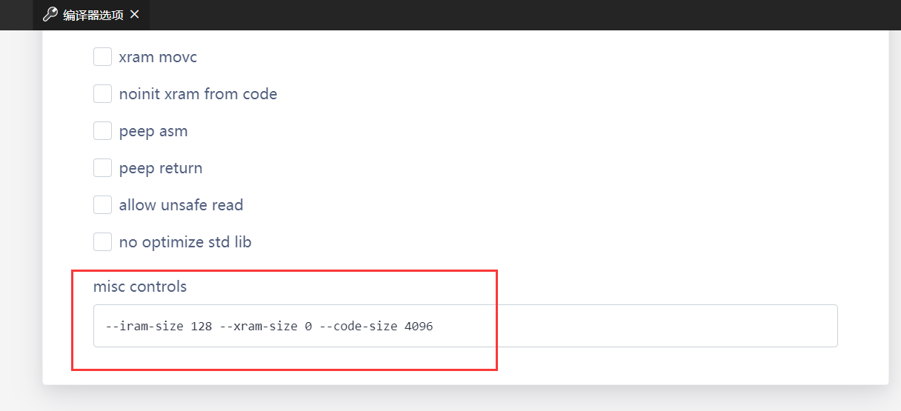
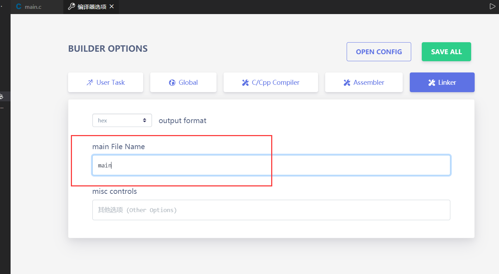

## 程序编写

- 在反转引脚时，最好不要使用**取反**，而应该使用**非**运算；因为 sdcc 会默认进行类型提升，然后进行取反，这样有时会导致一些问题

```ini
# 不建议使用的方法，强行使用会产生如下警告
# warning 180: using ~ on bit/bool/unsigned char variables can give unexpected results due to promotion to int
pin = ~pin

# 建议使用的方法
pin = !pin
```

***

## 编译

### 8051

- 在使用 SDCC 编译 8051 程序时，必须向 SDCC 传递芯片的储存大小信息，否则编译出的程序可能**超出地址范围，从而导致程序无法运行**

  至少有 3 个参数必须指定：

```ini
# 指定片内 RAM 大小，8051 系列是 128 字节，8052 系列是 256 字节
--iram-size <Value>

# 指定扩展的 RAM 大小，根据芯片而定
--xram-size <Value>

# 指定程序空间大小，根据芯片而定
--code-size <Value>
```

打开 **编译器选项** -> **Global**, 在 `misc-control` 内添加，**示例如下：**



***

## 链接

- SDCC 在链接时，**被链接的第一个.rel 文件必须是含有 main 函数(即程序入口)的源文件生成的**，因此**必须要设置包含 main 函数的源文件名**。

  以下摘自 SDCC 4.0 手册 27 页：

```txt
The file containing the main() function MUST be the FIRST file specified in the command line, since the linkage editor processes file in the order they are presented to it. 

The linker is invoked from SDCC using a script file with extension .lnk. 

You can view this file to troubleshoot linking problems such as those arising from missing libraries.
```

在 eide 中 **默认是 main**（即 main() 函数位于 main.c 中），如需要更改，请到 编译器选项->Linker 中进行设置，如下



***

- SDCC 提供了一些选项来重定位存储器地址，如下

```ini
# xram 的起始位置，默认值为0。输入的值可以是十六进制或十进制
--xram-loc <Value>

# 代码段的起始位置，默认值为0。当使用此选项时, 中断向量表也被重定位到给定的地址。
--code-loc <Value> 
```

