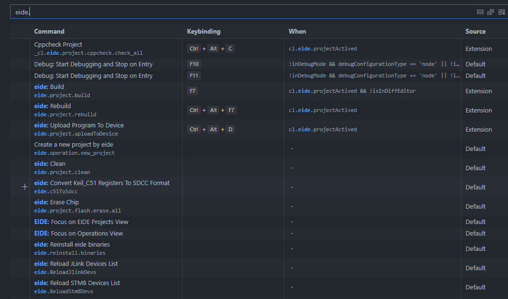

# 快捷键设置

## 修改默认快捷键

eide 默认的快捷键如下：

|名称|快捷键|
|:--|:--|
|编译|`F7`|
|烧录|`Ctrl+Alt+D`|
|重新编译|`Ctrl+Alt+F7`|

打开 vscode `设置` -> `键盘快捷方式`，在输入框输入 `eide.` 进行筛选，即可开始为 eide 命令修改快捷键



!> 注意：带有 `_cl.eide` 前缀的属于内部命令（这些命令暂时无法隐藏），不提供给用户所使用，因此不要尝试修改这些命令相关配置

***

## 使用 `vscode task` 默认构建快捷键：`ctrl+shift+B` 

vscode 的 `Task Build` 操作默认快捷键为：`ctrl+shift+B`，如果要将 eide 的 `编译，烧录 ...` 等操作放入其中，可以打开 `.vscode/tasks.json` 文件，将以下内容复制到其中即可：

```json
{
    // See https://go.microsoft.com/fwlink/?LinkId=733558
    // for the documentation about the tasks.json format
    "version": "2.0.0",
    "tasks": [
        {
            "label": "build",
            "type": "shell",
            "command": "${command:eide.project.build}",
            "group": "build",
            "problemMatcher": "$gcc"
        },
        {
            "label": "flash",
            "type": "shell",
            "command": "${command:eide.project.uploadToDevice}",
            "group": "build",
            "problemMatcher": []
        },
        {
            "label": "build and flash",
            "type": "shell",
            "command": "${command:eide.project.buildAndFlash}",
            "group": "build"
        },
        {
            "label": "rebuild",
            "type": "shell",
            "command": "${command:eide.project.rebuild}",
            "group": "build",
            "problemMatcher": "$gcc"
        },
        {
            "label": "clean",
            "type": "shell",
            "command": "${command:eide.project.clean}",
            "group": "build",
            "problemMatcher": []
        }
    ]
}
```

