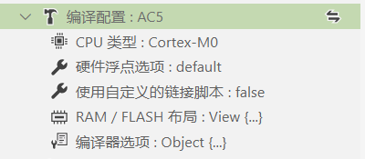

# 工具链和构建配置介绍

## 支持的工具链

### 51/STM8工程

- #### Keil_C51 工具链

  介绍：使用 KEIL C51 内置的编译工具进行编译

  > 适用项目: 8051 项目

  > 提示：插件使用的 Keil_C51 工具链的 链接器 和 汇编器 为 LX51 和 A51

  !> **注意**：使用前必须完全破解 Keil C51，否则可能会链接失败

- #### SDCC (Small Device C Compiler) 工具链

  介绍：使用免费的编译工具 [Small Device C Compiler](http://sdcc.sourceforge.net/) 进行编译

  > 适用项目: 8051, STM8, Z80 ... 项目
  
  !> **注意**：强烈建议使用最新版本的 SDCC, 目前是 4.0, 因为过旧的版本可能不支持多文件编译，以及某些重要的编译参数, 这可能会引发一系列的编译错误

- #### IAR-STM8 工具链

  介绍：使用 IAR-STM8 自带的编译工具 iccstm8 进行编译

  > 适用项目: STM8 项目

  !> **注意**：使用前必须完全破解 IAR-STM8

### ARM工程

- #### AC5/AC6 (ARMCC) 工具链

  介绍：使用 Keil-MDK 自带的编译工具 ARMCC 进行编译

  > 适用项目: Cortex-M 项目

  > 提示：AC5 是指 ARMCC 版本 5 的编译工具;  AC6 是指 ARMClang 编译工具

  !> **注意**：使用前必须完全破解 Keil-MDK

- #### ARM-GCC (GNU Arm Embedded Toolchain) 工具链

  介绍：使用免费的编译工具 [GNU Arm Embedded Toolchain](https://developer.arm.com/tools-and-software/open-source-software/developer-tools/gnu-toolchain/gnu-rm/downloads) 进行编译

  > 适用项目: Cortex-M 项目

***

## 编译配置

### 51/STM8工程

> eide 使用 json 文件保存所有的编译选项，点击 **编译器选项** 上的 **更改** 按钮即可打开 json 配置
> 
> json 配置的所有字段带有悬停提示和补全，可以根据悬停提示阅读其含义


#### KEIL_C51 工具链

?>略

#### SDCC 工具链

对于 **SDCC** 的配置，见下图：


- 其中带有 **<>** 的选项，被 **<>** 包含的内容应该 **被替换为某个值** (不要理会 json 验证器产生的警告)，如何取值见 **SDCC** 的手册

***

#### IAR_STM8 工具链

?>略

### ARM工程

> 对于 ARM 工程，会有一些公共的构建配置，如下



- **CPU 类型**：Cortex 系列名
  
- **硬件浮点选项**：CPU 的硬件浮点开关
  
- **使用链接脚本**：是否要使用自定义的链接脚本
  - `打开`此项，会出现一个**链接脚本路径**选项，你需要指定一个链接脚本路径
  
    

  - `关闭`此项，会出现一个**RAM/FLASH布局**选项，你需要打开它为芯片设置储存器的地址大小信息
  
    
  
- **编译器选项**：其他的编译参数，点击修改按钮，会打开一个 json 配置文件，修改其中的字段即可，所有字段带有悬停提示和补全，可以根据悬停提示阅读其含义

#### AC5/AC6 (ARMCC) 工具链

打开**编译配置**：点击下图按钮打开对应的配置


**编译配置** 带有 **悬停提示** 和 **自动补全**


**切换工具链**


***

#### ARM-GCC 工具链

?>略

***

## 附加用户命令到构建流程

**编译配置**->**afterBuildTasks、beforeBuildTasks**  使用 CMD 执行，可用于扩展编译流程，其中：

  - `beforeBuildTasks` 代表构建前要执行的操作

  - `afterBuildTasks` 代表构建后要执行的操作

命令中可用的 **路径变量**, 变量名不区分大小写：

>变量名：\${targetName}，含义：项目名称；
>
>变量名：\${exeDir}，含义：eide 内置构建工具所在目录；
>
>变量名：\${ToolDir}，含义： 编译工具链根目录；
>
>变量名：\${OutDir}，含义：项目输出目录；
>
>变量名：\${CompileToolDir}，含义：编译工具所在目录；
>
>变量名：\${toolPrefix}, 含义：GCC 工具链前缀，如: arm-none-eabi-

示例，加入以下命令到 afterBuildTasks：del "${OutDir}\\*.o"，含义：在编译结束后删除输出目录下所有的 .o 文件


### 通过 HEX 生成 Bin 文件

在编译选项 ->**afterBuildTasks** 中添加下图所示命令
```json
{
	"name": "output bin file",
    "command": "\"${exeDir}\\hex2bin.exe\" -b -c \"${outDir}\\${targetName}.hex\""
}
```

### ARMCC 生成 S19 格式的烧录文件

在编译选项 ->**afterBuildTasks** 中添加下图所示命令

```json
{
	"name": "output s19",
    "command": "\"${CompileToolDir}\\fromelf\" --m32combined -o \"${OutDir}\\${targetName}.s19\" \"${OutDir}\\${targetName}.axf\""
}
```
***

### 查看 GCC 生成的程序大小信息

在编译选项 ->**afterBuildTasks** 中添加下图所示命令

```json
{
	"name": "show total size",
	"command": "\"${CompileToolDir}\\${toolPrefix}size\" \"${OutDir}\\${targetName}.elf\""
}
```
