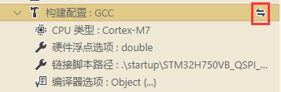

# 编译工具

eide 支持使用多种编译工具来编译项目

通过点击构建配置的**切换**按钮，并从列表中选择可用的编译器，即可完成切换，如下图所示

## 8051 工程

对于 8051 工程，支持 2 种编译器，如下：

- ### Keil_C51 工具链

  使用 KEIL C51 内置的编译工具进行编译

  > 适用项目: 8051 项目

  > 提示：插件使用的 Keil_C51 工具链的 链接器 和 汇编器 为 LX51 和 A51

  !> **注意**：使用前必须完全破解 Keil C51，否则在编译项目时会导致**链接失败**

- ### SDCC (Small Device C Compiler) 工具链

  使用免费的编译工具 [Small Device C Compiler](http://sdcc.sourceforge.net/) 进行编译

  > 适用项目: 8051, STM8, Z80 ... 项目
  >
  > 建议在使用 SDCC 前阅读：[SDCC的使用](zh-cn/sdcc?id=程序编写)
  
  !> **注意**：SDCC 版本必须 >= 4.0, 因为过旧的版本可能不支持多文件编译，以及某些编译参数, 这可能会导致一些编译错误

***

## STM8 工程

对于 STM8 工程，支持 2 种编译器，如下：

- ### IAR-STM8 工具链

  使用 IAR-STM8 自带的编译工具 iccstm8 进行编译

  > 适用项目: STM8 项目

  !> **注意**：使用前必须完全破解 IAR-STM8

- ### SDCC (Small Device C Compiler) 工具链

  使用免费的编译工具 [Small Device C Compiler](http://sdcc.sourceforge.net/) 进行编译

  > 适用项目: 8051, STM8, Z80 ... 项目
  >
  > 建议在使用 SDCC 前阅读：[SDCC的使用](zh-cn/sdcc?id=程序编写)
  
  !> **注意**：SDCC 版本必须 >= 4.0, 因为过旧的版本可能不支持多文件编译，以及某些编译参数, 这可能会导致一些编译错误

***

## Cortex-M 工程

对于 Cortex-M 工程，支持 2 种编译器，如下：

- ### AC5/AC6 (ARMCC) 工具链

  使用 Keil-MDK 自带的编译工具 ARMCC 进行编译

  > 适用项目: Cortex-M 项目

  > 提示：AC5 是指 ARMCC 版本 5 的编译工具;  AC6 是指 ARMCC 版本 6 的编译工具

  !> **注意**：使用前必须完全破解 Keil-MDK

- ### ARM-GCC (GNU Arm Embedded Toolchain) 工具链

  使用免费的编译工具 [GNU Arm Embedded Toolchain](https://developer.arm.com/tools-and-software/open-source-software/developer-tools/gnu-toolchain/gnu-rm/downloads) 进行编译

  - 相关插件设置：

    `EIDE.ARM.GCC.InstallDirectory`: GCC 工具链安装目录位置，默认：`D:\arm-gcc\8 2019-q3-update`

    `EIDE.ARM.GCC.Prefix`: GCC 工具链前缀，默认：`arm-none-eabi-`

  > 适用项目: Cortex-M 项目

  > 建议使用 `8-2019-q3` 版本, 快捷下载地址：https://cloud.em-ide.com/s/R4SY?path=%2F%E7%BC%96%E8%AF%91%E5%B7%A5%E5%85%B7

***

## **RISC-V 工程**

对于 RISC-V 工程，eide 支持 GCC 系列的工具链

- 相关插件设置：

  `EIDE.RISCV.InstallDirectory`: GCC 工具链安装目录位置，默认：`D:\xpack-riscv-none-embed-gcc-8.3.0-2.3`

  `EIDE.RISCV.ToolPrefix`: GCC 工具链前缀，默认：`riscv-none-embed-`

- 推荐工具链：

  `xpack-riscv-none-embed-gcc`: https://github.com/xpack-dev-tools/riscv-none-embed-gcc-xpack/releases

